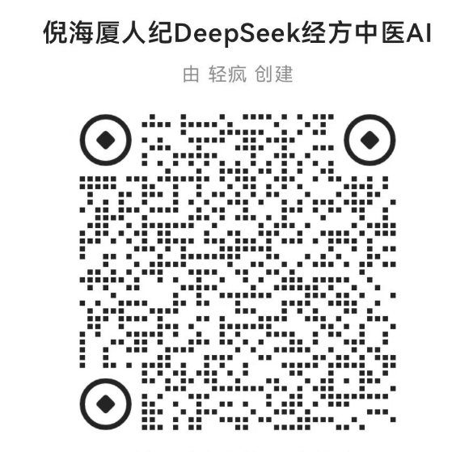

简介
===============

最近更新时间：2025-03-24 

  

传承中医，为往圣继绝学，内容全部来自网络，本项目完全开源。

主要以倪海厦倪师人纪天纪为主，专攻经方，后期会加入李可、胡希恕等国医大师自学内容。

内含倪师人纪系列(非视频语音转文字，皆是倪师自编教材课本讲义)

自学顺序：针灸，黄帝内经，神农本草经，伤寒论，金匮要略五部教学课本PDF（请配合B站视频学习，搜索倪海厦即可）。

人纪和天纪已经学完，视频课程上扩展内容，将编写成自学笔记，直接写在倪师教材上的原文中间，把视频课堂上总结和扩展的内容加上去。

> 用引用格式的内容，都是视频课程笔记。

进度
===============

* [ ] 人纪-1-针灸大成（只有教材，笔记未补录）
* [ ] 人纪-2-黄帝内经（只有教材，笔记未补录）  
* [x] 人纪-3-神农本草经（教材+笔记）
* [x] 人纪-4-伤寒论（教材+笔记）
* [x] 人纪-5-金匮要略（教材+笔记）
* [x] 倪师扶阳论坛演讲
* [x] 倪师仲景心法课程
* [x] 倪师经方的妙用讲座
* [x] 梁冬对话倪海厦
* [x] 倪师斯坦福大学演讲
* [x] 天纪（教材+笔记）
* [x] 汉唐方剂讲解
* [ ] 倪师医案（只有word版，正在整理中...）
* [ ] 地纪（只有教材）

如果提示目录或文件名称违规看不了，还可以使用[github镜像仓库](https://github.com/9527qingfeng/hantang-nihaixia-follower)查看，最好还是使用下面的全局搜索功能哦。

全局搜索教程
===============

全局搜索关键字，比如肝癌、脑瘤、尿毒症、糖尿病等倪师治疗思路。快速定位倪师教案内容+课堂笔记，快速筛查神农本草经本草药性，避免进入死记硬背背不住的情况。

新手临证只要记住关键词，然后快速查缺补漏，并不需要熟练掌握所有细节，以后用的多了自然记住了。

电脑端：推荐用vscode+git。
项目拉取到本地记得及时更新哦。

[vscode安装使用教程](https://www.bilibili.com/video/BV1eT421e7P8/?vd_source=587efb7b2cb61b90f1a6a89624ee0276)
[Git安装教程](https://www.bilibili.com/video/BV1vM4m1Q7hC/?vd_source=587efb7b2cb61b90f1a6a89624ee0276)
[TortoiseGit安装使用教程](https://www.bilibili.com/video/BV1xM41197PR/?vd_source=587efb7b2cb61b90f1a6a89624ee0276)

手机端：请用github移动端，到本项目的[github镜像仓库](https://github.com/9527qingfeng/hantang-nihaixia-follower)
星标star一下，就可以在你的github移动端找到项目，并使用强大的全局搜索能力了。

[github移动端教程](https://www.bilibili.com/video/BV1Np421Q7cc?spm_id_from=333.788.player.switch&vd_source=587efb7b2cb61b90f1a6a89624ee0276)

非程序员，可点击以上教程并观看教学视频，如果没有学会，可通过百度、抖音、B站搜索相关教学文章和视频，加油。

DeepSeek学习人纪后的AI
===============

学习建议
===============
毛主席1965年6月26日对卫生工作的指示：“医学教育要改革，根本用不着读那么多书。华佗读的是几年制？明朝的李时珍读的是几年制？医学教育用不着收什么高中生、初中生，高小毕业学3年就够了，主要在实践中学习提高”。

你踩在巨人的肩膀上，不要怕学不会，轮子拿来就能用而不是让你发明轮子。

刚入门的小白，建议学习倪师的针灸大成，足以受用一生了。

学习完成之后，如果途中觉得针灸大成都非常枯燥，想放弃，可以考虑学习一下倪师的天纪。

第一，之后的黄帝内经和神农本草经教学，相对很枯燥，心境没有改变，很容易半途而废。

第二，因为身体有病有药医，心有病只能靠自己。让群经之首的易经来帮你调整一下心态，天行健君子以自强不息。给你的执念解决一下，再把祖国母亲批量生产牛马的底层代码给更新一下。

之后学习完五部经典，如果还没有学天纪，可以开始学习一下。然后根据时间顺序，观看倪师各种讲座。

再来就是学习倪师汉唐方剂讲解，对病理学和药理学有更深层的领悟。

最后就是学习倪师所有的医案，同时可以看一看地纪，还有倪师的徒弟们的医案了。

天纪是不是玄学？
===============
毛泽东选集中写到，看它的过去,就可以知道它的现在;看它的过去和现在,就可以知道它的将来。

可以根据一个人现在的面相，而相由心生，知道其大致的过去和现在的情况，获取客户更多信息后，就能推断。这门学问非常考验一个人的见识和逻辑性。

中医的望诊总结、天纪的相术总结，一起来看，相术才比较全面。

最后
===============
希望各位程序员不要996透支身体，身体才是革命的本钱，钱是赚不够的。

身体虚弱的来学习一下医术，倪师的针灸大成教学视频，每天花一两个小时，看一遍也就一两个月，足够入门了解怎么恢复健康了。

如有学术相关问题咨询，扫码加微信，备注：咨询。

