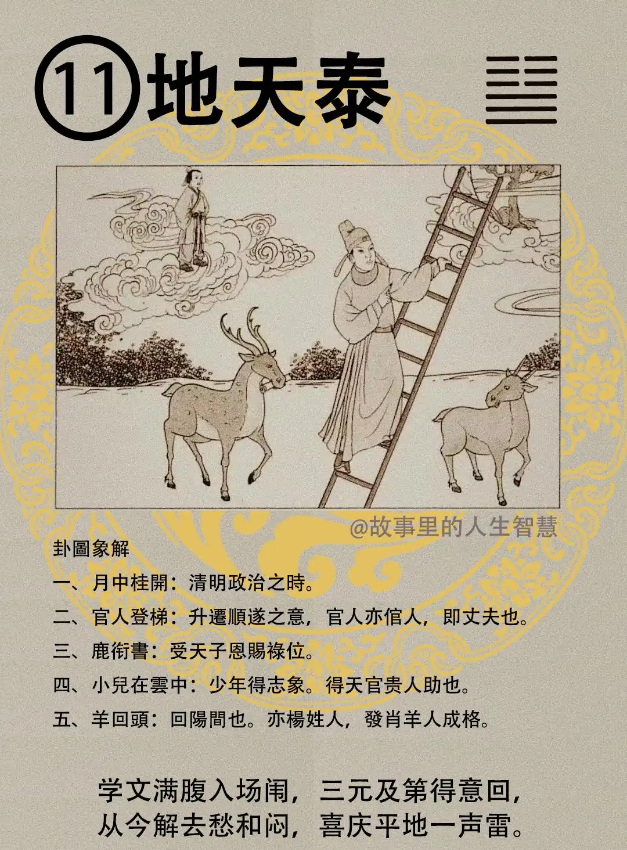

地天泰。

#### 先天卦

如果你先天卦排到是地天泰。

第一个，这个父登青云位，爸爸一定是高官，身在清贵家，生在清贵的家庭里面。

第二个，禄命来，少年得志，不要把他弄成痔疮了。

第三个，遇羊回阳，从阴间回到阳间。

第四个，这里有一个天机要告诉你，羊杨有桂，桂代表的是丹桂，我们受到很高的任命令，就是所谓的丹桂。 

第五个，中年以后，这个八字进入中年以后呢，40岁以后，禄命自九重来，中年以后你所有的人事命令统统从九重来，从总统府来。需要总统来帮你任命就是很大的官的，你公务员考试大不了当个职员，还要总统任命不太可能

#### 后天卦

后天卦，我们以前讲大内就讲九重，我是把以前古文写给你看。

第一个，这个就不是桃花朵朵飞，而是桃李满天下。清誉贵人香。

第二个，官人受禄命；当官的人，一定后天卦受到受到地天泰更好，平蹬青云志。所以地天泰这个非常的好。

第三个，遇到这种后天卦的时候，那个人啊，当时算命，被你算命的那个人啊，一定是有子在远方，儿子在远方。这个儿子要逢要羊，或者是杨，方回。可能他的儿子的，他的女朋友他的家姓杨或者是他的女朋友刚好是属羊。

第四个，子大贵。所以后天卦是地天泰，儿子是大贵。

#### 流年卦

如果流年卦逢到，老师我38 岁地天态，我们看看你38 岁。

第一个，官运亨通，官运非常的好，平步青云嘛。

第二个老师我38岁生了一场大病，疾恶回阳，你再重的病，或者出了车祸，大家都死了，就你回来，好，疾恶回阳，是一定不会死的，摔都摔不死啊，这个不会死人的。如果你排到那个人的大限，刚好他那一年是地天泰死掉了，你根本是你排错了，你懂不懂? 自己不要怀疑，你排错了，最好重新排一下啊。所以老师他怎么 38 岁死了，我给他排的 38 岁地天泰，我说那你该死啊，你看看，农历和国历是不是搞错了。

第三个，如果是求财的人，做生意的人，禄财，非常的丰盛，求财得财，非常的多。有个天机，进二春吉，春天的时候会进二，我就告诉你到这里，到时候你们就知道了。

第四个，男人逢到这个，男带桃花，婚事必成，你刚好28 岁那一年，地天态，一定成啊。但是地天泰那那么容易出现啊，一生可能出现一次，如果出现在婚事卦很多都会成啊，用在地天泰就比较可惜了，要找40几岁，最好是流年的时候。