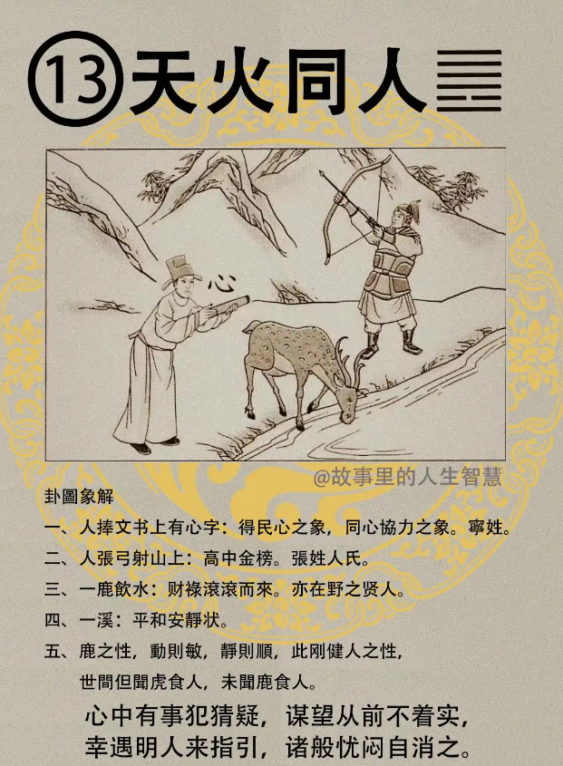

天火同人。

#### 先天卦

如果你的先天卦是天火同人卦。

第一个，生时，你一生下来呢，就带着一大笔钱来人间，生时带财人称羡，人家都称羡你，尤其现在这个社会呢，有钱人都是对的，大家都在羡慕他。

第二个，先天这种，天火同人呢是个文武双全的人，文武双全受封诰。

第三个，名登金榜，金榜题名啊，长弓寧，上面一个心字。

第四个，然后天火同人卦出现的时候，第三儿子成格，就是排名第三个成格，不排名第三的时候，余减一半，其他扣掉一半，就是发一半了， 如果是你是第三个儿子， 你可以顺利干到行政院长，可是你不是第三个儿子，对不起，科长，处长，可能就干到处长就这个样子，扣了一半，官职的人呢扣下一半。同人，同样是天火同人，卦的深浅。

#### 后天卦

如果你是后天卦，后天卦卜到。

第一个，文从武，武从文，以前写这个大家看不懂，现在看懂了吧，校长干到部长，部长回来干什么，什么都没关系，文从武，武从文。这个人文武双全啊，出将入相。那天我不是给你们讲了村嘛，是不是相，这个是什么? 将，是不是? 是不是这样子。如果寸赶上，討是不是，辱也是一样，自讨欺辱，没有办法呢，所以啊，有的时候要问问人家，不要说找张老师啊，倪老师。看懂没有?

第二个，名利双收，心想事成，所以天火同人卦非常好，心想事成的卦。

第三个，发於黄甲，黄甲就是这个黄甲袍、黄袍啊，发於黄甲。

第四个，天火同人，数中有四子，有四个儿子，最后结果呢，三子送终， 少一个。

#### 流年卦

如果你的流年卦，我们写这个流字啊都是青龙，三点水写成一个|，所以你那个勾陈啊，腾蛇不要乱告我，讲话有声无音，勾陈，勾陈怎么能抵得过青龙呢? 

第一个，流年卦呢，你那一年刚好天活同人卦，金榜登科，一定是高中。

第二个，一朝扬名，四海同心，这个做的非常的大，那一年。

第三个，但是呢，一定要专心，而且坚持，专心坚持到终必成。

第四个，遇到天火同人卦的时候，后面留个尾巴给你，冬加一喜，那一年的年味的时候，加一个喜事上来。那只有算到这个人，他一看，对，他自己心里有数，有些话还是不要和你们讲。

有一个人呢，她先生两天不跟她讲话，这人问算命的，请问我先生为什么两天不跟我讲话?测字的说，那你拿个字来好了，心脏的心，心啊，你老公啊忽然必变心，变心了，所以测字我们不能测啊，自己给自己测，就入相了。我们只能帮人家自己没有办法测。