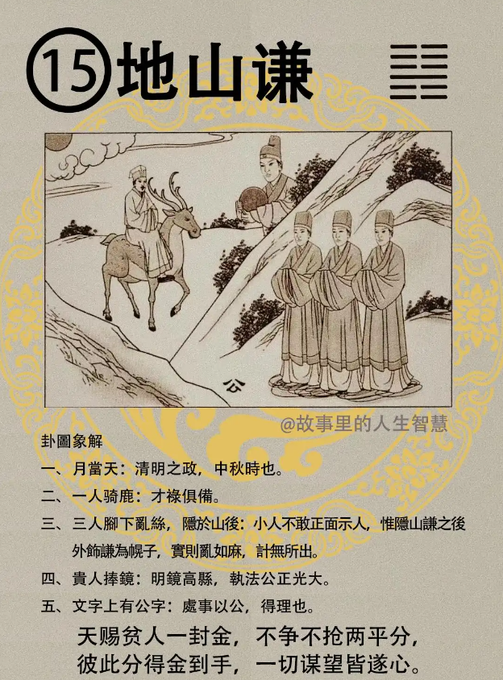

地山谦。

#### 先天卦

诸位你的先天卦如果是地山谦。

第一个，智明如月，才德兼备，非常聪明的，地山谦。

第二个，这里呢，这是天机道，众人心乱，无所适从，先天卦。

第三个，那谦卦呢，谦受益，满招损。

第四个，出则凶，出世的话，出山的话，招凶，会受世人诬乱，诬陷。

第五个，如果是潜藏，帮人家算的时候要告诉他，先生你一定不要出世，潜藏进德修业，潜藏吉，反而能看尽人间百态，反而能进步很多。

第六个，那这个卦逢的人，一定是，你看一个人在路上面，独来独往，三个人躲在山后面，有没有? 这个人独来独往。马最奇，如果是属马的逢到这个最好。

#### 后天卦

后天卦，如果你的后天卦是地山谦的时候，这个人呢。

第一个，君子临朝，会出来当官哦，后天卦是君子临朝，小人退隐。

第二个，这种人一定是为官公正，上面有个公字嘛，文字上有一个公字，为官公正，贤人入朝，贤人都会跟着入朝，这种人当官最好。

第三个，后天卦如果你逢马，逢到马年的时候，最奇，不但有禄而且是明，当官要当明，清官还不重要，要明官，要明了，才可以，不要光清不明，没有用。所以历史上有很多清官误国。

#### 流年卦

如果你的流年卦碰到这个，老师我今年是地山谦，你看看啊。

第一个，勾陈有窃，勾陈主的是窃灾，三人成行，三个人成行啊。

第二个，那你这一年的贵人一定是当官的，贵人为官。明月当天，明月当天在我们天机图里讲的话，还代表妈妈在侧，明月，太阳就代表爸爸，妈妈看不到，明月当天。

第三个，那这一年呢，流年卦呢，有禄至，有财禄进来，但是不会守，钱进钱出。

第四个，结尾一句话，结尾的卦呢，事行之后，事后官司但是终有巢。地上乱丝一堆，就是这个字嘛，缫，把这个绞丝旁拿出来，加一个冬，结果是什么，结果有巢，结果还是有房屋可以住，终有巢，官司还可以打，打了会有房子住，很好。