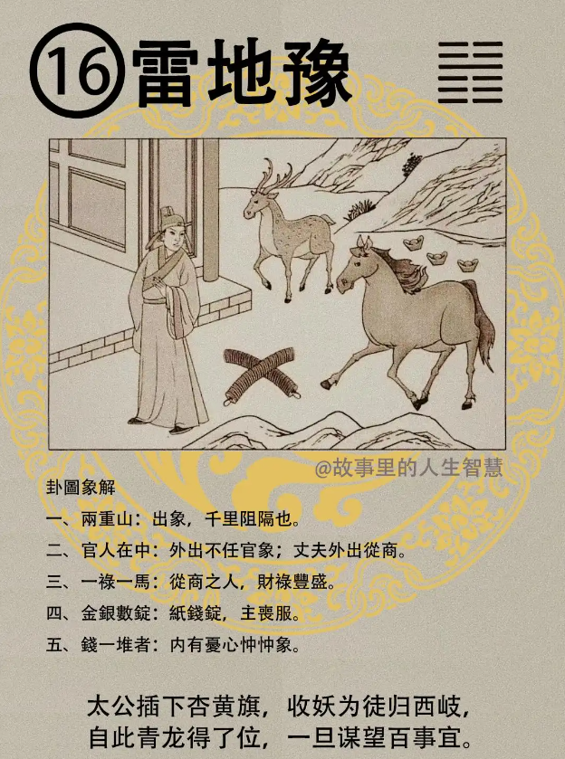

诸位看雷地豫，豫卦的时候一批马，一个鹿，一个官人站在门口。

#### 先天卦

先天卦怎么读呢? 

第一个，内忧外阻，父有凶，爸爸会有灾。

第二个，禄马。禄逢的马是最好，禄马交驰入豪门，进入有钱人家。本来你生下来平平的，可是，先天卦这个，爸爸会有凶，然后进入豪门，原来不管是做继子什么的都没有关系。

第三个，马人大利，肖马人，或者是长的像马的人，姓马的人，马人大利，凶为吉，看着是凶事，其实都是吉事。有的事看着凶其实是吉啊。

第四个，不为官人为富商，这是天机道里面注定的。

第五个，五阴一阳数中定，到时你就晓得了。

第六个，我们叫做孤子承母，三千宠爱在一身，这个卦非常的好。因为雷嘛，雷出地上，地是母。

#### 后天卦

如果你后天卦，这个主的是什么? 

第一个，生意兴隆，财禄多，财禄非常多。

第二个，出山得金又得官。

第三个，流年逢到，记得冬有丧服，冬天的话要戴孝，为谁死啊？阴人。 

第四个，出得外地分东西，东西南北不分，没有关系。

第五个，两个天道，草原千里为险阻，动得干戈，流年逢到，动得干戈有官司，会打官司的。最好的方法就是去官，不要干了，去官从商，南北走，这个去官从商南北走就是在天道，天文里面的算命里面的给客户的建议。去官从商。这个草原千里是天道，什么叫草原千里? 就是草字头，千里是不是这样子，董？（倪师写的董，中间的竖下面出头了，不知道是什么繁体字），还有很多写在里面的，四个字，中国的文字是很好的学问，常常在变幻。