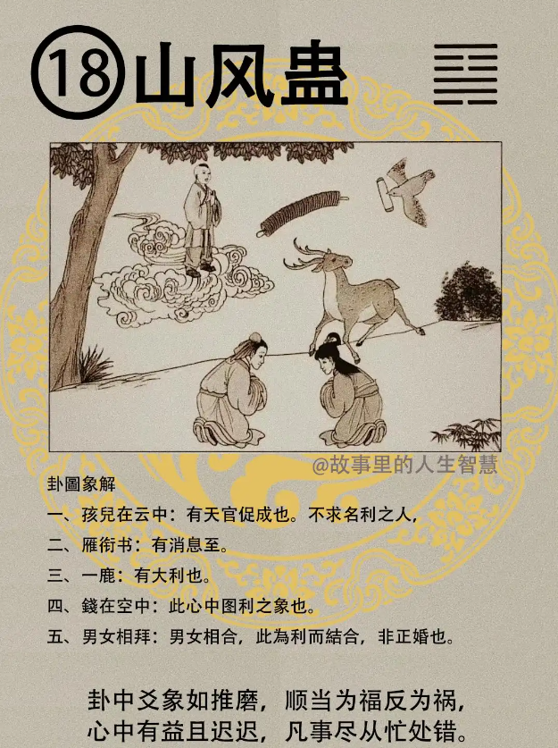

山风蛊。

#### 先天卦

如果这个人的先天卦是山风蛊。

第一个，五才大限，五岁有大限，女孩子呢，为凶，更难，女为凶而且难防，女人更凶。这个时候一定要须有天官，去找算命的高手。天机呢，天机给你，人貌不同。

第二个，如果先天卦是山风蛊，善知人意，大人状，主夭折，这个很熟了啊，如果象上面再有的话，更可怕。

第三个，那易经呢，一直提出来，积善之家，必有余庆，可过，积善之家可以逃过。诸位呢，你积到的是愚善，笨蛋的善，一点用都没有，因为你积的是愚善，我给你讲，不要随便愚善对人好，对真正需要好的入再好。小人在那边装可怜，你说我要帮他出头，积愚善，我告诉你，你只会让小人当道，让小人更盛，害了更多的人，你的愚善，千万不要去做愚善的人，这种人太多了，100万佛教徒9999999都是愚善，好，不可以的。要了解什么叫做真善，大家都想从善，你就不知道方法，知不知道，积善。

第四个，这个卦祖业有积，祖先的事业有积聚下来，机深必败。易经从头到尾都告诉我们，绝对不要心机太深，城府太深，有什么话直讲，不要心机太深，拐弯抹角的你在干吗。

第五个，这个山风蛊的，早有功名，考中的话早有功名，早有婚，婚姻都会比较早。

#### 后天卦

如果你后天卦是，山风蛊。

第一个，金榜题名，自由人。

第二个，这个卦很玩，不求名利，名利自来，那这个人呢。就是因为他会出名利，所以易经才会提醒他不要刻意去求，反而名利会跟着来。

第三个，财禄兴旺，无官带，没有官家的事情。

第四个，男女合有利，机多必败。这个机多必败，心机如何看? 我们眼睛看过去，舌头伸出来，舌头上面整个裂开来，裂舌，舌头是，嘴巴在讲话的，但你讲出来的话是分裂的，人家叫做裂舌。手纹打开，如果一看他的手纹都是很深的人，心机太深，这种人都会败。

所以我们那个看，常常看中医的时候，舌头伸出来看看，望闻问切的，怎么搞的，舌头是这样尖尖的，{，这人不好，喜欢造谣生事啊是非很多的。

#### 流年卦

流年卦，流年逢到，如果你26 岁走到山风蛊。

第一个，主科甲，高中，科甲的高中。

第二个，婚事呢，有成。

第三个，如果流年到了，我不想问这个科甲，我想从商跟人家合伙，从商，合伙吉。但须防人言生害，这个谣言呢，会坏事。

在这个世界上呢，大智慧的人遇到挫折的时候都首先看自己，自己有没有错，自己做了什么事情。那种小聪明的人，什么事都在指责别人，从来没有想到自己，这种小聪明的人，诸位绝对不要做这种人。易经告诉我们，如果读了易经还跑出去，在课堂上听的很清楚，出去就忘了，也不行啊。