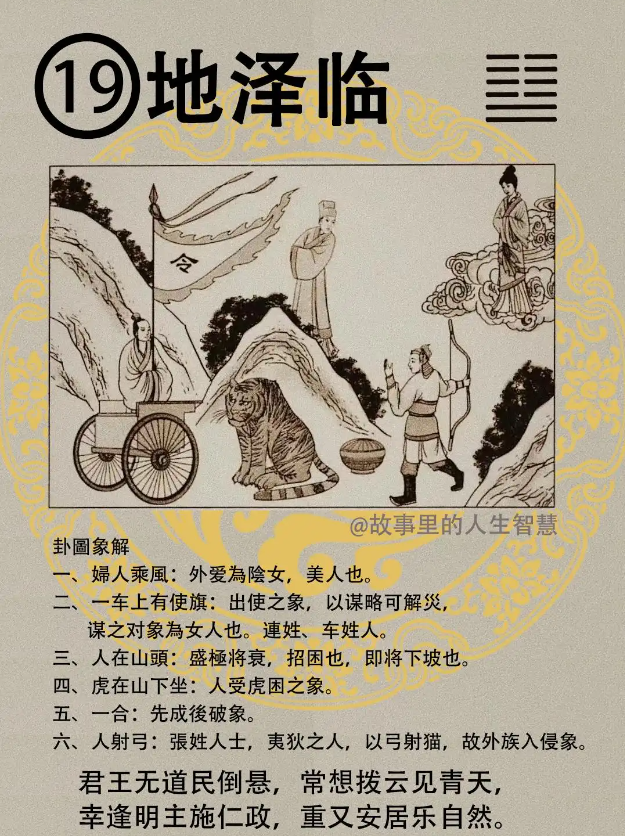

地泽临，临卦。

#### 先天卦

如果先天卦是它。

第一个，天机给你一个，这个没有办法，自己看懂。桥木有凤来仪，阴多阳二，这个是简体字不好，给你写成勾陈的样子，有凤来仪，阴多阳二，阳只有两个。

第二个，生在武官家主大贵，他父亲是当武官的，大贵，地泽临。

第三个，下面是姓氏，这几个都连在一起，陈啊，单啊，连（連）啊都是车子嘛，陈，连，单，使，发肖虎人，老师我是属老虎，地泽临，很发啊。

第四个，防长弓，长弓之人呢，暗度陈仓，遇到长弓，姓张的，暗度陈仓，先成后破，所以事业上要防这个。

#### 后天卦

第一个，武将，受困，你如果当军人，当警察，法官啊，外交官，武将受困，逢张生害。现在我们的国运逢苏生害，这是逢张生害。

第二个，那你想通了以后呢，后天卦要怎么做呢，要去武从商，能够去武从商呢，反为富人，成为有钱人，反为富人。

第三个，后天卦还没有完，天道上面有遇美人，遇到美人，当然这个美人可能是那个X太太，也可以是李太太，美国人也是啊。他没什么了，美人在任可出使，这句话比较特殊，出使车行千里。

第四个，如果这个卦里面很特殊，从头到尾都是，防张生害，如果遇到张的话就会，人至北千里。可能当初我们的祖先在统计的时候，有人被发放到北疆去了，大兴安岭啊那边，北方去，本来到四川还好点，流放到那边还可以研究药材，最后发放到北大荒去了，为什么? 被张陷害，所以很火大就写上去了。

#### 流年卦

流年逢到这个卦的时候。

第一个，如果你正好26 岁，要结婚，婚事啊需要防，虎，这个时候老虎，虎生暗害，所以不一样。

第二个，武官的人逢到，武官外调，一般武官的人常常逢到这个地泽临，武官外调，出使他国。这个是等待时机，不要硬去争，硬去求，等待吉，等待他的命令，一定会来。

第三个，如果等不及，强进啊，硬要去争取，硬要去，强进生是非，然后反而会得到官司。官司招人陷。对他不利。
所以流年逢到这个卦，你给人家说，你不要急，你等就好了，等待，不要动，你硬要去，发布人事命令或者怎么样，反而会对你生到祸害。