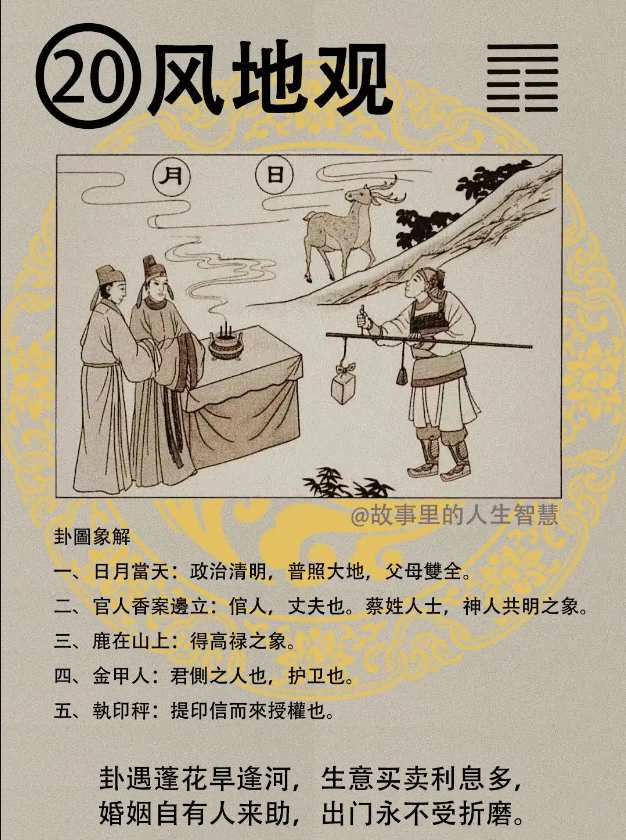

诸位看风地观，观卦。

#### 先天卦

第一个，父母双全人大吉。

第二个，次子呢，偏路成事业。

第三个，官人得应又称心。

第四个，女子逢之恐为偏，这是先天卦，女人逢到这个先天卦比较不好。

#### 后天卦

第一个，父全，母失，为定数。

第二个，财禄日增官运通，官运非常的顺利。

第三个，如果后天卦在逢到辛，逢到乙，辛年乙年啊，逢辛逢乙，必增辉，会更好，比如说你的老板，刚好姓辛。

第四个，火年需防母有凶，妈妈在火年的时候会有问题，这个午年啊，属马的就有祸。

#### 流年卦

流年卦如果是风地观，

第一个，逢之必升，诸事顺遂，所有的事情，而且路上平安。

第二个，婚事可成，夫主贵，这是讲的女人，这一年尤其是风地观，先生比较好。

第三个，父母双全，人安康，这为什么要老提到这个，父母全不全的你不必要去在那边多说，而是说图上说日月当天有没有，天上一个日一个月，所以如果这个女孩子逢到这个卦，结了婚，和老公，可能跟自己的爸妈还是住在一起，没有分开来，因为还可以看到自己的日月。
