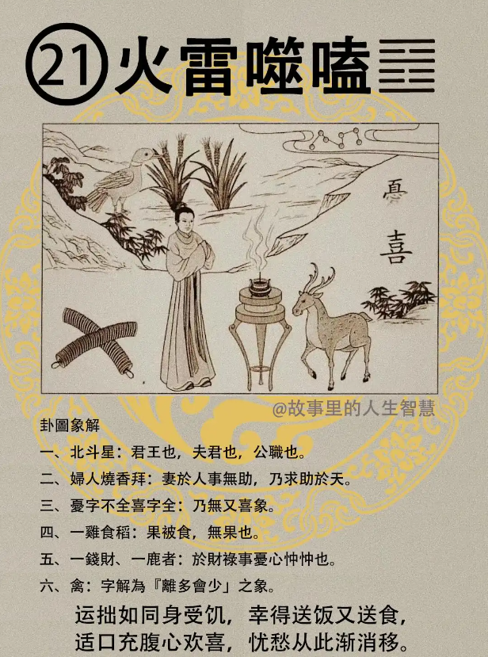

火雷噬嗑。

#### 先天卦

先天卦逢到火雷噬嗑的时候。

第一个，生为尾胎，不是轮胎啊，尾胎最后一胎，也是在豪门。

第二个，足踏七星，发男儿。如果这个人排出来先天卦是火雷噬嗑，脚掌拿起来一看，是七个黑痣在下面。安禄山、 史思明的故事听过没有?

第三个，多败多成，如果不是脚踏七星的话，多败多成，为从商，这个人呢，做生意的话多成多败。

第四个，如果呢，脚踏七星的人，从官，从武，位至极品，一人之下万人之上。官非常大的。

这是先天卦，都是可以从图上读出来的，没有一个不是从图上读出来的。

#### 后天卦

后天卦是不是不一样，完全是反的。

第一个，清香一柱为夫君啊。

第二个，所求未果，逢鸡丢财，逢鸡年，或遇到属鸡的人要担心你的钱财了啊，逢鸡忧财。

第三个，女人的命逢到后天卦是这个，要小心哦，枯坐到老。老师我不喜欢枯坐到老，赶快来我帮你解，当然有解啦。

第四个，求财呢，这种人求财如镜中的月，可遇而不遇，所以后天卦逢到这个很累。

那一般来的话，我们看到的都是太太非常强，先生比不过太太，其实太太烧香给夫君好一点啊，追上我一点了，这样就好了，对不对，太太希望先生追上太太的事业嘛，先生就是没那么大成就，就是追不上太太，太太就停不下来，没有办法，不好啊，不行啊。

#### 流年卦

第一个，防窃，流年逢到的时候小心窃灾，防窃，忧失财，破财。

第二个，如果考试逢火雷噬嗑，再度无功名有没有?无又喜嘛，就是未考上。

第三个，那有一个人呢，心诚，求上天啊。有一天道在里面，肖鸡能使果，就看属鸡的，或者鸡年，属鸡的，我们十二生肖嘛，肖鸡的。

这就是天道，怎么样跟你们讲呢，你们自己去悟啊。因为讲出来事实不一定是这样，遇到情况就懂了，因为我们把神写给你，神是一样的。