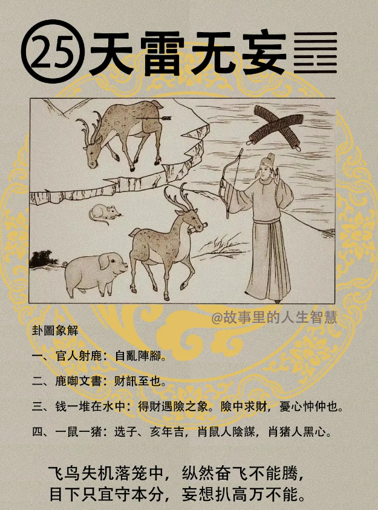

天雷无妄。

#### 先天卦

这个天雷无妄卦啊，出生的时候逢到。

第一个，如果这个人本身就是肖鼠，老鼠啊，肖猪，属猪的人需防。你是天雷无妄，又是属猪的，如果你的小孩子，你刚好猪年生或鼠年生的孩子，然后排字先天卦都是天雷无妄。若大家业，分东西，家业统统分掉。

第二个，这个人的个性呢，必定是刚断用事，做事呢非常的果决，然后险中求财，比如说我们开赌场啊，险中求财，六合彩啊。就是险中求财，赌博性的电玩啊。

第三个，商人行，合伙的财候，有合伙的状況出现，防陷，被你的股东陷害。

第四个，这种状况天雷无妄的时候有大禄至，有大财禄来的时候，须戒盛，这个解戒盛都学过了，人间道上来的。

#### 后天卦

诸位呢，如果你的后天卦是天雷无妄。

第一个，猪年，人进禄，为天数。猪年，或者是肖猪的人给你生意做赚到的钱，或者是长的很像猪，蒋经国就是猪脸。

第二个，但是逢到天雷无妄要记得，少缺一半，要少掉一半，阴人有谋略。

第三个，那做事情啊，不报侥幸，所以实际上这个易经一直在告诉我们，其实绝对不要抱着侥幸的心理，可脱险。

第四个，最后一个是要给客户一个鼓励，遇到这个的时候，如里他遇险了怎么办? 遇险了才来找你算，留在青山在不怕没柴烧。

#### 流年卦

如果是值年卦，你的流年卦逢到这个。

第一个，险中求财，有财得半，得到财，险中求财，开赌场你赚到钱，得财只有一半拿到，有一半分掉了。自乱阵脚。这种铤而走险啊，贩毒啊，那个只要有一个风吹草动，可能大家阵脚都乱了。 容易紧张嘛。

第二个，这一年呢，一定要防窃，我们命卦上面，你只要看到图上面，钱掉到地上，就是都有窃灾的，钱掉地上都有窃灾，防窃之年。

第三个，那这一年呢，还有忧心，爸爸病重，那这种忧心父病，到你面前来一看就知道，他的日角会变成，发暗，颜色会暗暗灰灰。