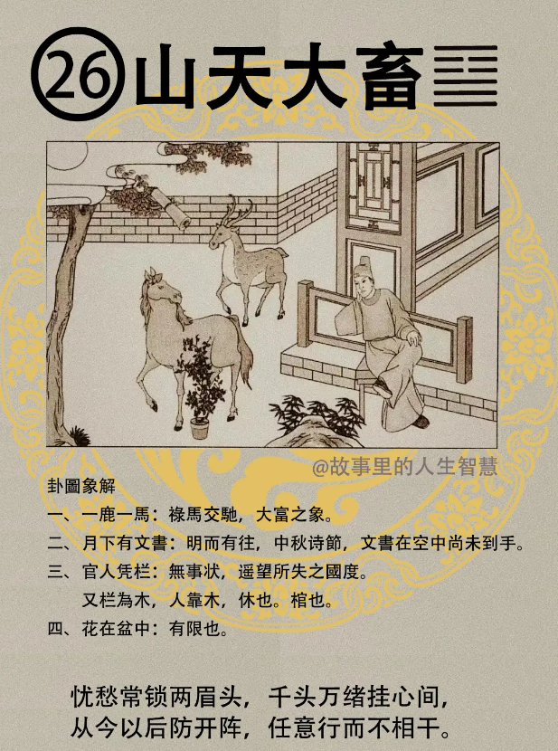

山天大畜。

#### 先天卦

先天卦如果你山天大畜卦。

第一个，生来注定富贵人。 

第二个，红楼之中，有科名，有科甲。

第三个，马人呢，大吉。

第四个，这个卦求官不利，求财吉。

第五个，这个经营交易一生富足。先天卦就注定。

#### 后天卦

如果你的后天卦，这个是山天大畜卦，遇到这个的时候。

第一个，一定会休辞官位，不当官了，老子不干了，专心从商，一心一意要去做生意。

第二个，得祖业，祖上的业会有，但是守成不易。

第三个，男人呢，不犯桃花，不要犯桃花，果必成。有的人犯桃花没有关系，这个卦不能。

第四个，后天卦逢到弃官从商了以后呢，财禄也是富足一生，所以这个卦就是有钱。

#### 流年卦

那你有一天，你的流年卦，老师我38岁刚好逢山天大畜。

第一个，那你就是一个官人平南坐，这叫做遥望国土思故乡，身在异乡为异客。如果你刚好考大学那一年，你家住在台北，刚好那一年，一考平东龙专，就很远了，要放大缩小。

第二个，命里面有禄马，财禄兴旺，禄逢到马是最大的禄，滚滚而来，我们叫禄马交驰。这个滚滚而来。财禄通。

第三个，文书至，有文书来了，记得啊，这是天机道，文书至的时候，必度势而进，不要躁进，绝对不可躁进，要度，看局势而进，不能退，要往前进。

第四个，不可犯灾而行，明知道太危险了，还往前跑。

第五个，官人逢之，当官的人逢到，山天大畜卦的话，贪禄休官，官运会停下来，就是因为贪禄。