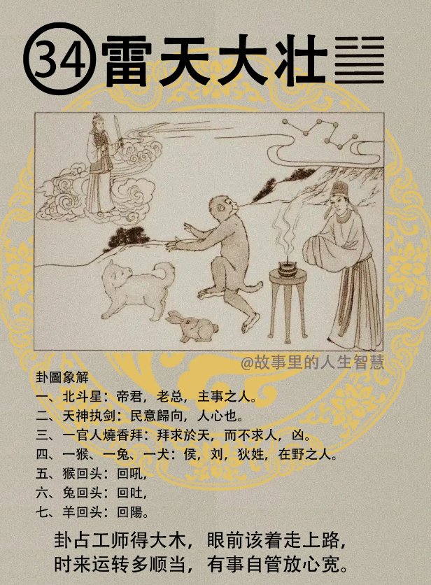

什么叫大壮啊。

#### 先天卦

如果先天卦逢到大壮卦的时候。

第一个，猴，羊，犬成格，成一个格，如果他刚好说我刚好长男，我是大儿子，长男，更壮。

第二个，女呢，不成，女人得到雷天大壮的时候会招凶，为什么招凶呢?过刚，女孩子太刚猛，不好。

第三个，那成格的人呢，凡是成格的人，逢凶，每个人都会有凶事，逢凶不为凶。名扬四海。然后呢，文武双全， 官比父大，当官比他爸爸还大，马英九就是这样，当个官比他爸爸还大，他爸当一个科长，他当部长。当然他早逃走了， 不好意思啊，赶紧退休。

第四个，遇到这种人，九重禄命位至三公。

#### 后天卦

如果你是后天卦，后天卦逢到。

第一个，中年以后，平步青云。

第二个，这个后天卦有八个字啊，这个最早的时候这个我们老祖宗呢，给这个后天卦的时候，八字，给君八字，不是算命的八字啊，是八字真言，遇到这个卦怎么做。争时宜远，和时宜近。这个到时候诸位就会用到，这个没有办法解释，因为我们也不知道。等到事情来的时候，他自然就会知道。

第三个，那一念之间呢，天地反复，完全不一样，你一念之错的话。

第四个，后天卦遇到这种呢，猴，属猴，属羊，属犬的，加贵，还要更好。

第五个，女命逢到的时候，后天卦逢到的话，这个女孩子命逢到的时候，当官呢，比她老公还大，现在太太比先生官大。这个女人逢到的时候，官运比较大。

第六个，后天卦还有一个，如果你受天子禄命的时候，所谓受天子禄命，直接总统任用你的时候，得人心却背利，这个背利呢，背后，这个利本身并不是得利的利，背利就是说有一种被利用，被利用的现象。

#### 流年卦

流年卦逢到的时候。

第一个，贵人，来助啊，贵人来助，则快利财，那过去我们讲快利财，就好像现在赌钱，或者是乐透中奖。

第二个，那流年逢到，猴，羊，犬，逢到猴羊犬呢，加吉，将更吉。

第三个，当官的人呢， 当官的人逢到，升迁，他升迁的时候还求之不得，原来想求都求不到，升的非常的好。

第四个，男人逢道的时候，妻，太太重病，但是无灾，这个病灾会有解啊，会平安。
