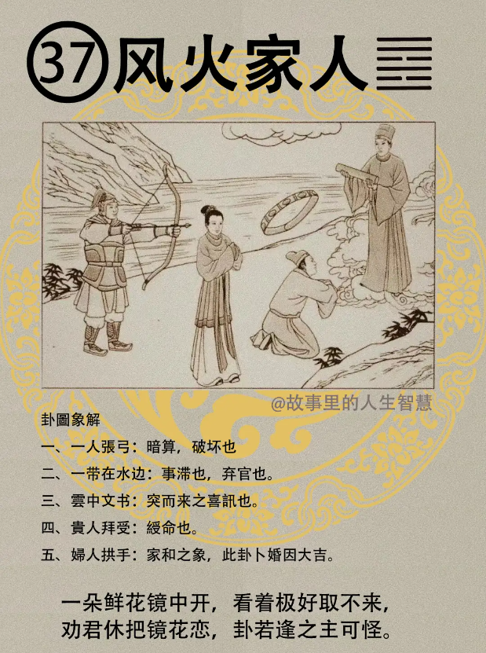

家人卦呢。

#### 先天卦

第一个，这种家人卦的时候出现顾名思义家庭非常的和睦，那家族的事业也是非常的兴盛，遇到这种情形的时候，都是田财广进，小的时候，家里面家业就会一直到老，先天卦走完。

第二个，然后在先天卦这一段时间呢，科甲，家事也不错，然后读书考试又考的很好，科甲高中，有没有，是不是? 田财广进啊，钱财光进，科甲高中，生而为官，他不需要去当官，不需要去贪污，家业就很好。

第三个，这种状况呢很好，有一种现象也是不错的，妻妾个一， 这是我们男人的梦想，好， 梦想，兄弟呢，一文一武，严母持家。

#### 后天卦

后天卦，后天卦如过是风火家人的话。

第一个，这个人呢他的事业会由武转文，由武官转到文官，然后受到封印，先天卦和后天卦还是不一样。受到封印，然后刚开始由武转文的时侯，刚开始的时候，先有阻滞，因为带在水里面，事后成，阻滞过了以后就非常的好。

第二个，太太的助力大，唯逢水，逢到，后天的流年的时候逢到水年的时候凶，逢到水年的说很凶。

第三个，婚事吉，婚姻非常的好，主得二子，两个儿子。

#### 流年卦

这个流年，如果流年逢到，老师我二十五岁正好风火家人，流年逢到。

第一个，逢之有科甲，那一年你正好高考，上。那官人受印，上了之后很快就分发了，有的人上了三年还没有分发。这一年呢，大贵之年。这一年非常的好，婚必成，那一年求婚的时候，一定会成，那你如果，会算命，事先知道啊，知道婚会成，就找一个梦想中的女孩子去追，跪在门口，就成了，好。

第二个，这一年呢恰逢水年，如果那一年刚好是水年，这个大家要注意了，叫防人生暗害。诸位要留个观念啊，要害你，真正会害你的人，他一定是暗害，因为很多事情，当着大家的面，明着跟你讲的人，都不是害你，背后讲你才会害你，懂我的意思吧? 所以一定。很多法官办案子，对面讲的话都真的，背后讲的都是假的懂不懂? 给人家制造诬陷。那你知道，那老师这句话批下去之后，他还是被害了怎么办? 这就是我讲的人间道啊我就告诉你什么叫小人啊，什么叫做人才，什么叫做庸才，小人的动作都是怎么样，我们看象都是教你如何去识人，懂我的意思吧。诸位呢，人生一定要会识人，有的人天生就会识人有的人天生不会，不会叫后天的训练，我们就是这样，训练你如何识人。最坏的拿出来看了，没事你拿出来看了孙 X，就知道了。 就可以把图读完了。