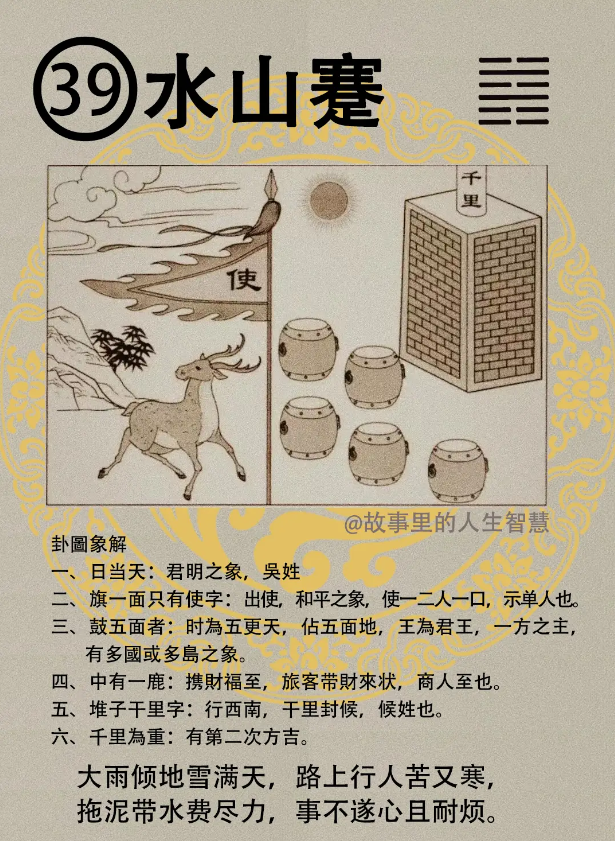

这个水山蹇，蹇卦，蹇卦出现的时候。

#### 先天卦

第一个，生于官家，日头正旺。两人一大口，六亲数在五人。但出一卜，一商人。一卜一商人。

第二个，那这种人呢，被你算的那个人呢，外地封侯，被你算的人绝对不是一卜，这一卜是我们这种咖，算命的咖，这个就看我们这种咖，外地封侯，一方之主。

第三个，像这种呢，先天卦是水山蹇，不为使节，就算不在当大使节的时候，为儒林，也是很有名的老师，读书人。

#### 后天卦

后天卦呢，后天逢到的时候，很好玩。

第一个，夫妻同出外地，五人相从，为什么?从本来就五个人嘛，一个双人， 四个，五个，从（從）字本来就是五个人。 

第二个，夫来从官妻生财，就是男命和女命，男人的命呢，后天卦，男人逢到的时候从官，女人逢到的话，去从商。三子去一，发两房。

第三个，特殊的还有一种状况，还有一种状况，女命呢，还有一种特例，逢之，有一种现象，千里单骑，千里单骑出外求财，然后呢，岛中居。

#### 流年卦

流年卦，流年逢到的时候。

第一个，夫当外出，求禄，财禄必兴，一定会很兴盛。

第二个，如果官人逢之，你是当官的，逢到的话出外使节，现在当大使了，小心，一个不小心把台湾国籍弄成中国国籍，你就下台了，现在已经下台了，为什么?我们把中国的当官的都看透了嘛，他们非常注意形，没有注意神。

第三个，那流年逢到这个时候，女命逢之，女孩子命逢到水山蹇的时候，女命逢到这个时候，须防，子劫，偷天换日。那这里呢，有两种状况，好，一种是儿子被人家抱走了，小孩子被人家抱走了，很多人在找小孩子，还有一种呢，儿子行窃盗，这个要注意，那你怎么知道从哪里来呢? 你看这个更，五更的更，日字在中间，天字在中间，夹进去，偷天换日啊，日把偷走了，这是什么，这是朱雀，窃灾，所以很多图呢，我们都是从六神里面找出来的。我讲的这些词啊，那个铁板神数里面都有，我们把它集中起来。