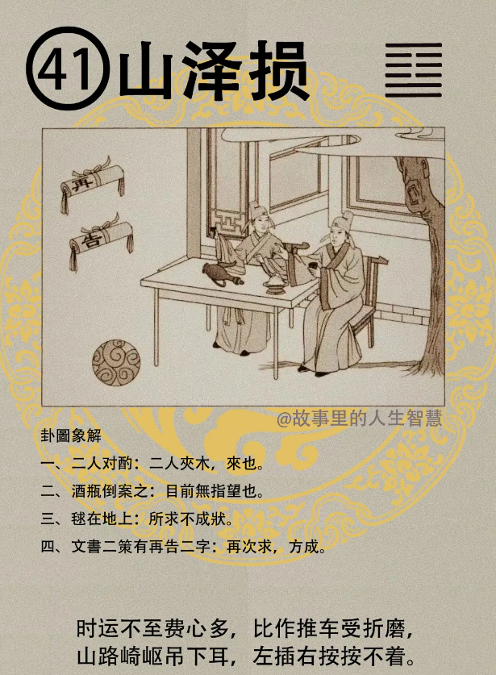

解卦完了以后，诸位看山泽损卦。

#### 先天卦

第一个，三人损一人，攀龙附凤，求功名。

第二个，这种八字呢，始成终败，为定数，就是为定限。

第三个，举人终生，你一生做举人就行了，举人终生一生平安，千万不要贪多。

第四个，那父不父，子不子，中间有个不完妻。

#### 后天卦

后天卦，如果后天卦遇到损卦。

第一个，明月当空，我们的月有很多解释，明月当空，清闲度日，明白我的意思。

第二个，遇到损卦的时候，后天卦，遇事力求反失，想去争取，反而会失掉，要再次可成，一定要做到第二次。

#### 流年卦

如果流年逢到的时候，流年卦最重要。

第一个。二人同力，所求初不成，再次吉，就是第二次才成。 

第二个，官事，当官的人，不升，财禄呢，天机道就是不求反吉，越不求财，财就进来，不求反吉。损卦完了好，诸位看下面那副卦。