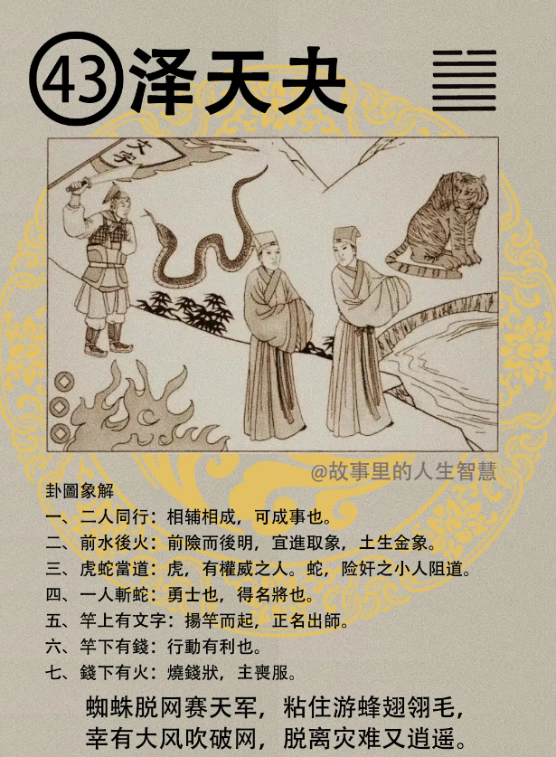

泽天夬，快卦，这个为什么我们书上没写，因为后面我们还要增炼很多进去，书上反而写的不是很好。一直在增练。

#### 先天卦

先天卦，如果你是泽天夬，快卦的时候。

第一个，一生辛苦啊，白手成家，求科甲吉，当公务员， 当老师，求科甲吉，求财去做生意呢，利少，赚不到什么钱。女命呢，为师道，当老师，终身可吉。男人逢到的时候泽天夬，武官最吉，当军人，当警察，最好。如果这种泽天夬先天卦的人，他去求官，求富，这种官就不是武官了啊，是文官，求官求富，招害难免，一定会招到凶害。婚事难成，遇到结婚的年纪到了的时候，婚事难成，要成的话很简单，要逢虎刚断，乃利。夬卦的年呢，后天卦，如果走到泽天夬，逢土金之年，遇到土年，金年，前险后阻，商人求财不利，钱不进来。后天卦呢，只发武将，只发武官啊。后天逢到虎年，或者遇到老虎的，你的老板，主观是老虎，遇虎大贵，都能够逢凶化吉，虎年的话都有吉。那夫妻呢，相助，夫妻感情非常好，但是有一个缺点，母子相继。流年卦呢，你的26 岁，流年刚好逢到这个，婚事易成，一个冲动结了，这个时候外圆内方，天地交泰。这个外圆内方是告诉你，遇到这种事的时候你怎么面对他，婚事的时候一定要遇到这种， 因为你泽天夬，里面有险，所以外圆，外面要圆滑一点，方在里面，不要太刚直了外面。那那一年的时候你36 岁，刚好去做生意，好，那一年的流年刚好逢到泽天夬，他的财气欠旺，得利二，三分。 同时呢，家有丧服，这要注意。