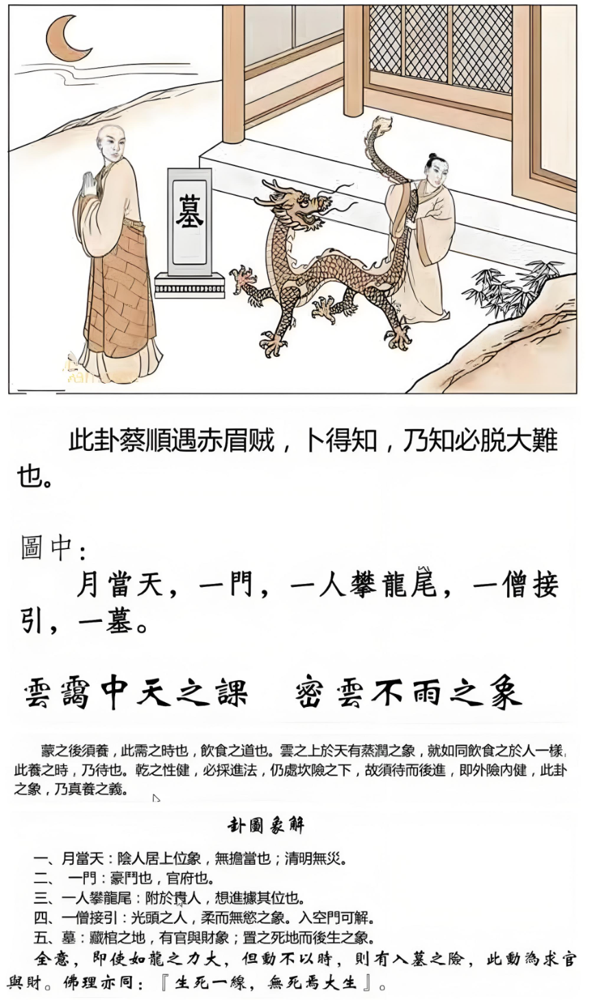

看到这个，在下面是水天需，我现在写的不是太好，我们发行的时候很抱歉，你们大家看的到。那你偷偷看录音带被我骂了，没办法，那你书上没有，书上不会印出来。

#### 先天卦

水天需，看中间这个图，两个人在里面摆着龙尾巴，一个墓碑在里面，一月当天，在一个门里面。如果你算那个人的先天卦，老师他是水天需啊，天跑到水下面去了。

所以父先丧，爸爸先走，妈妈独养成，妈妈独立把他含辛把他养大，含辛茹苦的把他养大，这是先天卦。

所以如果这小孩子刚生出来，一排到这个卦，马上就看到父亲走，懂不懂我的意思。丈夫人中有那么短，短命，八字再拿出来一看，再一看厨房在西北角，问题就会比较多。

攀龙，附凤，居於尾，居在尾巴。

那五岁之前，有凶事。

二十日大人入土中，这个要你去悟的。

这个墓啊，本身是不是太阳，日入草，草头在上面，日入草下，地中，土在下面， 人在地的中间有没有， 一个人，地在这边，人在这边，人在下面， 上面是日头，然后草在这边。

攀龙，附凤，居於尾，那这一句话呢，临床上看的时候是这样的，他爸爸过世了，只剩下他妈妈一个人带他，然后妈妈养他比较辛苦，后来又再跟另外一个结婚，那个人有钱也是把他当成自己的孩子一样，就是居在尾巴上面，就是这样子。

#### 后天卦

后天卦呢，如果你的后天卦一算算到是这个水天需。

侍君身策为驶席，驾驶员，公车司机啊。

跟随贵人，终其一生。为什么? 摆着那个龙尾巴，跟在贵人后面，终其一生。

那这已经很辛苦了，结果呢，还有兄弟争财，兄弟为财而争。

然后到结果呢，后天卦如果是水天需，老来入门， 门开这是空门，老来入空门。

#### 流年卦

这个诸位在图上面，在流年的时候，诸位看到龙出现，我们宠是不是这样写的啊，失宠，有没有，失宠无官，所以那一年如果有龙在中间，龙尾巴被挡到了，对不起您丢官了，所以流年卦出现的时候，流年卦逢道，如果30多岁流年卦逢道，水天需，那你一定丢官。你的丢官不是你辞职啊，是你不得已，非己所悦也，没有办法的，丢官了。 

流年卦第一个，记得有父凶，爸爸凶啊，有父凶之虞啊，爸爸要过世。

然后给你一个天机，草中有玉，不见天日，这是当时你遇到事情的时候就会知道。

还有呢，尾大不掉，任人宰割。千万不要再相信人家，自己的房地产给人家保管，结果人家偷偷的过户掉，过成他的名字。

丢官。

然后遇到这个流年卦的时候，过去我们的祖师，就告诉你，入空门可解，那一年不然入空门算了，这是消极的避灾，所以以前要避灾的时候，就是以前，他们只了解卦，没有用在阳宅上面，诸位我们讲到64个爻，64个卦在变化的时候，那阳宅是我们自己，我们现在把它重新读出来。以前邵康节，他们都不晓得这个的。会用但是不会解，解都是要入空门的，去读书啊。现在没有那么多空门进去啊，对不对，以前跑到山里面就可以入空门了，对不对，现在读书可能比较方便， 以前都是这么解得。

那一年你流年逢到的时候，你会发现一种现象，婚姻，你看我今年的婚姻如何，我今年来找你最重要的目的是看婚姻，我们电脑说一看，今年是水天需。

婚姻，婚事有凶，易结难离。你结婚的时候很简单，要离婚的时候，对不起，易进难出，绑着着尾巴不放你，龙在那边。

好可怜，有待戌年，要到戌年才会发福，发禄，福禄从这里来，但是要等到戌年，或者是遇到这个戍年那一年是时机，或者是遇到犬。肖狗的人，或者是名字里面有狗的，或者是在那边站着看着就像狗的。有人站在那边看着像哈巴狗啊，那你找他跟他结婚，去找他。所以你如果你要办离婚官司的话，你看到那个律师长得像一只狗，有的长得很像狗，哈巴狗，律师您贵姓，我姓狄，你属什么? 我属狗，找的就是你了，赶快过来签约。

诸位学到这些就要帮助人啊，帮助人，千万不可以害人。