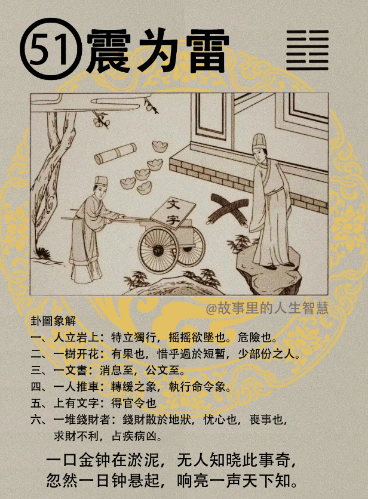

再一个震为雷，

#### 先天卦

先天卦出现震为雷的时候。

第一个，生有一口，好辩才，现在我们知道很多人是这样的，好多人先天卦，震为雷。然后呢，又是长子，成格，成正格。

第二个，乡里之间有名声，这种人白手兴家。

第三个，一朝得禄命，这就属于贵命，禄命得到的话，就运转四方。

第四个，往往这种人犯的最大的错误，就是最大的错误就是不知道居安思危，所以好景不常，所以他这种人往往很快就下来了，大起大落形的。

#### 后天卦

如果你发现你的后天卦，震为雷。

第一个，你感觉到你位高不稳，前半生不一定是震为雷，要是职位很高，但是工作做的很不稳。所求啊，如果求财还是求什么，所求必至，但是所求的都会忧心不断，都会很担忧，来的都不是很踏实。

第二个，做生意的人求财得财，做生意的人是大发财，钱财积的很多，但是都不长久，都是没有办法长久，这就是易经的人间道讲的，为什么不能持久呢? 戒之在盛，人在最好的时候，盛时的时候，最好的时候，才是戒的时机，不好的时候，跑路了，还去戒，每天担心小偷来偷你吗，那你太看得起自己了。

#### 流年卦

流年卦逢到的时候，你那一年是震为雷。

第一个，主的是财官双美，两相宜啊。

第二个，记得这里有一个天道，逢五带孝。一四得令，你会得到任命都是在一四，逢到五的话带孝，二十一岁，二十四岁。二十五岁，这是逢五。