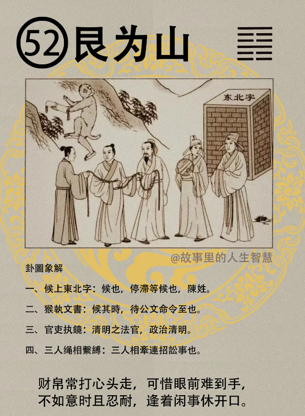

诸位看艮为山， 艮卦出现的时候，

#### 先天卦

第一个，数上面怎么记的呢? 五房兄弟，二房贵，正房偏房都包括。

第二个，那在这个数中呢，最好的是什么? 猴子，属猴的三子成格，就是排行老三的成格、主官贵，只要成格，我们见到成格的都大贵，不是大富就是大贵。 

第三个，生猴，猴子的猴加一个边，你又是生是猴，逢又是逢的猴年，发黄甲，黄甲就是很高等的金榜题名啊，尤其利司法，司法人大吉。

第四个，如果不入格，就是不是我们刚刚讲的格的人，没有进入这个格的时候，不入格人主是非，一辈子是非很多，多讼多灾，数中定。为什么会有这种现象呢? 我们这个卦好像我们一个出生的时间，这个流年逢到这个卦，同样是早上七点到九点，或者是八点钟生的，八点零五分生的，八点三十分生的，这卦深浅，懂不懂我的意思? 卦的深浅，我就直接把他读给你们看了，我们排到震为雷，没有逢到这个卦性比较浅，反而反过来是非很多。

第五个，那遇到这种情形怎么办呢?不贪不求，待等时机，不贪不求等时机，这种人呢。

第六个，不为医林，为儒林，不去当医生，去当老师。不为医林为儒林。

#### 后天卦

后天卦，如果后天卦是艮为山。

第一个，官止不进了，当官到此为止了，科长干到退休了，那副官就干到副官，干到顶了，官止不进。

第二个，如果逢猴年的时候，逢猴的话你会封侯，会外出当主管，但是一定要逢到猴年，那你比如说先天卦走完你刚好走到是50年，你剩下15年，15年没有逢倒猴年，当然一定会逢倒，12年一个猴，那逢猴的话，或者是逢到你的主管是猴的话，才会出现。很晚很晚才发禄，如果你走到56 岁，很可能就好退休以前都不会升官了。

第三个，求财，从商，求财或者做生意的人，官讼连年，所以后天卦你是做生意的，结果你一算到后天卦是艮为山，官司是非。

第四个，逢到申年呢，大忌，申年大忌，唯一的一个是不求侥幸，才能够逢凶化吉，做事情绝对不能抱着侥幸的心理。

#### 流年卦

流年卦，流年卦如果是你是艮为山。

第一个，那你说老师我刚好属猴，猴人逢之啊，主大吉，属猴的人非常好，就会变成，身受禄命。

第二个，如果说，老师我今年我是艮为山，我去合伙，合伙呢，开张那天我送你两个字，必凶，还招人连累，受到人家的拖累，所以绝对不可以去合伙。

第三个，那如果是那年是考试，刚好你那年，流年卦正好是良为山，科甲逢之，大吉。那一年刚好流年逢到，婚姻亦吉，婚姻也会很顺利。