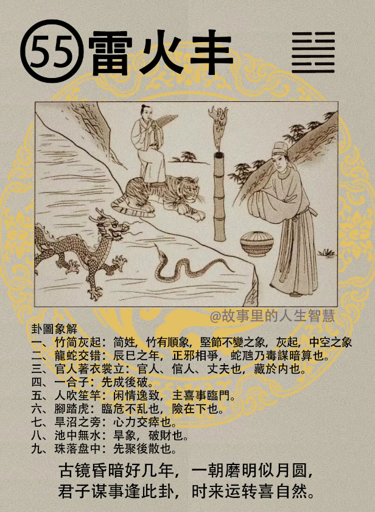

雷火丰，其实每一句话我都可以从图里面，没有时间跟诸位讲，都在图里面。

#### 先天卦

丰卦出现的时候，先天卦逢到的时候。

第一个，叫做虎蛇龙三人，先聚后散。

第二个，那这个人呢，外实内虚，官运不明，就是停在那边，该他升他不升，官运不明。

第三个，进退两难，进退不得，进也不得，退也不得，动也动不得。丰卦出现的时候，叫做至丰之道，丰盛之道，很简单，不求则丰，越不求越丰盛。

第四个，那先天卦还没走完的时候，遇到龙年，或者是蛇年，龙蛇之年，变化非常的多。爸爸，丈夫受累。

第五个，外喜，内忧。客户到你面前来，或者是朋友，见到你在那边笑，你看他两眼，洪水冲，就是黄黄的，红丝贯睛，外喜内忧。 

第六个，雷火丰出现的时候，一种，现在独立工业，现在做的工业不是商业，工业这种非常的好，工业的人，无人争利，制工啊，大火在那边烧。

#### 后天卦

第一个，如果是后天卦逢到夫妻凶，夫妻会离婚，外喜内忧。

第二个，对商人来说的话，后天卦逢的话，商机，做生意的时机非常的不好，慎防破损，那其因呢，一定是识人不明。我们为什么教诸位很多看人，用耳朵听明，一句话去听，识人啊要很重要，诸位将来不管在社会，在企业上面，在公司上面，办公室里面，识人不明就祸害千年，你没有第二次机会，识人要很明，能够很好的政治家，能够识人。识人不明，时机丧失，后天逢到这个卦，他看到这个卦的时候，他一定是感慨万千，识人不明，当他时机已经丧失掉了以后，他造成很大，时机没有掌握到，对你来说就是伤害，这时候再去后悔，再去学识人，就要买录音带，六万块，刚开始就可以学了嘛。 

#### 流年卦

流年卦，逢之，很好玩。

第一个，贵人，小人，同时在侧，尤其你是老板，如果遇到这个流年卦逢到雷火丰好累啊，贵人小人同时在侧，分不清楚啊。他不晓得这个到底哪个是贵人还是小人。外喜内忧（倪师嘴上读的是内喜外忧，估计是经常性嘴瓢了）。

第二个，官司受累，又会有官司，官司承讼。诸事不宜进，守成的话不宜贪多，不宜进。财禄呢，财破，钱财一定会破耗。

黄历上面常常讲，诸事不宜，有没有? 到底什么叫做诸事? 其实你很倒霉了，你不要去做事就好。要守一点，不要想着出来。