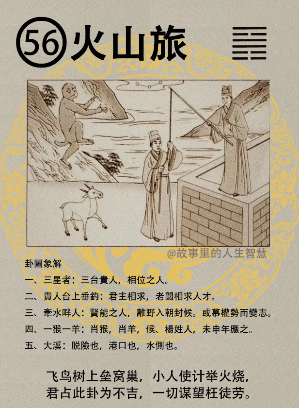

火山旅，旅卦出一呢。

#### 先天卦

第一个，身为公门人，中年前，中年讲45岁，旅卦是45岁前半生，45岁平步青云，从小一直到这个先天卦结束之前。

第二个，那如果再逢猴，逢羊，成格，你的先天卦是旅卦，遇羊，猴，成格，这种人大利西南，大利西南方，外动频。所以先天卦是旅卦的时候，常常被调来调去，调动，包括结婚了以后夫妻都是聚少散多，都会有这种现象。那还要再加上去，属猴的人呢，猴得长一人助，得长的一个人相助，流年再逢到羊，逢羊开泰，逢羊会，流年在逢到羊年的时候，这个开泰，就是非常好，当官的人的话，就是做的很大，位列三台。所以一个人上去的时候，就是时运啊，时运好的时候，羊也可以去带领狮子啊。还有一个李XX 的大笨蛋，那种咖还可以做副总统，看着就晓得是庸才嘛。你们看，连看他的象都不知道他是庸才，你们也不必学看象算命了。太差了。

#### 后天卦

后天卦，后天卦遇到火山旅的时候。

第一个，位子很接近三台贵人，位进三台贵人，不求自来。

第二个，那会有离野入朝，现在很多民意代表离野入朝。未中得利，未中呢，是未年。

第三个，但是后天卦是一样啊，逢猴，羊，主利，非常利在羊年，猴年，但是要防，千万要小心，这个卦出现会乐极生悲，所以就算很乐，也不要高兴太过头了。

#### 流年卦

流年卦，流年卦逢到的时候。

第一个，当官的人呢，升迁在八月，大利西南。

第二个，不利婚事，还有求财，做生意求赚钱。

第三个，女命逢之，女孩子逢到的时候要防一目人，一个眼睛的人，你不要说是独眼龙啊，不是，不一定，不是的，须防一目人。 逢猴，逢羊，一定要忌。那一年流年刚刚好是羊年，要忌，有险，一定会有艰险。就是明中有险，好事里面带凶事，吉处藏凶。

第四个，那如果遇到这种有个特例，本名，是猴羊，反之，本来是属猴，属羊的人，遇到流年卦，火山旅的时候，就刚好反过来，反而主大吉。非常的好。