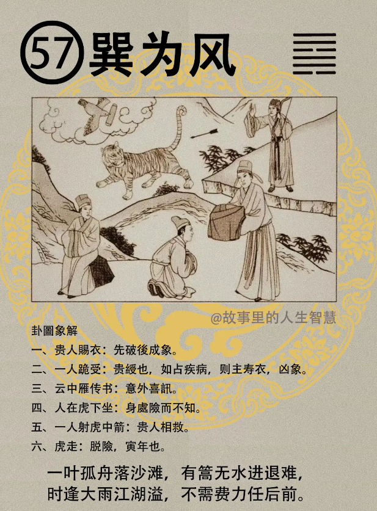

巽为风，巽为风出来的时候。

#### 先天卦

第一个，三人之中伤一人，三才防虎又防雨。到时候看，老虎是寅年。

第二个，正官带印，非常的安分守己的人。

第三个，这种人呢一定要见机而进，要伺机待进，才会利进，不招耻辱。有的人不量力而进，到底什么机呢?机在量力，要量力，测测自己有多少斤两，再去做，量力而进。

#### 后天卦

后天卦，逢到的时候，你后天卦是巽为风。

第一个，出将入相，临受禄命，会受到禄命，但是一定要须防止暗箭。

第二个，虎人呢，难逃，其余平安，其他的平安。

第三个，女人的命逢到的话，一定要防暗害，防暗中之害，吉中有险。女孩子命逢到的时候，吉中有险，夫有难。先生呢，可能会有灾难临身，要注意先生。

#### 流年卦

流年卦逢到的时候。

第一个，这一年巽为风，刚好你又是属老虎的，虎人呢招害，老虎的人碰到是最倒霉的，诸事先成后破，这属老虎的人一定有特别遇忌，化忌就在巽为风那一年，要特别要小心。

第二个，遇到这种人的时候，我们在算命的时候就告诉他，知止方吉，知道止之道是好的事情。可是我们往往跟他讲话，他一出门头撞到门或者怎样，脚踩到什么，就会忘掉，我们后天卦就帮他修正了。

第三个，这个科甲，流年卦逢到的时候，科甲高中，科举会考上。婚事呢，流年卦，你刚好28岁是巽为风，只要28 岁流年不逢寅，不是寅年啊，不是寅年，或者你的对方不是属老虎的，可成，其他如果遇到这种就不成了。

第四个，巽为风出五短之人，个子不高，短短的，五短之人大吉，诸事顺遂，你在给他排的时候，大吉啊，你别看他先成后破，但是他吉啊，你懂不懂我的意思，这是特例，特殊的，巽为风非常的好。