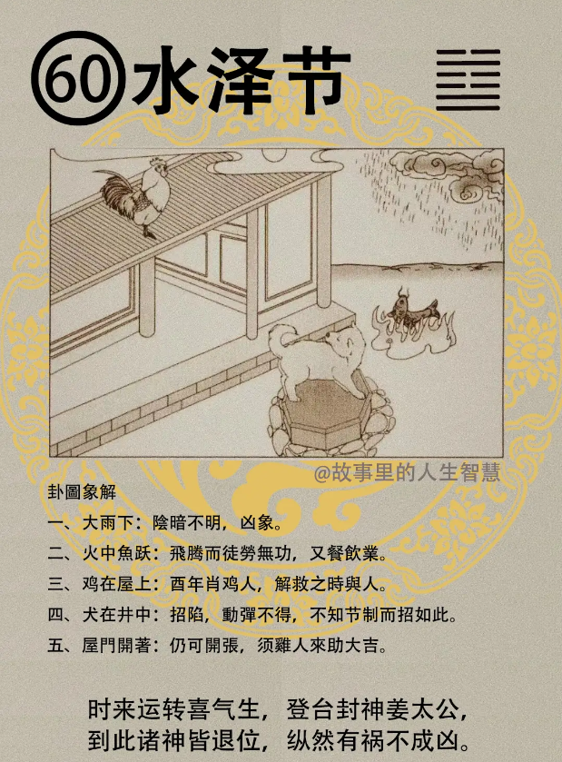

水泽节，节卦呢。

#### 先天卦

第一个，财帛丰茂，财帛非常的多。天意逢鸡，就是属鸡人，你是属鸡的，如果先天卦是水泽节，非常的好。门庭吉庆。

第二个，但是要注意一点，父吉，母凶，妈妈的身体要注意，财散无常，遇犬加凶，再遇到狗年，或者是遇到你丈夫属狗怎么样? 就是会加凶。

第三个，那先天卦还没有走完啊，商机逢酉大利，做生意的人他的流年刚好逢倒节卦，水泽节就会大利。

第四个，遇到这种商机呢，开门得财，犬生暗害，这个人流年走到这个，要特别防属狗的人。犬生暗害，除了属狗的人以外，其他人都是吉，没有关系啊。

第五个，天机在这里，鸡独犬四，数中定，夫凶，妻吉，太太吉。

#### 后天卦

后天卦呢，后天卦逢到的时候。

第一个，就是酉人重立门户，且吉，这种人，会得父之助，爸爸会来帮助。

第二个，犬人呢，自陷，属狗的人呢， 自己陷在里面，皆不出节，节卦就是要有节制，要有法度。唯鸡可救，这个后天卦逢到的时候，鸡代表鸡年，也代表肖鸡的人，属鸡的人，或者长的很像鸡的人。这种长的很像鸡的人，鸟嘴。

#### 流年卦

流年卦逢到，那你那一年逢到水泽节的时候。

第一个，你哭笑不得，进退失据。流年卦逢到一样夫凶妻吉，对太太比较有利。

第二个，那流年呢逢到这个，逢鸡，逢酉会重生，逢犬，犬代表狗年，也代表属犬的，或者到处找厕所的，逢犬陷阱不拔，掉在陷阱里无法自拔。