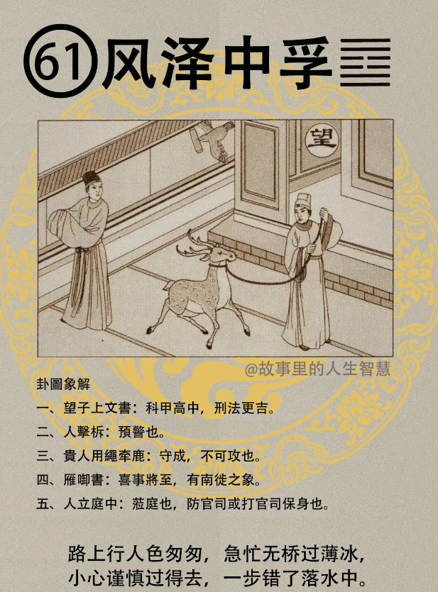

诸位再看地六十一个卦， 中孚卦，中孚卦出现的时候。

#### 先天卦

第一个，兄弟分家，分家没什么了，分家还不相往来，父财必争，一定会争。

第二个，这种人呢，从官大吉，武为司法，文为财官，所谓财官就是在金融界或者银行界，或者是财经界这种人。

第三个，这种人科名并茂，读书当官都很好，犹有一子，有一个儿子在身边，但是这个儿子主是非，这个儿子主是非，带来是非官司很多。

第四个，但这种八字的人啊，先天卦很好玩的就是，他的婚姻，婚事，成于财货，就是因为利益而结合的婚姻，利而结合，也凶于财货，也是因为利害关系太严重了，结果分手。

#### 后天卦

这个后天卦，后天卦出来的时候，上面写的。

第一个，望子上文书，希望儿子考上了，同时呢，节制财帛防人害，人家会贪财把你的鹿牵走。望子上文书，科甲会中，儿子科甲会中。

第二个，做官的人呢，要舍禄求官为上策，做官的人舍禄求官为上策。

第三个，对夫妻来说，夫妻本是前世修，前世修来的，何必为财生争执，遇到这种情形的时候，就会有这种现象。

#### 流年卦

第一个，科甲大吉，非常好，但是财禄呢，受到限，我们禄啊，图上面画的鹿呢，被绳子绑到，就是财禄会受到限制。禄受限，要须防子劫，要小心孩子会劫走你的财。

第二个，这一年呢，喜出望外之年，这个双喜临门，这一年很好。