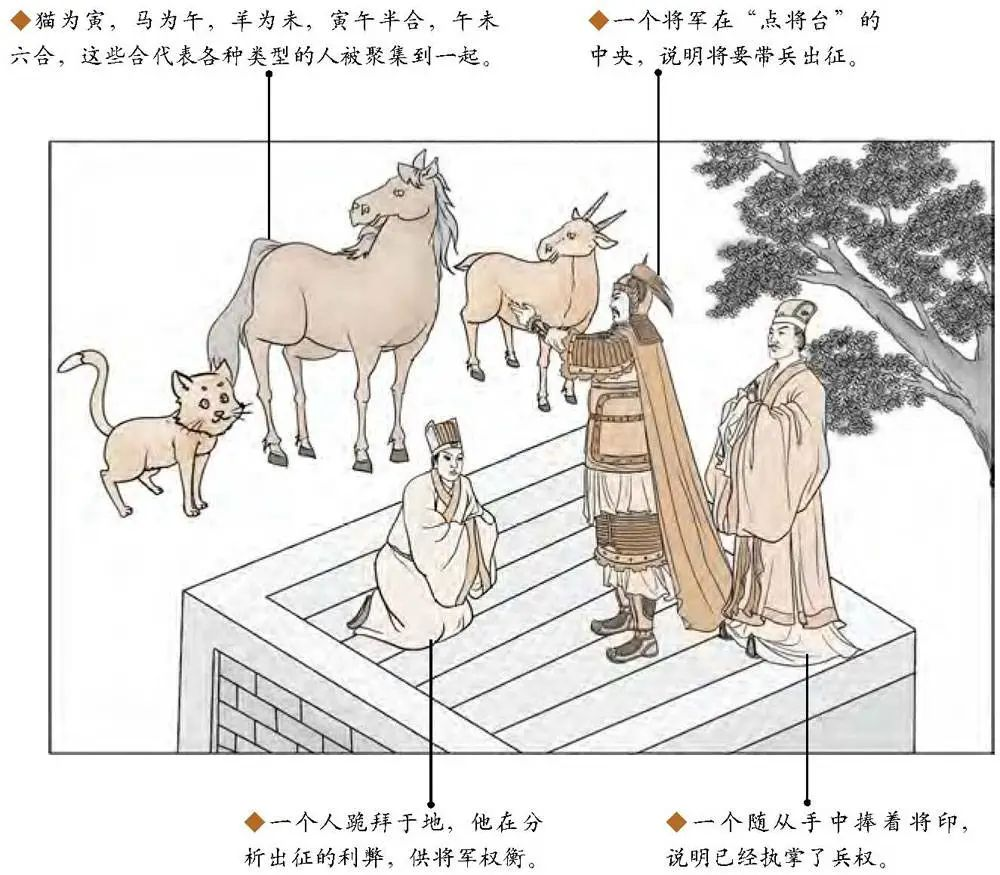
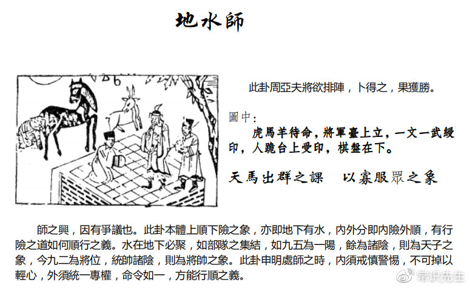

地水师，如果你是先天卦是地水师。

#### 先天卦

遇到地水师，你又翻你儿子的八字，一看，老师我儿子是先天卦地水师啊，很好啊。

天降神武啊於斯人，英明神武啊。

然后这个成格一定要肖马，肖虎，肖羊人，属马的，属老虎的，属羊的，成格。

这种人先天卦地水师啊，林彪。恩宠，九重天，所以一定会受到重用，所以很年轻的时候就当将军，很厉害。林彪打了胜仗，是常胜将军，所以有中共，林彪占了一个很大的角色。可是常胜将军换来了死于非命，我们的陈泽是常败将军，常败将军，干到副总统了，都有问题啊，不按照功勋来，谁对我忠我就用谁，可以吗? 不对的方法。

然后批的时候，这种属于在易经排命的时候，属于将星受命啊，这种人主大贵，尤其发武官，军人，警察，法官，外交官，武官人。然后呢，批在后面，手足三人，发二人，发两个。

#### 后天卦

这个后天卦，如果卜到，你把他排到地水师，诸位给他批这个没有错了。

平步青云，逢调必升，不是我们沈必升，就是必升，一定会升官的，所以很多人名字都重复了，对不对? 中国文字它有用，所以外国人的文字看起来都是朱雀跟勾陈，腾蛇，中国的文字比较有意思。

如果你的 42 岁到 51 岁，流年逢天马，紫薇天马刚好在申宫，在旁边， 紫微天府，紫府同宫，这种就是 42 到 51，逢调必升，调动就往上升。

这个时候呢，出将入相。

棋子呢，少，唯一的缺憾，这个命格唯一缺的就是棋子比较少，就讲这个子，儿子可能就一个，独子，这种现象。

你看，村，有没有，如果把村这样子写呢? 木，寸，寸这个是将，这个是相，有没有?出将入相。儿子叫村很难听啊，出将入相。所以如果有一个人来找你，看这个人应承如何， 写一个字来，村，此人出将入相。

#### 流年卦

流年卦逢到地水师的时候。

叫做升将之年，那一年的升将军，升地方法院院长，升警察局局长，当外史，当使节。派你出去当大使了，好升将之年。那后面有个天机要告诉你的，叫回阳回首，虎为后，好了，老虎在后面。

命印中央，命来自中央，命受封之年，过去就会被弄成诸侯啊或者什么，振远，边疆的，镇国大将军啊，这种的，就会有这种现象出现。

那整个卦还隐含着一个天机在里面，隐含一个天机在里面，当这个人在做将的时候，做将的时候，现在一直有出现。将三人台上立，台（䑓），我不过你讲台湾还是什么，反正台嘛，台，室，下面至，有没有，室人呢，坐喜，室人做喜。这个诸位自己去想啦。
