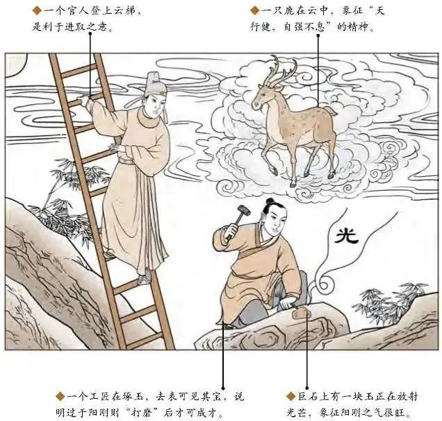

#### 详解乾为天䷀

<table>
<tr>
<th colspan="1">—</th>
<th colspan="1" valign="top">六爻</th>
<th colspan="1" valign="top">过</th>
<th colspan="1" valign="top">亢龙有悔</th>
</tr>
<tr>
<td colspan="1">—</td>
<td colspan="1" valign="top">五爻</td>
<td colspan="1" valign="top">君</td>
<td colspan="1" valign="top">飞龙在天</td>
</tr>
<tr>
<td colspan="1">—</td>
<td colspan="1" valign="top">四爻</td>
<td colspan="1" valign="top">宰</td>
<td colspan="1" valign="top">或跃在渊</td>
</tr>
<tr>
<td colspan="1">—</td>
<td colspan="1" valign="top">三爻</td>
<td colspan="1" valign="top">相</td>
<td colspan="1" valign="top">终日乾乾</td>
</tr>
<tr>
<td colspan="1">—</td>
<td colspan="1" valign="top">二爻</td>
<td colspan="1" valign="top">将</td>
<td colspan="1" valign="top">见龙在田</td>
</tr>
<tr>
<td colspan="1">—</td>
<td colspan="1" valign="top">初爻</td>
<td colspan="1" valign="top">下</td>
<td colspan="1" valign="top">潜龙勿用</td>
</tr>
</table>

这个卦进入人间以后，在我们所看到的就是乾为天这个象一般外面的《易经》讲爻的时候讲的是辞，并没有把它的神传出来，所以刚开始的时候第一个卦我讲的很仔细，依此类推，这个第一个爻我们叫做初爻，第二个爻叫做二爻、三爻、 四爻、五爻、 六爻，我们老祖宗把一个事情的发展、进展分成六个阶段， 当你进入每个阶段的时候，程式都不一样，这怎么解释呢?也就是说你正好在第四爻，在我们初爻的时候，我们叫做下，在中爻也就是二爻的位置我们叫做将，三爻的位置叫做相，四爻的位置叫做宰、五爻的位置叫做君，六爻的位置叫做过，这是它的程式，所以《易经》在讲初爻的时候，初爻是下爻，是潜龙毋用，为什么呢?下指的是下面，你还没有入朝当官，你在野，就是刚开始的时候时机，在这个时候诸位要自修，本身是自修的最好的时机，当你有一天进入二爻的时候，当你为将的时候，当一个主管的时候，或者是当县长的时候我们叫做见龙在田，在《易经》上说的意思是说你今天如果去当了主管以后，你还是一样，你当主管和你当百姓的心是一样的，刚开始你是阳，阳主刚，到了二的时候你还是阳，还是主刚，你不要当官的时候就忘了你是潜龙的时候，现在很多人当官就忘了百姓，不可以的，要阳刚，内心不能因为你做了什么而改变，所以这个时候利见大人，这个时候适去交很多对你有利的朋友，诸位知道什么叫做对你有利的朋友? 第一个交比你懂的多的人， 第二个术业有专攻，交跟你同样类型的人，就是比如说你是律师，我是医师，我们两个在一起律师的问题就解决了，法律、 医疗的问题解决了，再来一个会计师，三个人就能建一个国家了，千万不要交一个一天到晚找你借钱的朋友。进入第三爻的时候，我们《易经》从这里开始分两段，第三爻来说是这是内这是外，这是没有问题的，对这个卦来说是到顶了，所以你从下往上升生到相的时候到顶了，到顶的时候《易经》说终日乾乾，为什么呢? 当你再升上到相的时候，你爱每警惕自己，要静德修业，所以有的人到了42岁以后还去修博士， 因为到了这个阶段如果再不去静德修业就上不去了，但是从下爻到相爻内在都不变， 内在都是阳刚，不要忘了你是百姓的时候，百姓的苦恼不要忘了。 当你终日乾乾、静德修业的时候，不要往上看，要往下看，这个时候你会跳到第四爻，第四爻做宰相的时候在君王的左右手的时候，要或跃在渊，你是一个龙讲的是刚德，刚正的意思， 当你到这个的时候你要待时机而动，或就是待机而动，到底是跑会深渊还是继续待在这里，要看你的君王，要顺时而动，不能乱动。举例，如果我们到了这个位置，有一天开始政治斗争，政争了，这个时候如果我们是相，我们进入宰的时候，已经修业了，这个阶段的时候因为听天子的，如果有政争的现象产生的时候，最好是跑路，什么叫跑路? 我到国外去，不要参与这些事，这叫做因时而动，因为在争的时候你走哪一边都不对，出去等到政争停下来，君爻见的时候，你自然而然会被重用。当有一天你要或跃，或就是看时机而动，否则你一念之差，终身没有机会回头了，当你有一天做到君王的时候，我们叫做飞龙在天，即使你在最下在野的时候一直做到天子的时候，你的心都没有动，都是刚正，都是守着你的原则，所以乾卦叫贞正，要坚心，不要忘了你是百姓的身份，你有一天也会做回百姓。如果《易经》上来说你当了君王，结果呢? 你没有往下看，你还是往上看， 我要当天子不够了，我要做圣人、神，进入第六爻的时候你还是往上看的时候，叫做亢龙有悔，进入亢龙有悔的时候，过激的龙，只相信你自己不相信任何人，请问你中华民2000万人，都是没有能力的吗? 不一定。造成无民无辅，进入亢龙有悔的时候，你会永远没有百姓跟你，没有人敢辅佐你，像谁?袁世凯，当总统怎么够，我要当皇帝，皇帝还不够，还要当天子当圣人当神，当君王一定不能往上看，要往下看。这六个爻，这是天机。

如果有一个人来找你，说我现在遇到问题，我现在是当了相，你看我继续出国拿博士好还是继续当官好? 我今年已经40岁了，如果我出去读书的话我会把老婆孩子留在这边，就很痛苦，如果我不去拿博士的话，可能我的官运也就至此为止了。他就在终日乾乾的位置，每天晃来晃去不知道怎么办，所以你告诉他静德修业，去读书你才会再进一层，不去读书到此为止了。如果是或跃在渊这个阶段来找你的人，刚好他是这样来的话，你告诉他要见机而动，见时而动，这个时就是我刚才说的外地会比本地好，如果是潜龙勿用这个时机来找你，他还没有出来，你告诉他好好的静修参加考试准备进入第二阶段。来找你的人不一定是哪个阶段，还有你自己要知道什么时候怎么做。下面介绍的 64 个卦每个爻都有爻变，比如说我们乾为天，如果按照这个原则来做事情，你就是乾为天，了解我的意思吗? 有没有听懂? 比如说我们有个凶卦是天地否，如果你按照天地否的方式每个爻来做，你就是否了，可能还加个病的痞，所以我们研究《易经》八卦，可以让自己变成卦，也可以让那个人变成卦，然后看到这个人在什么状态之下，我们就知道他目前处在哪一卦的第几爻，从那个爻往上走，如何从这个卦变化，变成地天泰或者乾为天，一下就把他的念改过来了。这就是《易经》。所以我们在讲《易经》的时候，从乾为天第一个天来定位，这是天的性，再来讲坤为地，天地定位以后开始循环了，就好象一个手表一样，如果走到25的时候再要变成几，我们马上就看到了，27、28你再怎么做会怎么样，我们都能看到。我们学的东西就是站在外面看到里面藏了什么。所以要讲六个阶段。

这个乾为天，诸位看这个图象，这个图有一个官人在登梯，空中有鹿，有人在磨玉、拿个铁榔头在敲，玉上有光，月在空中，这是什么意思? 图下面注解的不用看。如果今天有一个人占卜，你看我父亲现在身体病重，你卜个卦我看看有没有问题，卜到乾为天，楼梯旁边有一个棺材在上面，你不要被图绑到了，如果以人间道来说的话，我的这个官运都不亨通，如果我以后继续当官下去，以后会不会亨通?一卜也是乾为天，你就跟他说，你看看这个官人站在梯上就是要居上位而不骄，你今天以前没有升官就是你居上位太骄了，你看那个人在磨玉，就叫你往下看，你看乾为天那个人爬楼梯往上爬，他不是头往上看，他是头往下看，老祖宗就告诉你你往下看。空中有一个鹿，代表是空想意思就是说你要断念，我们是来做官做事情的，不是为了钱，禄要放在空中，我们图上只要看到有工匠，后面的图很多都有工匠，今天为什么请工匠到你家里来? 就是改门面，就是改朝换代。玉在石中还没有露出来，代表事业尚未成功， 同志仍需努力。所以卜一个人的官运，他会升官但是要往下看，千万不要往上看，绝对不要骄，才一定会升官，如果卜到疾厄是凶，如果卜生男育女呢? 这个都是阳， 当然是阳了，不会是六胞胎。一个人在琢玉啊，动作很重要，尤其是对乾为天当官的人，人琢玉，人在那边雕玉叫小心谨慎，雕玉的时候很小心，不然的话手一抖就破了，破了再粘回来就不值钱了。这个卦如果遇到卜事的时候，我们要给客户这样解释。我们在讲占的时候都很分散，一个象很多种解释，决定在看你卜什么事情，客人在问你的时候你可以卜到很多方面，如果卜婚姻呢?一卜到这个乾为天，你说这个婚姻可不可称? 婚姻可称，可是要坚心，要像磨玉一样很小心，不然的就破掉了，如果不小心这个玉随时会破，玉还没有出土，所以你一定要坚心。诸位还有什么看不懂的呢? 有没有? 月在当空，清明的象，后面也有月在当空，都是清明的象，代表政治是清明的，你本人不明，你自己错了，如果没有天煞晦暗，代表你是贤人，你可以退，闲云野鹤退隐山林，这里是政治清明你自己的问题，所以你本身一定是太过骄，一定要不骄，居上而不骄，就会成事。所以一个乾为天卦卜出来的时候，我们有爻课进展的时机，看它到什么时机我们就要做什么事情，如果阶段刚好是相，比如说当部长了，做到组委了等等，如果他在这个时候来你要让他静德修业。
