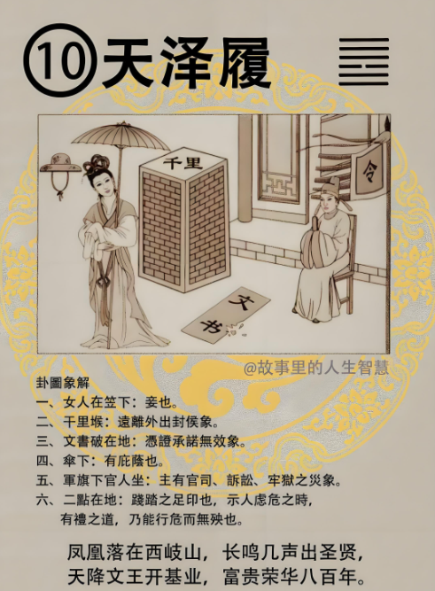

#### 详解天泽履䷉

诸位看这个小畜卦的序卦，我们叫天泽履。

小畜卦的序卦，为什么是履，小畜卦是聚的象，那人聚在一起以后，大家在一起，就礼尚往来了，所以履呢，礼也。而制履之道也就是履，化解履的状况，也就是礼。

那为什么叫做天泽履，天在上面，兑为泽，泽在下，天本来就是在上面，沼泽本来就是在下面嘛，这叫做尊卑、上下，长幼有序，长幼有序就是礼的源头。礼的本。

但是现在外面的老师，所有的宗教家，不管你信什么宗教，都是嘴巴上会讲道理，道理人人会说啊，说我们长幼有序很好，结果回到家里，儿子打爸爸，妹妹结婚姐姐还没有结婚，夫妻要闹离婚，对不对，还有那同性恋。

那现在很可怕，我给那些宗教家信仰宗教的人一个建议，非常多的人，信了宗教以后，拿了宗教后，宗教是一个形，懂不懂我的意思，然后他每个礼拜乖乖地去听道理，他认为听完道理就是圣人，我就不会错了，这种人很多哦。礼拜六才讲完说上帝说不要任意批评别人，有一天上帝会批评你，礼拜天早上，人家送礼到家里来，你就说这种礼怎么可以送家里来，这不是丢脸吗，懂不懂我的意思，背后批评人家，这种人相当多。这个表里要合一的，这是礼的源头。

因为我们的祖宗看到天在上，泽在下，天地的顺序，就是礼的本。

进入人间道，诸位看，天是外卦，这是内卦，外是刚健，外健，泽呢，是兑卦，是喜悦的悦。

外健内悦，我们两个来往，我表示健，表示正直，里面很喜悦地和你谈话，这是真诚的象。这就叫做礼。

履卦当年的时候，子路卜到这个卦，讲履卦的状况给你听，子路有一天到山里面，老虎在睡觉，他走走，不小心踩到了老虎的尾巴，老虎在睡觉啊就醒来火大谁踩我的尾巴，老虎睡眼惺忪看看你是谁，子路一踩道一看哇不得了，往前跑也不是，往回退也不是，站在那里也不是，我在看他，这就意思告诉你进退两难，所以礼很难啊。真正的礼，你要恰到好处，很难，懂不懂我的意思，你礼做的好，就算踩道老虎尾巴，老虎都不会咬你，你礼做的太过，或者做的不及，都不行，这是形容礼的很难！礼是非常难的一样东西。

所以这个卦就是告诉我们，人啊，不要有过多的贪念，贪念太多了以后，就没有礼了，我们去争利。

现在的社会上，我们分士农工商。君子，我们的古圣先贤说：礼要有限制，把你限制在一定的范围，自由也要有限制的，当有限制的时候，我们人就会有定志，各安其位。

算命就是一个很好的各安其位的方法，我们一看，小姐你是公务员的命，你这辈子干公务员领退休金，你一辈子很快乐，你说倪先生，我想做生意当老板，对不对，谁都想当老板，你不行，你去做一定必败，必败哦，你不要说，小姐你大概可能也许会败，她就去做了，你一定要用果来决其行，让她安于其位，她适合扮演角色就安于哪个角色，然后安于她的角色，她的外相，就是外健，每天正正堂堂地面对人家，不会闪闪躲躲，闪闪躲躲的就代表你股票市场输钱，你贪嘛，内悦，里面很高兴，我在这个位置我很愉快，我好爽，对不对，即使是柜台工，有些柜台工也很愉快，每天很愉快的面对大家，外健内悦，就是礼之道。

就是内心要有定志，你要知道你扮演什么角色，安于其位。

现在我们社会上，士人，从下到公务员，上到部长院长总统，都一样，士人日夜所念的就是如何我更尊荣，现在百姓看你做汽车出来没什么稀奇，部长院长都坐汽车，不行，我要坐飞机出来给你看，太过。所有的都想日夜尊荣。

然后农工商的人呢，每天在那里想，我要赚亿万的钱财，已经没有限制了，这个时候，亿万的人口都在互相交利，那你想想看，大家的心怎么会连在一起，你要让天下不要乱，都很难啊，一定会大乱的。

所以我们君子，处履的时候，一定要有礼，礼就要有限制，就好像我们自由也有一定的限制，没有限制我开车开到总统面前停下来，我高兴啊，自由，这不是胡说八道。一定要有限制，有了限制，最重要的，就是每个人都会安于他的位置，这个时候人心就统统在一起。

当你安于你的位置的时候，你不会去羡慕别人嘛，你王永庆有100亿吃卤肉饭和我有100块吃的卤肉饭是一样的，你每次吃卤肉饭放一块黄金啊，毒死了啊。一样的嘛，为什么有贪念呢？

所以我们为什么要去算命，就是叫你各安其位，我们为什么要去改阳宅，也是叫你各安其位。

那各位看这个天泽履，爻卦上面看的时候，我们老祖宗画的这个样子，天在这里，泽在这里，是不是，爻卦：
 
到后面的时候，456爻全部是阳，上面一个卦，下面一个卦，对不对，456都是阳，就是礼之终，就是礼的终极，到了礼的顶的时候，诸位要记住一个原则，叫做始终如一。

我今天是演电影的，我刚刚出来演戏，这个老板说倪海厦我栽培你，花一千万，所以你这部片子能拿十万块，有礼。那么等到我名气很大，老板说这部片子成本只要五百万，但是由于你名气很大，卖座可以到五千万，你可以拿2千万，领完三千万我拿。你说不行，别家高薪更高。你没有始终如一，这是什么人，贪利，现在人就是这样子哦。你忘本了哦。

你如果对一个人有礼，你始终如一，都是有礼，诸位想想看这是什么世界，代表你是真心诚意的，你在很有钱的时候对你很有礼，你在没有钱的时候不理你，现在社会上就是这样子啊，大家摸着良心看看有没有这种人，那有没有办法做到，他有钱没钱你对他都是一样的。

这是一个动作，所以我们眼睛要去看，看一个人，有没有礼，你只要看他对别人有钱没有钱都是一样对待，一视同仁，这是真正有礼的人。现在社会上很多人，嘴巴上讲说巴结有钱人，这句话是自己在巴结奉承有钱人，他不敢讲自己，他赶快先讲别人，这叫恶人先告状，所以读心的时候就是他在讲这个话的时候，他就是这样子的人，懂不懂我的意思。

真的有礼的人，对上下左右都是一样的，根本不要讲这句话，是有礼的人，不会去讲，脑筋是天生的，不会讲这句话，所以诸位出去遇到这种人，就知道了，那就是他，他讲的就是他自己，懂不懂，这是礼之道。始终如一这是他最好的精神。这是礼的极限，能够做到这个样子不得了了。

诸位看占卜，

诸位看，有个千里，文书掉地上，一个女的，在笠下，一个人坐在军旗旁边，底下两个点，这是什么？

你看哦，笠下一个女，妾！哪里啊，图上啊。你说倪海厦，你看看我婚姻如何，一卜到，呵呵，那就脸色就白了。

第二个千里堠，这个墩很高以前叫堠，就是远处到外地去封侯；如果你来找我，倪先生你看看我今年是否会调动，一卜，哎，会调动，调动到外地掌权当主管。那你说很好啊，我说太太等等，旁边还有个妾。卜出来先不要讲，我要教你们讲话，说话很难啊。现在外面乱讲话的人，很多。

傘，一个人，下面有四个人，对不对，就是有庇荫的意思。比如现在有官司纠纷，有伞在这里，有人庇荫你。

军旗下官人坐那边，主的是官司，牢狱之灾；

两个点在地上，两个脚印，代表文书丢在地上，脚去践踏，代表如果有婚约，买卖的和约，有合约绑着他都不理你，丢在地上，践踏的意思。这是卜卦的解释，合约都是无效的。

诸位在这种进退两难的时候，礼仪之道可以化解。礼能解履。

#### 阳宅

阳宅的部分：什么时候有履卦的现象，爸爸没有安其位，乱睡，本来父亲是主这个西北方，结果住到西方位置去了，这个时候，你叫做天泽履，你太太是地泽率，不要讲她，还没讲到。

所以很多男人结婚以后，住到西厢以后，他就发生了一些事情，怎么搞得，进退两难，想往前冲啊，不敢，怕老虎追你咬你，想往后回嘛也不敢，站在那边也不对，老虎在看你，你敢踩我尾巴我正火大呢，他会进退两难哦。

比如说，有一个人想选乡长，已经干乡长两任了，干乡长是在没有什么意思，两任之间有个人有野心，也想当乡长，他势力很大。那我又想说乡长干的不想干了，想去做省议员，可是如果我省议员没选上怎么办，那我乡下乡长没干怎么办。往前走把后面被人家干掉，站在这里不动，省议员那个很可惜，干在原地又有威胁，他跟我竞争搞不好我竞争不过他。

天泽履嘛。怎么办，送礼去啊。你别问我，问我还是送礼，问我第三遍，我还是送礼，懂不懂。只有这个化解之道。

那是人事上的化解，那阳宅上，住回西北角，那就是乾为天哦。那是地理位置上改，那是运气会很好。当你一睡回西北角的时候，上面就来了，有个马脸的，鼻子大大的，讲话声音细细的，武官挤在一起的，哎呀没有关系啊我们gmd人才很多你不要跟他竞选他乡长干的不错。不要竞争何必嘛，就是这样。你一住乾为天，就会有这种事情跑下来。