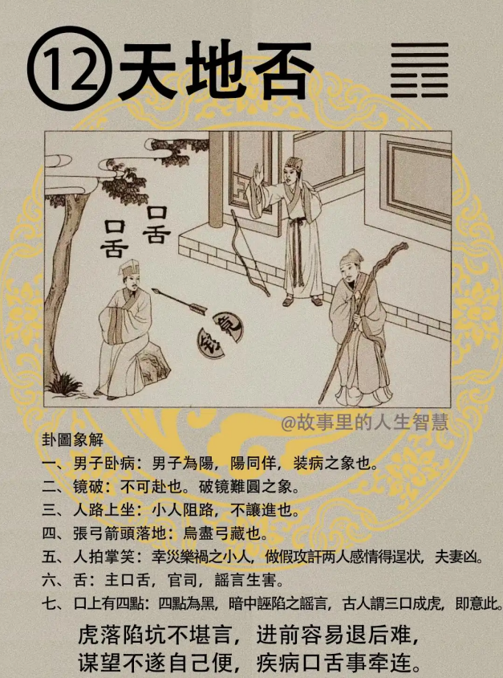
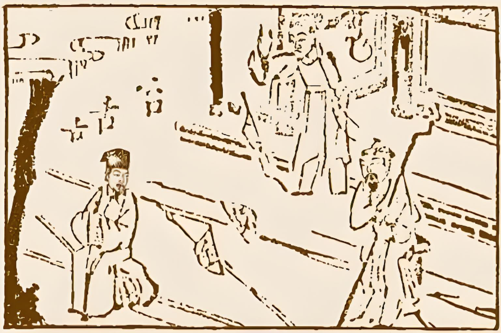

#### 详解天地否䷋

天地否。爻变的时候，上面三个是外，下面三个是内。

我们介绍否卦之前，我顺便用五分钟给你讲一下办公室的风水。所以所有的东西统统来自易经。我们先看大格局，比如说，这个办公室的门，刚好斜进来，从西北角斜开着

1. 办公室的门的朝向，为外卦。

2. 老板的主位为内卦；

比如说，你看他的办公室，刚好进入的门是西北，是乾，乾居西北。然后再一进去看，老板的主位在坤这里，这个你不用看其他的东西，就是否啊。你念fou也无所谓啊，就是否啊。那做生意遇到否，那就完了。那为什么完了，一会我们读图给你们看。这就是天地否。

如果你的办公室是这样子，西南角进来，西南是坤，是不是地，那如果老板的位置在西北角的话，叫做地天泰。

先把位置定好，那里面的办公桌的位置，再朝他八字的位置。

那如果你是东南角，那东南角是巽，是风，就是地风升卦。这个还没介绍。以此类推。会不会，这是办公室的大格局。

慢慢我们易经深入了以后，我们慢慢讲风水。所以易经解释天、地、世间所有的东西，统统在内，到后面批八字排八字我们都可以用易经来排。

首先看天机道，讲天的象，前面的泰，泰的终极，地天泰的时候，终极是上六，是阴爻，如果你处在泰卦，天下太平的时候，如果是一直在阴，一直在柔，柔到后来，其实易经非常在意柔中带刚，君王一定要有威，你没有威，人家不怕你，你一昧的柔，就好像你劝解，劝了半天，很累，那个人还是没有劝醒，没有用的。一定要有带刚性，那到了泰卦的极卦的时候，还是阴柔的时候，泰就到了否地。

所以泰之终极呢，为否，所以我们中国人讲，物极必反，所以在讲泰卦的时候，天地相交，否卦，则天地不交。

注意看，天在上，地在下，这个易经外卦也叫上卦，内卦也叫下卦，天在上面，地在下面，天走天的，地走地的，两个相隔，天地相隔，这就是否卦，否就是不交，两个不交。那天地相交，有了天，有了地，以后，人呢是万物之首，那就形成了天、人、地三才。

算命测字卜卦，都是属于天；看阳宅地理位置还有人间道，所以人间道加上地理位置，就是三分之二，就会大于天这三分之一。这是最合逻辑最合科学的解释。

那易经的原文呢，否之匪人。就是否的道，非人道。不是人君之道，不是正道。所以，逢到否之道，不是符合我们易经的天纪，易经上就是非人道，叫做匪人。

我们上节课讲到天地否和地天泰，他发展的是在一念之间，成否，还是成泰，就完全看你用什么态度。这堂课跟诸位讲，处否之时，当你遇到否塞不通的时候，什么叫否塞不通呢？

比如说他的爻变是这样子：第一爻阴爻，最下位的人，敢怒不敢言，你是老百姓，第二爻你是将军，也是附和，不敢讲话，阴爻嘛，现在社会上很多这种人，该讲话不敢讲，到宰相的位置，还是阴爻，然后让上面是阳爻胡作非为，我非要干，非要干到底，然后上面当了天子还不够哦，还相当圣人，如果是信基督教的话，想当圣雄，异想天开，当上帝，所以就是否。

那处否之时，否塞来的时候，否象的时候，所有天下的君子都不居荣位，因为否之道的话，小人得道，君子道消，以退为进。

所有的小人呢，在否象上面，讲的很清楚，注意看，外健内柔，里面呢，阴为小人，外面看是君子，外面穿的西装笔挺的，讲话讲的都是君子的话，一肚子里面坏水，言行不一致，表里不一致，就是小人。

现在我们国家很多人，我做什么事情都是为了大家，讲了半天，如果你真是为大家，你就不要讲为大家，你就去做好了，如果是君子不开口，直接去做，含章之美，你在那个位置，你本来就该做的，你为什么去讲，为什么取歌功颂德呢，别人不歌功颂德，自己还成立一个日报来歌功颂德，这不对嘛，找一个不对的人去当一个电视台董事长，就是想去替自己歌功颂德。这是不对的，我们要盖棺论定，不是你在那边歌功颂德就可以定了哦。

那君子来说，在朝的时候，是照样，如果你在公司，在学校，是其他什么地方，或者你的邻居，遇到否塞不通，履可解否，易经提到了解法，履卦，天泽履，履呢，是礼，有礼，当你彬彬有礼，人家说鬼不打笑脸人，履的序卦呢，就是地天泰，对不对，前面刚好介绍过，当你处否之时，或者你发现同事同学都不理你了，发现你是痞子，处否的时候，就用礼就可以解。这是人间道。

那如果你现在政坛上面，如果能退居出来的人，统统是贤人，恋栈求进的人都是小人，同类相聚，所以你以为看不清楚，那是你以为，每天去争的人，全都是一票小人。

我们相书里说，一个人的声、神和他的气最重要。那个声音要洪亮，从丹田发出来，要余音绕梁，讲话声音像女人一样，一点点阴桑桑的，也去当个国防部长，不要说开枪了，刀子拿出来就躲到桌子底下去了。这都没有用，这是大痞子。

我们看一个人很好玩，教你们怎么看，比如说我跟他讲话，笑嘻嘻的，因为你的记者嘛，当然对你笑嘻嘻，你旁边一叫我，我就换脸了，你看，刚才还在笑，现在就变另外一幅嘴脸，这种人不好。

还有一种人呢，无事而笑，也是一个痞子，这种人，还没看到你就笑嘻嘻，心生毒计，坏蛋嘛，没什么事笑什么。

否，就是表里不一。那种心虚的人，就会去求外事。没事有什么好笑呢，对不对。

#### 占卜

占卜的时候，诸位看，
 
中间两个人坐在那边，镜子打破了，
两个舌头，四个点，有个人拍掌笑，有个张弓落地，这是什么意思？

你看我们读图给你看，

首先呢，男子卧病，为什么不讲女人卧病，男呢，是阳，尔雅讲是同音，阳呢，佯，装病。我就碰到一个人，装病，脉象心跳比我还好，还说有病，贱。因为他一事无成，他就必须找个理由来面对亲朋好友，佯病，痞子啊，你看。

还有第二个，诸位，去否之道就在这里，当你在政局上面发现小人当道的时候，你就装病退休，都是贤才。

镜破，一个玻璃打破了，如果我们易经上面，镜破太好解释了，夫妻难合，不会团圆。如果是临诏，有征召你去国家当什么部长，不可赴。小人找你你就去了？

人路上坐，小人阻路，不让进也。这个小人呢，在否卦的时候，非常清楚，小人是一群，不是一个人，所以小人群居在一起，他最怕你刚直，怕你去揭发他的隐私，他就会阻扰你。

张弓，箭头在地上，这个是鸟尽弓藏，你被利用完了，就把你当痞子了。处否之时，如果你一卜到，赶快退，不可恋栈。如果你发现你是小人，一定会升官，小人在否的时候都是升官的哦。

这个人拍掌笑，为幸灾乐祸的小人，这个人专门造假造谣攻击两个人之间的感情，造假破坏。所以如果卜夫妻的时候，一卜到，就知道夫妻会分离，就有第三者在中间破坏，卜到了，你就问，先生，您家的邻居和亲朋好友，有没有人煽风点火，咬耳朵的，一定有。

那你说你怎么知道那个人，心生毒计咬耳朵呢，未言而笑。有没有邻居在那里没看到你就在那里笑，都不讲话的，是他。写在脸上的，不敢正眼看你。对你做了亏心事嘛，造谣生事。

舌头，在这里，住口舌，官司。各位都知道了，那这个谣言。

那为什么旁边四个点，一个口，四个点是黑口，就是诬陷的谣言，后面写了三个口，你看他，图上写，一个舌，两个舌，是不是三个口，古人言，三人言成虎。所以曽参的母亲，第三个人来说曽参杀人了，她就跳墙跑了，曽参的妈妈都这样子。诸位，三个人讲话都不能打动你，谣言要止于智，诸位，教你如何听明。不要做聪明哦。听明。

我们去看病，一个人生病，不管你是这个病人的主治医师也好，你是病人的亲人也好，或者是他的女婿或者是子女，好，他生病了，你们去探病。你发现到一个人，不是直系亲戚，而是一个旁系的人，比如说妯娌，或者是女婿啊媳妇啊，一直在讲，你要怎么样怎么样子，你看他又不是医生，他为什么提供那么多意见，这就是心里面做了很多对不起这个家族的事情，在这个紧要关头，要表现出我很关心我这个亲戚，表示我很关系我的公公或者婆婆，哎呀你们一定要怎么样怎么样，表示我很关心，这叫做做人的动作。其实最坏的就是他。这就是听明。

有没有疑问啊。很多人不敢跟我讲话，为什么，一看他说话我就知道他什么事情发生，还没有陈述，我已经讲完了。

那如果你们当面指明，当面骂，你不见得有这个功力，了解我的意思把。

如果是男的，眉毛直的，对着你，这个你们知道对吧。如果是女的这么看，左右眉毛上面这边发青，青色，这是犯桃花的意思。

所以三人成虎，谣言非常可怕，诸位呢，一定要做智者，谣言要止于智者。你听到谣言你也来传，过来说，听说有人说，他说，其实就是你说的。

我一个朋友，跟我很好，有一天他太太打电话给我，倪海厦他要跟我离婚，我说他没有跟我讲，这叫做恶人先告状。然后这个太太就开始讲，我告诉你哦他在背后怎么怎么讲你，我说你讲完了没有，讲完了，我说我刚才听到的都是你在外面讲我的坏话，就是你说的。她傻了说我怎么会这样讲，我说你不会这样讲，你先生怎么会这样讲，你只是借用他的嘴巴讲出来，想破坏我跟他的感情。

你们有没有这个本领听明，真正君子的人，不会去讲这些，又不是很好的事情，干吗到处去讲，对不对，自己做过的事情，结婚也是自己要结，离婚也是自己要离，男人就是敢作敢当，为什么要去宣扬呢。

所以去做人中最坏就是这种人，背后讲人家的坏话，那她给我讲一番话，太好了，我就知道造谣的人是谁，对不对，然后她在我面前讲，然后利用别人的名字来讲。如果是你们的话，一下就煽动的话，你就是小人嘛，因为谗言易入耳，记得哦，所以三人成虎。

天地否和地天泰，就是你一念之间。你家隔壁邻居看到你跟你先生感情很好，他很妒忌，然后呢，开始造谣，那你这个做太太的，本来夫妻很好，是君子，结果太太本身是小人，耳朵很软，听进谗言，人家讲什么，她就听了，人家说你要小心你先生我那天在超市看到什么什么的，这叫做搬弄是非，好了，夫妻两人感情就产生问题。

所以各位不管在事业上，或者是对人处事上面，你不要想去做人，不需要，不要浪费时间和精力，你做事就好。你看有人过来对你示好，说我多关心你，我把所有的事情都告诉你，这叫做做人，不是做事。

如果你的邻居说陈太太我看你没时间买一个东西，今天正好我去超市帮你买了，讲完就走了，这叫做做事，做人的人就在搬弄是非。我算命看过，很多人都是三人言成虎，本来是泰，结果被人害成否。

还有，测字哦。中间两半的镜子，你看他写一个金，和一个竞。很简单，中间是不是破裂了，叫做竞金。如果是有争利，则凶。

他说，倪先生，你看看，我今天去买股票好不好，一卜，天地否，你这个大否子，不必了。金竞有没有，争利，大凶，不可以哦。那你不能说，太好了，赶紧去买，那是你想害他。看你当时的心情如何。如果遇到小人，快，赶快去买。然后他买赔了，过来说倪先生为什么赔了，我没有让你买哪一支啊，你没有问我买哪一只啊，话都是看你怎么讲。所以我遇到这种情况，我都事后先看看哪只长了，哈哈。

所以，这里呢，告诉诸位一个大原则，一般人读到这里，争利，则凶，就结束了。但是我没有读完，争利，四个字就得到了，世界上从古不变的经济规则——背道而驰，对，人弃我捡，人争我与。

我跟诸位讲过这个，背道而驰，你看一票的人冲去买股票，你不要去，你可以抛股票了，叫你卖空啊。没有人买的时候，你买回来丢在那里放着，背道而驰。你以为你要利，所有人都要利，所以要背道而驰，如果香港97大限，全香港的都全部跑路，房地产贱卖，你呢，就进去买，听我的话，买之前你可以卜个卦。看是地天泰还是天地否。等到事后发现没什么，房地产开始涨了，再去买，所有的人，就是同向而驰，你要背道而驰才能赚到大钱。所以从古到今，能赚到大钱的，都是背道而驰的。

#### 阳宅

阳宅，对，嚯，这个阳宅很精彩啊，夫（父）居母位。东南西北，这是母位，这是父位，应该是妈妈住到爸爸的位置，这是地，这是天，有一天呢，住反了，先生同太太住在太太的位置，就叫做天地否。

否象出现的时候，第一个，诸事不顺；

第二个，升迁不成；

第三个，妻盛夫衰。

第四个，得女。

所有这些，根据我的临床，命上面再吉，运为否，地理上住在否的位置，你知道他为什么是否，八字拿出来看，流年都是化禄啊，日月会出大财哦，哎，他住在否卦上面，这个钱就没有赚到。我们算命可以知道他结果钱没赚到，知道他为什么没有赚到，就是因为这个天地否，所以解就在卦上面：

外刚内柔，里面是空的，可是他做事情，住在天地否的先生，往往是很刚强，常常得罪到很多客户，得罪到很多的人，甚至得罪到公司的人，然后四分五裂，然后客户也伤到了。

这个出现的时候，有礼则天下太平，履卦，天泽履，进入有礼的阶段，马上进入地天泰，很快，这是解否的办法。

如果你懂得有礼，你懂的人间道，可是如果你在位置上住的是否的位置的时候，我跟你讲完以后，你只是一时知道有礼，你没办法一世，懂不懂我的意思，过不了一会，又回到原状。

所以易经说要好的话，要贞，我叫元亨利贞，这个贞就告诉我们，要坚心，当我们决定有一个方向的时候，要像一个工匠在磨玉一样，要始终如一。所以位置上住否，讲了半天告诉他，他一时改，后来又回头，一定要在这个位置让他养成。

那如果他是一个很坚心的人，所以我们平常说，培养你平常心，像佛经讲，培养平常心，你看那个小孩子哦为了喝一口牛奶，陪你吵一个小时，我告诉你，你不给他，他就永远记得，今天一定要喝，一直到睡觉前，他还记得那边还有一口没有喝，他就记得，坚心。

他如果从头到尾都非常坚心的话，他符合人间道的话，他随便住天地否，他倒立着睡，他还是泰卦，懂不懂我是意思。

所以如果你有人间道，你真能把人间道做得很好，真正能够执行他，而且24小时的遵循他，而且坚心到底的话，地理上影响不了你，懂不懂，你不受到天地空间的约束，你可以任意遨游于宇宙之间，所以人间道很重要。

所以比方说，我们地天泰，外柔内健，外面很谦和，里面很刚健，内充实自己，这种人到哪里去走遍天下。那有的人是外面很刚健，其实肚子里面一肚子坏水，哪一天他会恼羞成怒，很多人会恼羞成怒，自己做了不对的事情，回来太太一讲，他就骂，打，那太太以后就不敢讲了，对不对，他外面看起来很刚健，里面是空的。他就是天地否。

所以我们不但可以去否，有礼可以去否，我们还可以造成否，也可以造成泰，完全在我们一念之间。里外两个态度不一样，一个泰，一个否，马上就可以看得很清楚。所以天和地之间陈述的道理比较多，所以我们陈述的比较多。

那如果住到否的位置，在阳宅上面来说，因为妻盛夫衰，这是地理位置，占三分之一，那如果这个人命上面，他是二婚命，八字里面是二婚命，天命占了三分之一，那地理加上天命，是三分之二了，就大于人间道，懂不懂我的意思，那就变成只有你懂人间道，你那口子不懂，还是离婚，无法挽救。

所以我们看一个人的八字，是二婚命，那一定要看他的阳宅要有，然后那你不要管人间道，这个人就算是至圣先师，照样离婚啊，只要他的命是这样子，他的阳宅是这样子。

所以，我们常常说可以害人，就是怕旁边有人害人，刚好你懂啊，哎，你家里为什么这样子，他一看完了，你懂，他小人的动作就被发现了。

那根据我现在临床的经验，所有外面的，不是我们这一派，出去给人家看风水的，看了半天，就是一个萝卜一个坑，他的命中注定大限到，找到的算命师改房子，西北角就改成厨房，夭折，罗盘一摆，刚好就在那个地方。找算命师改了半天，还是命，很可悲啊，我看的太多了，我希望诸位能够把这个发扬出去，这个天人地的关系。

这个妻盛夫衰看得懂吧，如果我们李某人跟他太太住在西南角，那是他太太当总统，他就没有了。