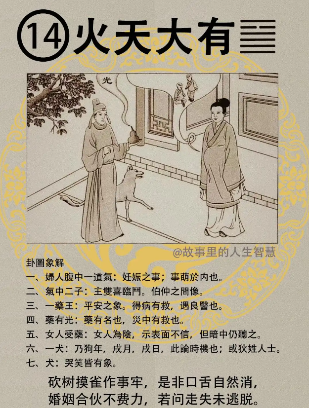

#### 详解火天大有䷍

火天大有， 什么叫火天大有? 离为火，乾为天，《易经》从第一个爻，二、 三、 四、 五、 六，这三个各一组，这是外卦，这是内卦。

大有卦是同人之序，为什么呢? 前面介绍天火同人的时候，人心能同，人如果能够同心，千万、亿万的人一条心的时候，《易经》上在人间道务必所归。如果为政的君王，他的心跟百姓的心是一样的，他了解百姓的疾苦，他做出来的事情都是因为百姓的需要而去做的，这个时候人心统统为所归，统统归来以后就会成为大有。

所以火天有卦专门讲君王之道，就是当总统要怎么做，什么叫做最好的君王，什么叫做小人的君王，什么叫做君子的君王，大有卦完全是讨论天子之道。

天火同人卦是世界大同的状况，可是大同的状况非常容易转变成火天大有，因为人还是有一个依赖性。

真正的大同，世界大同、治世的时候，大同之治的时候是一群人，这一群人在《易数？书？》上来说有17 个人，这17个人在决策一件事情，然后这17个人都是民选出来的，都是过去所谓的智者，然后这17个人无所求，这17个人每天讨论的就是如何分均，分的很平均，这是大同的治。可是这个很难，可能要八百年以后才看到。

那同人，人心一同的时候，非常容易还没有进入大同的时候，一下就跳成火天大有。

就像过去抗战的时候，他能够得人心者，人同之，人同之的时候本来应该进入大同，可是一下会变成大有，为什么? 因为物之所归，人都在听一个人讲话，中国人被同一心。

所以当初我们毛泽东是对的，为什么? 因为中国的十之八九是没有钱的农民，他一提出来农业革命，农民革命、无产阶级，马上得到人心，你知道列宁为什么会成功? 列宁跑出来的时候，所有的苏联的农民，一看到列宁的时候，列宁站在那就是一个农夫的象，农民们觉得这个人长得跟我很像嘛，就是因为这个支持他。有的人为了名字很好听就投他票，有的人因为唱歌好听就投票，人心什么人都有。所以过去能够得到天下就是能够得人心，人心之所就是同心才能够聚，一聚的时候就变成大有卦。

这个大有在物象上，人间来的时候，第一个富有人，有人很有钱，他大大的有一笔财富在身边，这是大有。

先生、 小姐们，富有本无罪，但是你用富有来骄侈，骄就是跟你家隔壁邻居比，我每天过的很奢侈，骄奢之心现于外，这是富有，一定是有祸害，所以如果这个大有用的不得当，反而会招祸害。这是富有的人。

天子之道，天子在第五爻这个位置上，这是君王的位，下面五个阳都来朝他，五位。诸位知道一、三、五本来是阳位对不对?阳位为君位，五阳位是君王的位置，今有阴柔从之，《易经》上就告诉我们了，天子之道要居尊执柔，你做了君王，居于尊位，做什么事情要以柔，这是天子的德性。

卦象外卦是火，内卦是天，火为明，以前我们要点火才能看东西，外火卦，离卦就是明，乾卦，天为刚，等于是外明内刚，一个人如果你要变成大有，要拥有周围的所有的朋友，拥有所有的人的人心。如果你是有钱人，人家只是因为你有钱来屈服你，这个不是大有，迟早会生祸害。真正的大有是要外明内刚，对事外在看的很明，是非善恶分的很清楚，内刚，内里为什么要刚? 因为有刚的人，才能不惑，不被外界所迷惑，不会被财富、权利所迷惑，因为他内刚，内刚的人不会被物欲迷惑，这个时候就能够遏恶扬善。

这个遏恶并不是要把坏事隐蔽起来的意思，而是要揭发它的意思，为什么叫揭发呢? 诸位用天地之间的道理来看，天已经很高了，火在天上面，火在天上面它的明亮很远。

我们有火在三个地方做到，火如果在地下，叫做地火明夷，火在地上叫做火地竞，现在火在天上，为大有。

火地竞，地上有火只是周围一个很小的范围看到光亮，这是诸侯之象，所以火地竞专门是讲为将之道，做诸侯的。

火天大有专门是做天子之道，火在天上照的很明亮，天下人间、所有的善恶统统看到，恶要把它揭发出来，永远不让坏人存着侥幸的心理，因为他知道为恶的话一定会揭发出来，名字还公布出来，如果小孩子做什么事，父母亲什么信息统统公布出来的话，小孩子还没有犯错的时候父母就已经管了。

现在我们遏恶，现在是好事不出门、坏事传千里，一定要这样做，可是现在很多人遏恶之道不对，为什么?老是在挖掘人家的疮疤，我们所谓的遏恶之道不会去挖掘人家的疮疤，而真正的坏人要揭发出来，扬善，这样才能够把人心归象。

你老是说我是天子，我很富有，你们的地统统属于我的，你们的财富是我的，我要抽税，你们统统是我的子民，你们都是我的羊，这样的话，你们都是我的财产，这就不是大有了，所以天下不是私有，是共有的，《易经》讲的意思在这里。

如果你以富有之心来表示，你只是骄奢之心，你做天子为骄、为奢，电视上看坐汽车出来的人，还有司机，前后有警察的，这算什么，想着自己还要坐飞机呢，那都是混蛋，拿我们的钱去充凯子。

大有卦是以君分直柔，遏恶扬善，八个字来代表君王之道，这样人心才会归。这是大有的卦。

#### 占卜

占卜上来说诸位看这个图什么意思? 卜事的时候，如果我们卜到孕妇的事情，有两种解释，妇人腹中一道气，第一个如果是怀孕的，代表肚子里的小孩子是贵子，可能是双生，这是一件事。

还有一件事就是怀孕的妇人在主事。有的人说，卜个卦看看我会不会升官，一卜火天大有，一看先生，决定这个事情的是谁? 是一个女的，她现在在怀孕，成，象出现了。这是贵人，成的原因可能是怀孕的人不愿意在怀孕的时候做一些亏心事，就让你成了。也可能。

第二个，气中二子，主的是双喜临门，还有伯仲之间，两个一样的。有人说你来卜事，美国签证能不能拿到，一卜大有，成，而且还是双喜临门，这个双喜可能是说科甲也有，考试也有，或者是红鸾星也有，或者是财禄也有。

一个药王，这个药王表示平安的意思。现在古书上画的药王，有的人有心病，他要住在医院里才安心，这就叫做小人，因为小人最怕死了。所以如果卜疾病，卜到火天大有，平安，有解。

药有光，难中有救。比如说你在卜卦，糟糕，先生我看工厂的，结果里面有一个人意外死了，我是老板，我到底会不会有事? 卜个卦，火天大有，先生，你没有事，有救，那怎么个没事呢? 火在天上，看的很清楚，跑不掉的，你就报道自首，你不要跑，你根本没有事，你本来没有事，你跑了才有事，跑就是心虚嘛。

女人受药，就是女人是阴，就是说表里不信，暗中偷偷在服药，就表里不一。如果是指生病，是这样。如果是指合伙，合伙做生意就是这样，表里不一致。

一个犬，我们每个卦都有时机，以时机来说的话，狗年或者戌年，像今年就是戌年，戌月、戌日，这是时机，以姓来说的话狄姓的就是狗。

还有一个，第七个，画了一只狗在下面，哭、笑皆有的象。诸位如果光看这个你会很纳闷，可能临事先来的时候，你一卜下去你就知道了，我们老师有一把刷子，你就知道这个这样解释最好。

#### 阳宅

阳宅火为离，所以是次女，次女居父位，成格。

你们看排名是老二，二女儿，南方不住，然后住在西北角，图式在这里，东西南北，西北角的房间叫做次女。诸位记得次女的定义是未婚，还有是姐未嫁，第一个你没有结婚，第二个你姐姐也没有结婚，才是所谓的次女，那天你姐姐一结婚了，你这辈子就没有火天大有了，马上就变了。诸位想想看有没有道理? 有道理。

比如说我们一家人有三男三女在这个房间里，原来一家8 口人，这时候有八个人的相处之道，有一天一个结婚走了，变成7个人的相处之道，再结婚一个就越来越不一样了。你怎么能老是原来的解释? 这不对。你看有没有道理? 如果你们家有6个女儿，4、5、6的女孩子先不入象不入卦，之后顺到1、2、3 的位置，补位上去，大女儿一结婚的时候二女儿补位，老四变老三，这样补上来。

大有卦的女孩子有几种现象，首先第一个阳刚盛于男人，女人主事，二女儿住在爸爸的位置，跟男孩子一样，个性很刚强，嘴巴从早上开始就谈事业的事情，晚上做梦也是事业。

第二个未婚先得子。婚姻算什么?我不需要，我自己可以赚钱，我找一个品种好一点的，生一个儿子就好了。你在不同的位置上就有不同的想法。

诸位不要不信啊，以后住在火天大有的女的，你把我的话讲出来，那个女的腿就软掉了，差点跪下来。

第三个这里要开始进入一个深度，我们有很多洛数。我们用九宫图开看，九在上面，一在下面，五在中间，左边是三，右边是七，二、四、 六、八，这是洛数，这样加15，这样加15，这样加15，这样加还是15，这样还是15，怎么加都是15。

五要居中，而女儿是九位，九居六位，差三位，九比较大还是六比较大? 九比较大，所以它是九，但是跑到六的位置上的时候，等于是进三，前进了三位就变成了六了。所以婚提前三年。

举例，一般来说火天大有的女孩子很特殊，比如说她的命是 36 岁婚，她住在在大有卦的话她会变成33 岁结婚，所以她住西北角，还是会结婚，但是在结婚之前先有子后婚，后婚的夫是已婚夫，可能已经有太太子女了，这个我们不管她。

过去本人的临床是这样的，她去做秘书，认识她的老板，他的老板已婚，但是跟太太的关系不好，秘书原来是在夹缝中间生存的，什么事老板娘都打电话找她，首先她就是半个老板娘，回头一看发现老板娘是小人，到处造谣生事，我们老板不是这样的人，就同情老板，同情老板以后就帮助老板了，先生了一个孩子，生的孩子可能因为老板没有离婚，不行，后来离婚又跟她结婚，这种事情很多。这就是大有卦。