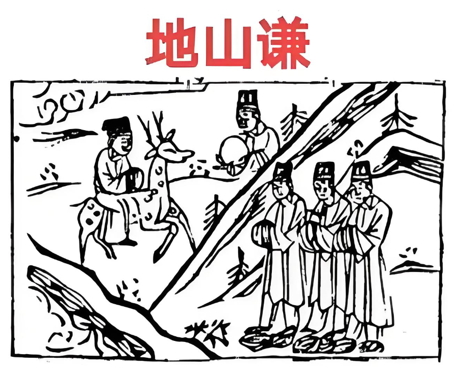

#### 详解地山谦䷎

再来地山谦。这个谦卦本身是大有的序卦，我们人在大有的之后，也就是说拥有了你想要的东西以后，圣人戒盈，盛，孔子害死人，孔子他说我们要戒慎，做什么事情都要小心、谨慎，这是废话，这是要害死人，孔子有些很好，有些错了，读书不能读到被书绑到。

假设孔子是对的，如果谨慎有用，请问你坐飞机上，飞机掉下来你怎么办? 没有关系，我是谨慎的人，可能你烧了最黑。没有用。

所以戒的时候要有时机，所以《易经》从头至尾在谈时机，当你在最好的时候才要去戒，你不好的时候戒什么? 跑路欠了一屁股债睡在大街上，你以为小偷来偷你? 小偷眼睛很亮的，他偷豪门也不会偷你。

所以当你好的时候才去戒，所以这个慎如果把它换成这个盛，孔子就得到神了。结果孔子写的是这个慎，不知道是他错了还是刻字的人刻错了，音是相同，但是字差很多。

戒盈之道就是说当你充满有的时候一定要做到谦，所以大有以后为谦，到底什么叫做谦? 不谦虚? 这个谁都会说，道理人人会说，谦的定义是什么? 你看这个自然的象，地在上面，山在下面，山是世间至大之物，居于地下，所以我们把它用人间道来说的话，就是说有德而不居为谦。你很谦虚，每天都是很谦谦君子，你肚子里什么都没有，你不是山，你没有谦，谦是要有条件的。

现在每个人都说我谦虚，你谦什么? 我看你是笨蛋啊。你要有山的厚德，山的能量才可以。

你想想看山多大，我们人类科技很发达，愚公移山是个寓言，你用现在的科技移山看看，你把喜马拉雅山移到台湾来，笑死人了。

要有德而不居叫做谦，所以谦谦君子真正在哪里? 真正的君子之道无欲，不会跟人家竞争，争利，君子但求达理，他能够达理，永远不会有竞争之心。小人呢?有欲必竞，小人一天到晚比来比去，有欲必竞，这是君子和小人的差异。 

因为有欲必竞，你们注意看外面的人，小人有德必伐，什么意思呢? 当他看到有人比他好的时候，他就开始攻击人家，自己没有能力跟人家比的时候就画个大饼。比如你的电脑很好，小人就说你没有什么了不起的，表面上是这样讲，心里是小人，我要跟他竞争，然后说我认识一个人他的电脑就比你好，假借其他人来压他，这不就是神经病嘛。很多这种人的，这就是小人。所以我告诉你，有一个人说别人怎么样怎么样，他就是小人。诸位想想看。自己不行就说不行，为什么要借用其他人来讲。

在这个地山谦的德我们提出一个，《易经》上写了很多，提一个地方给诸位看。

第四爻这个位置，整个谦卦从初爻，最下位的人，谦之道如何，将位二爻谦之道如何，三爻相位，整个谦卦的重点是在这个第四爻，居于天子之侧的人，谦的真意在这里。

《易经》上写这个，就是劳谦之美，这个劳呢，就是劳碌，在古代有一个人就是劳谦之美，叫周公，当时周天是幼主，周公出来辅佐他，对上，周公知道谦，不把功劳放在自己身上，功劳变成天子的，对下他也知道谦，谦以待人，他是有大德的人，外面是劳没有怨言，所以他定的周朝的事业八百年。

我们现在当官的当政的人就是没有劳谦之美，我们现在都在歌功颂德，每天都要写大记事，这是你应该做的，不然你拿人民的薪水做什么? 什么大记事，本来就是应该做的，还在那边宣扬，宣扬叫做鸣谦，就是叫，我很好，我很好，现在就是这样的人，就是没有劳谦之美。做了你本来应该做的还在歌功颂德。

现在的员工，我不是不同意诸位劳工界的人，诸位摸着良心，老板给你一个月5万块的薪水，就是叫你拿了这5万块，在这个月上班的时间多花点心思在公司上，把事情做好，真的很多人上班的时候看报纸或者人溜了人找不到了，然后哪天薪水被扣了，就不高兴，他还怪老板，没有想到自己做了什么。

现在我们国家最流行这种鸣谦，你看他从来没有怨言的都没有，都不知道劳谦之美，这不是我说的，这是《易经》说的。

我们中国人，《易经》是老祖宗的东西，你为什么崇洋呢，去看圣经？因为你看不懂《易经》，你只好看《圣经》。不懂没有关系我教你，要不耻下问，尧舜三岁小孩讲的话有道理他都接受，谁规定当校长就可以当部长，这是你想出来的。

#### 占卜

诸位这个占卜，诸位看地山。

这个图上面有三个人站在山后面，

有个人骑着鹿，

有一个人拿着镜子在那边，

文字上有公字，这个图传了很久了，文字比较不清楚，我看不到公字，

月当天，月当天就是代表清明的政治，清明的人，清明的政治，

一个人骑鹿，神经病啊? 马不骑要骑鹿，人骑鹿是财禄俱备。

三个人脚下乱石，你看这三个人是不是躲在山后面?那个鹿和那个贵人，是看不到这三个人的，对不对? 图为什么要这样画?就是告诉你有三个小人躲在山的后面，那很紧张，心乱如麻，地上一团乱石啊，计无所出，互相牵连在一起。一票人出国去旅游，牵连在一起又不知道怎么办了，心乱如麻，为什么?清明的政治要来了。

贵人捧镜，代表明镜高悬，这个执法公正光大的意思，文字上有公字，这个图上的意思就是处世以公，得理。

《易经》能够谦之道，人民会享受到你的谦的时候，得人心的时候，很简单，只要能够得理就好了，所以是有理走遍天下，而不是有钱有势。诸位你站在理之上，再外表谦让就可以了。但是肚子要有东西才谦让，你不要没事在那边谦让，诸位看天纪的《易经》上的注解，《易经》到第六爻的时候如果是君王的人，君之直柔，到了第六爻，你一直在谦让，谦让太过了，小人就趁势而行，他认为你怕他，软弱无力。

所以在《易经》上说谦不能太过，小人会盛，所以圣人在谦卦里特别提出来我们这个谦为什么要明镜高悬? 要有财禄的人，明镜高悬，要执行法纪，为什么? 叫做柔中带刚。中国人过去三代表多数，不是只有三个人，中共就得《易经》之道，先把三个人干掉。我说的《易经》之道。

#### 阳宅

这个阳宅部分呢?谦卦，母居东北位是地山谦，地是妈妈，东西南北，妈妈什么地方不好住，住到东北角，地山谦，谦卦，任何人住在这里，在65 岁以前，比如说你30 岁结婚，一直住到65 岁，不可能的，没有住这么久的，在65 岁以前夫妻住的话，感情退化、乏味，不想看到他了。太太看先生越来越不顺眼，越看越没有味道。这个都不好。这是第一个。

第二个，65岁以后住没有关系，青年夫妻不能去住，尤其不能结婚的太太住，很多你们女孩子之间聊天，奇怪，我结婚以后我怎么怀疑我有性冷感?一看住在东北角，那个女人住在东北角。

第二个住在东北角的妈妈，最喜欢这样，外饰清明，内实小人。这个你婆婆在家里，婆婆住在东北角，你看这个婆婆人平常都很好，你嫁给你先生以后，你和你先生住在西北角，你没有感觉到，刚开始结婚没有感觉到，然后你怀孕了，生小孩了，结果你的同事来看你，送给你的鲜花、送给你的蛋卷、奶粉，你很开心，他们走了以后，晚上的时候婆婆来了问，这谁送的? 我的同事送来的，婆婆说这种东西也送的出手? 你怎么这样讲别人? 这是东北角。

看似谦时实非谦，除非是内实，如果你婆婆是读过书，满腹经纶，内实谦刚好会出现，但是《易经》说女人很少。

住在里面所思不成，并头痛，如果妈妈住在东北角，头一直痛，头痛的原因就是一天到晚想得到的得不到， 一天到晚怨天尤人。

那住在这里十年以上，人变成目现凶光，看人是这样的，皱着眉头瞪眼盯着人，出去看人每个人都欠他500块钱一样，这是目现凶光的人，表里不一致，非常不好，十年乃字，最后会变成这样，所以妈妈住东北必凶。

阳宅上来说，妈妈住妈妈的位置，住西南的位置，这是最好的位置，身体健康，如果夫妻要好的话住西北了。

爸爸住东北很好，跟妈妈不一样，所以65以上，在《易经》65 岁以上的退休的人，住东北角的人夫妻要分房睡，不要睡在一起。那你说开玩笑? 哪有要分房的? 我们一辈子睡在一起，哪有要分房的? 是《易经》说的，我怎么办? 这是《易经》说的。

至于分房的原因就有原因的，我们过去年轻，壮年的时候，阳刚、阳盛的时候，叫阴阳同居一位才能阴阳平衡，年老力衰以后，要分开，要养精蓄锐才会长命百岁，过去是这样讲的。你说我不想长命百岁，那你就去住啊。看个人，我们没有强求，我只是陈述状况给你们听，这是不能强求的。

