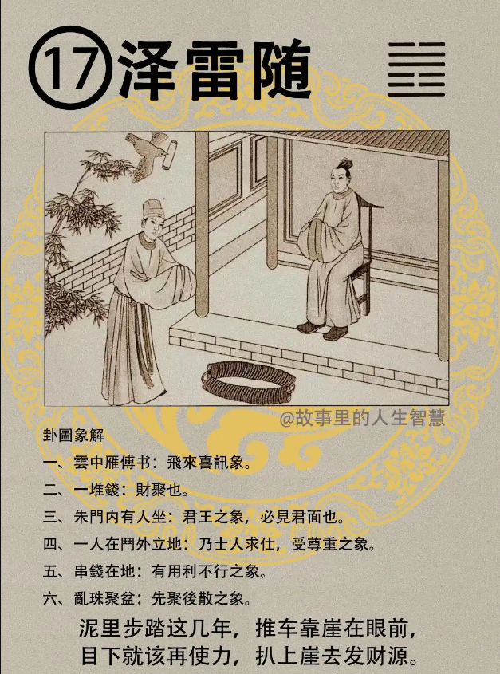
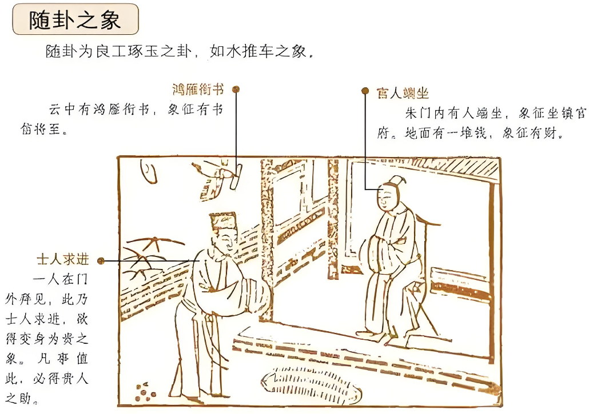

#### 详解泽雷随䷐

这个随卦，随的来源人的性，每个人都会因为喜悦而随，所以雷地豫卦就讲的是喜悦的道，因为有喜悦以后人就会跟随而来，所以随卦是豫卦的序卦，继续下来的。

在这个卦专门论随之道，所以《易经》一个卦，就是专门的那件事情。

这个随，你要追随，比如说人间道，在天地道上看的时候，圣人为什么会领悟到，我们的古代圣贤为什么会领悟到随卦? 因为泽下有雷，雷在泽的下面，看到没有? 也就是说这个雷一打打到泽上面，这个泽随雷而动，这是一个随的象， 自然界的象。

那《易经》就提出了随很重要，有几种状况需要随? 人间道就出来了。

第一个人君之从善，你是君王的，你要从善如流，你到底是要从善，到底要随哪个道，这是随的方法。

第二个做臣下的奉命行事，这也是讲随的道。

第三个学者，读书人要从义，从义理。

第四个临事的时候，遇到事情来的时候，要从长，这个长含义很广，不单单是长辈，而是从专长，你要遇到事情要术业有专攻，要请教别人，也叫做长，你不能老是长辈长辈就完了， 读《易经》就是烂经，越读越难了。 

一般的人，常人随的时候，常人所随，一般人由他自己的心来随，怎么讲? 如果你是常人，就是这样的，你看到你心里所爱的，你看到他做的都是对的，你心里所讨厌的，看到他做的都是错的，这是常人之随。你不能说你喜欢的就是对的，你喜欢的是你的事，他就是对的? 这是乱随。

君子之道，君子之随，什么叫做君子的随? 君子的人交往，交朋友不以私，什么意思? 就是不会有私情的所受，受到私情的影响，取正，只要是正派、正道的人君子是专一的，这是最好的随道。

我们一般人的随，戒是在兼，这是《易经》讲的，什么叫戒之在兼? 很多人交朋友的时候，随道的时候，这个随他也交正人君子，刚正的人他也交，小人他也交，这就是失掉君子的义，为什么? 为什么要戒之? 因为真正的君子跟你来往的时候，发现你有朋友不好，你还跟他来往，他根本就不要你这种朋友。

结果你失去掉君子。是因为你自己没有去戒，兼交，懂不懂我的意思? 你以为兼了可以，实际是不行的。因为你是君子，你很好，结果别人会利用你的好，小人会利用你的好，他跟我是好朋友，来提升他自己的地位。

臣之随，你做臣子的，做总经理的，做经理的，没有做到君王，臣民的，做臣的随之道，如果你使民心或者是专门使公司的里的心，随己不随君，你当了总经理了，结果公司的人都向心于你，结果都忘了董事长的存在，自己找自己倒霉，这是大害，现在很多人就是这样子。

真正的做臣下之随，厉害的人，他可以替君王做事情或者帮老板做事情的时候，做事情他去做，然后把功劳统统推给老板，这就对了。你做臣的，你把功劳推给你的君王，这是臣的随的义。

君主，你做人君的随，要随善，对的要坚持到底。现在如果人君、做皇帝的人常人之随由心，我喜欢他，看到他的东西都是对的，我不喜欢他，看到他的东西都是错的，就完了，你连君子都不如还要做君王呢。现在我们就犯了这个大毛病，你看每个卦都可以讲他，好累哦。没有一个是对的，真是麻烦。

我们的圣人最后把随卦归结为一句话，他说得民者昌，失民者亡。这是我们古代圣德告诉我们，其实就是从随卦来的。

他说即失位之人，你完全离开权位，这是随之即，到了第六爻的时候，随卦进入第六爻的时候，代表阴柔，第六爻完全没有了，你不在君位了，已经离开了，但是民心还是随到你的时候，你还是可以照样会到你的机遇，所以民心的重要就在这里。

#### 占卜

占卜，诸位看云中燕传书，图上有一个燕子在咬了一个信有没有? 飞来喜讯，写的是燕子而不是乌鸦嘛。

一堆钱在那里，有三串哦，就是财要聚，财聚的象，你如果卜卦做生意的话，这个卦太好了，

朱门有人坐，为什么讲朱门? 朱门是候门，过去的朱门是官府才会有朱门，所以说君王之象，里面有人坐在里面就是帝王的象，会面见君王。

有一个人做生意，一卜，居然可以卜到可以面见君王，可以啊，就是做大了。

一个人在门外立在地上，这个意思就是有一个求官，受到尊重的象，求官大利，求财也大利， 

串钱在地，还有一个，刚才已经读过了，这是财禄，这个串钱，诸位看图，字上没写出来的，我们读图出来的，这是我说的，这是图上有的，三串钱掉在地上嘛。

如果这个我现在打官司，一卜卜到这个卦， 串钱在地意思是说用钱买不通，懂不懂我的意思? 钱行不通了。用利不行了。威胁利用嘛，用利不行。

左下角有一票黑点，有没有?叫做乱珠，聚在那里，先聚后散，知道为什么吗? 你如果是家里有小孩，很简单，你拿着杯子，里面放弹珠，早上放上去，小孩子在家里，中午回来，可能不要中午，一个小时回来，珠子就散了满地，先聚后散。

为什么? 任何的卦象里就有果在里面，因果统统在里面，然后现在有一个人来卜卦，你看我现在跟人家合伙做生意好不好? 一卜，会赚钱，因为赚钱以后拆伙了， 了解我的意思吧? 结果是这样的。卦上有没有解? 有，有解，你跟你的股东要谈义，不要跟股东谈利，谈利不行，谈义就不会散。什么叫做义? 要帮人家断后。三个人赚了一块，一人三毛三，还在那四舍五入的舍来舍去，斤斤计较，那一定散的嘛。

#### 阳宅

阳宅，少女居长子位，你的名字是三女儿，结果跑到大儿子的东宫去睡了，象就出现了。

第一个，女身男态，女孩子跑出来穿裤子，动作像男人，剪个短头发。

第二个，女的同性恋的形象。

第三个，一心于事业。不但一心于事业，而且未婚居君侧。你看有的女孩子没有结婚，二三十岁，就做了大老板的秘书，能力很强啊。

第四个婚姻有利而且能成，这个女孩子一定会必嫁富夫。这种女孩子一定要嫁给有钱的老公，再丑都没有关系，以财富来决定嫁给谁。我们平常算命不会这样讲，你不什么都讲出来，适可而止啊。

第五个是婚早4年，提前4年。比如说她的红鸾星是30 岁结婚，她是这个卦的话就是26 岁结婚，加减就出来了。