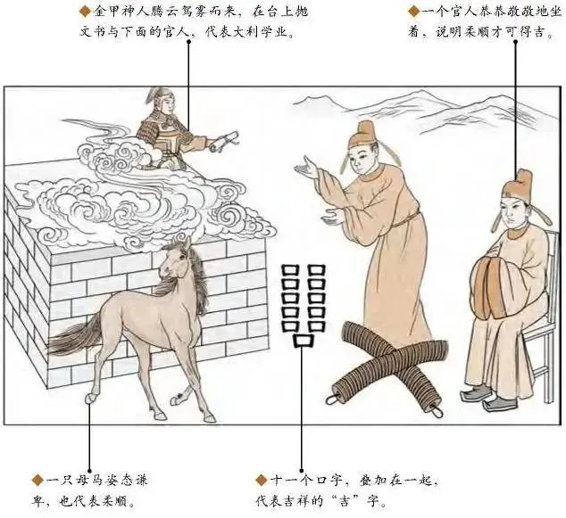

#### 详解坤为地䷁

诸位看这个坤为地。坤为地这个卦我们介绍《易经》，一定是天地定位，天的性我们已经介绍了，我们来定地的位置，地的位置坤为地，这两个刚刚讲了乾为天，刚刚忘了介绍。

如果在阳宅上来说的话，九宫这边是东西南北，西北方是父，西南方是母，母居母位为坤，为地卦，父居父位为乾为天。

一个房子，不要管门在哪里，我们看布局，房屋的中心点妈妈住在太太的位置就是坤为地，你是爸爸住在爸爸的位置叫做乾为天，如果太太从先生，住在先生的位置叫地天泰，每个卦我都会讲到阳宅是哪个位置上，所以如果你本身是结婚以后，你一直住在父亲的位置，自然而然会把你养成乾为天的性，一直在往下看，也不晓得为什么，就知道这样比较对。当你坐的位置是对的，你的念就是对的，出来就是乾为天，如果住错了，坐到妈妈的位置就是天地否了，坤为地就是太太住太太的位置，所以你到阳宅上拿罗盘一看西南角是坤地，一看是妈妈住的，坤为地，代表什么意思? 就是这个。

<table>
<tr>
<th colspan="1">⚋</th>
<th colspan="1" valign="top">六爻</th>
<th colspan="1" valign="top">阴位</th>
<th colspan="1" valign="top">过</th>
<th colspan="1" valign="top">龙战于野，其血玄黄</th>
</tr>
<tr>
<td colspan="1">⚋</td>
<td colspan="1" valign="top">五爻</td>
<td colspan="1" valign="top">阳位</td>
<td colspan="1" valign="top">君</td>
<td colspan="1" valign="top">黄裳，元吉</td>
</tr>
<tr>
<td colspan="1">⚋</td>
<td colspan="1" valign="top">四爻</td>
<td colspan="1" valign="top">阴位</td>
<td colspan="1" valign="top">宰</td>
<td colspan="1" valign="top">括囊，无咎无誉</td>
</tr>
<tr>
<td colspan="1">⚋</td>
<td colspan="1" valign="top">三爻</td>
<td colspan="1" valign="top">阳位</td>
<td colspan="1" valign="top">相</td>
<td colspan="1" valign="top">含章可贞，或从王事，无成有终</td>
</tr>
<tr>
<td colspan="1">⚋</td>
<td colspan="1" valign="top">二爻</td>
<td colspan="1" valign="top">阴位</td>
<td colspan="1" valign="top">将</td>
<td colspan="1" valign="top">直方大，不习无不利</td>
</tr>
<tr>
<td colspan="1">⚋</td>
<td colspan="1" valign="top">初爻</td>
<td colspan="1" valign="top">阳位</td>
<td colspan="1" valign="top">下</td>
<td colspan="1" valign="top">履霜，坚冰至</td>
</tr>
</table>

坤为地的爻1、2、3、4、5、6，从第一爻到第六爻全部是阴爻。下面是内卦，上面是外卦，这是下卦这是上卦，名词很多，意义都是一样的。

初爻的时候这是坤为地、乾为天，德同法异，什么意思呢? 它六个都是阴，从头至尾它的性就没有变过，阴是主柔、主静。乾为天六个都是阳，从头彻尾都是阳，它的性没有变，所以性就是讲德，德是同的，方法不一样，乾是以刚静，坤是以柔静，一样可以坐到很高。

自然界上来说柔就是地性，地能载万物，它的柔性，随便什么东西它都接受了，把它消化掉，替换掉，再返回给天，就是之前讲的从来不邀功。地从有天地以来一直默默无闻的做这些工作，这个方法不一样，德同法异。

我们在《易经》上除了这个以外，我再介绍一个稍微深入一点的，也不敢太深入太复杂。

1、3、5 这个位置就是阳位，2、4、6 是阴位，这个有目的的，第一爻应该是阳爻，结果第一爻的是阴爻，所以第一爻在《易经》上就写了刚开始的时候我们所谓的阴就是柔、寒都是属于阴，第一爻应该是阳，结果阳爻的位置被阴爻占领了，这就是好象自然界的现象，当你走在路上突然有一天脚踩在草丛里踩到霜，有声音，一踩下去，就知道后面要更冷，这个什么意思呢? 比如说到人间道的时候就变成这样了，当你发现他是小人的时候，要赶快去掉，这个叫做戒之初，如果你不去掉的话，坚冰就来了，等到坚冰来的时候再去的话你就不是圣人了，我们不能做圣人，但是我们要效仿圣人，所以发现不对马上开始。就好象小孩子，当你训练小孩子发现他错的时候，你马上要修正他，如果你在狠狠的修正的时候你太太跑出来说这个小孩子还小，好言相劝就好了，姜太公说宁向直中求，不向曲中取，好言相劝以后作奸犯科，小毛病的时候马上就要修正他，强烈的修正的话他根本就不敢想别的了，千万不要委婉的相劝，没有用的，这个时候要把中国妇女的美德丢掉，否则将来很惨，看到孩子失败的时候，当你发现当年错误的时候已经太晚了，你可能隔着铁窗和他讲话。一开始就要戒，戒之初啊。

所以如果你刚开始到一个地方去上班，一开始进去的时候遇到阴，就是反的，应该是阳结果遇到阴， 你去的时候发现不是你想象的那样，你要知道后面间坚冰就要来了，你不要想办法改变中国的人，让他们有美德，让他们读各种经，这是你很好的想法，你还没有教，坚冰就来了。

如果进入第二爻的时候，阴爻居阴位，第二爻是直方大，你如果第一爻过去了，进入第二爻的时候就是将的位置的时候，将就是科长啊，处长啊，你有三个字，就是直方大，直方乃大。

什么叫做直呢? 如果我们今天交了一个朋友，如果你有什么不对他敢直接告诉你，好朋友，这是直的意思，同时你对人家也是直，不是人家对你这样，不要背后讲人家的闲言碎语，当面讲。

什么叫做方? 方就是义，道义，义前面学过，就是断后，后出义也，如果我在你面前讲他的闲话，我开始讲的时候你马上就跟我讲他不是这样的人，你不用跟我讲，你为什么在我面前讲他这种闲话? 你目的是什么? 这就是他帮他断后，柔静但是直方乃大，你只要掌握这种个性的时候。不习，你的资历可能比别人差，生活上很多人学历不高，可是他非常会做事。就像李国兵说我这辈子都不会用考银行特考进来的，会考试不会做事啊，所以台湾科甲制度有问题。

即使你不懂，对你一点没有害，所以圣经讲的很好啊，不要批评人家，哪天上帝会批评你的，大家人都在的时候讲的是真话，你不在的时候我在别人面前讲你的坏话这是假话，这是直的性。人家在搬弄是非的时候，你要帮人家断后，把是非矫正，叫做方，现在大部分人都是大家一起去讲，人云亦云就去了，脑筋都搞不清楚。

到第三爻的时候是阳位，结果还是柔的性，自始至终，到了第三爻做到相的位置的时候还是柔，这就是《易经》讲的含章可贵，做属下的今天已经领了老板的薪水了，你做什么事情都是天经地义的，你不要在乎人家给了你多少钱，你要在乎你自己做了多少事，现在很多人你请我上班就要给我多少钱，从来不说我应该做多少工作才能有价值，就是没有含章之美，含章之美的人是丞相，你为君王做事情的时候，你做的任何事情统统不表扬，闷闷的在那边做，就叫做含章之美，这种人有地的厚性，这种人可以用，他非常的好，居于阳位还是柔性。

到了第四爻《易经》叫做括囊，什么意思呢?简单就是说闭口，为什么要闭口? 因为第五爻是阳位，阳位是阴居在那里，第四爻和第五爻最接近，意思就是说当你到这个位置的时候，他是君你是臣，两个人都很接近的时候，当你的君主、老板、董事长跟你最接近，而你发现你两个意见不合，要括囊，要闭口，董事长说什么你去做就对了，不要讲。讲了的话有两个后果，第一你一讲他会认为你贪什么东西，第二个你讲了如果他没有听你的话，他按照他的意思做，错了发现你讲的是对的，他会把你干掉，为什么? 因为有你太可怕了，功高震主，闭口，所以当你有一天跟老板发生冲突，两个人的意见不相合的时候，闭口是最厉害的，即使你按照他的话做的，对错都是他负责，但是你不要把责任给推出去，什么都要闭口。即使结果错了，你被骂了，你不要说不是我要这样做的，是他要这样做的，你被骂了也是闭口，随时要记得闭口，你就会逃过这一劫。否则你走入退隐山林的卦。

第五爻的时候是君位，结果阴居君位，代表女人在当皇帝，所以《易经》上说黄裳元吉，裳是下面的衣服，上面是衣，下面是裳。

如果你今天是武则天，有一天当了天子，阴居君位了，你要柔静了，你要尊重所有的大臣，大臣穿的衣服都非常的漂亮，这个时候你要穿素服，你不能穿个龙袍什么的，阳不行啊，你阴居阳位，你逆位了，要穿素服，然后坐在那边，然后抱着请教的态度，态度非常恭敬，请教你的看法是什么，你这个看法非常好，就按照你的方法做，你千万不要去抗。

如果你要抗的时候进入第六爻，叫做龙战于野其血玄黄，玄是天的杂色，黄是地的污色，天地是杂色了，天地被感染了，其血玄黄，所以一定会遭到很不好的结果，所以历史上有几个女的皇帝到头来就是没有掌握到这个原则，如果掌握原则不会有这个事情，她太过了就进入第六爻了。

如果有一个人来找你问事情，你还没有卜卦，我现在是公司的董事长，我是女孩子，我继承我父亲的，阴柔居阳位，里面很多的高级主管都是很多年了，这个时候你如果一抗，冲突会很大，因为你是女孩子，柔居阳位，这个时候你穿的要越朴素，你手下穿的越好，你中规中矩坐在那边听，听完以后说你的意见很好，我回去研究一下，你的也很好，我也会去研究一下，听到真正的贤臣你要会看象，看他是贤臣，你可以采纳他的意见，对哪些人怀疑的，你可以考虑一下，回去问父亲问问家人，问问贤能之人再做定夺，随时保持这态度，戒盛，千万不要抗，一抗进入这个其血玄黄，这个人不但背叛你，还要打击你，开始乱搞，结果是这样。

所以即使我们不用卜卦，她进来的时候在哪个位置上面我们就知道她做了什么阶段。

如果同一个公司，今天来找你的是公司的经理，他刚好在第三爻位置上，你要含章。她上面还有各种副总，总经理，而现在董事长换人了，换了个女的，怎么办？先生，您现在在第三爻，含章之美，现在开始不要争功，埋头做事情，公司有没有新换老板，你都不要管，你要做工作，很快就可以跳到第四爻，所以进来的时机或者人不一定是同一个阶段，这个时候我们要看他在哪个阶段，给他最好的性。这是坤为地的柔性。

这个图是有一个人在空中下来， 有一个马上在下面，一个人站着，一个人坐着，官人啊。 什么意思?进入占卜，如果你占卜到坤为地的卦，有几种解释，我统统解释给你。

首先看一个人坐在椅上， 一个人站着，这个是官人，地上是有两串钱，两串是这样写的X，串叫做忧心忡忡，两串钱氏忧心忡忡， 官人看到钱为什么忧心忡忡? 想拿又不想拿，贪污。

十一口是吉，这是一种解释，你不能说贪污是吉，这是两个解释啊。十一口是陳(陈)。

一个人在空中下来，人代表民心，代表有人检举，检举也是民心啊。

有一匹马在这里，马有两个解释，一个是肖马，属马的人，另外一个是马回头，属马的人逢此卦调动，因这个事情而变动。

小山头上有四个小点，四点在土上是黑。

有人卜卦，我讲个例子给你们听，有一次卜卦，一卜坤为地，他是司法界的，他本身属马，他现在办的贪污的案子，有两个人联合贪污，已经被关的人姓陈，这是有人检举上来他们才查，你看像不像，吓一跳啊。十一口代表吉，如果我做这件事情同样代表陈，因为有马，这个案子会有变动的现象，可能还没有办完的时候他就可能会离开或者转交给别人怎么样，这个象出现了，为什么? 因为上面还有四个黑点，黑黑的，还没有拨云见日，他现在已经拿的一笔现，还有很多不敢拿。你不要觉得我们讲占卜的时候很分散，你一卜事的时候就看到了。

十一口除了代表吉以外，也代表众口铄金，也代表有替代众人发言的象，替老百姓讲话的象。如果有一个人来找你，我们今天选举，你看我会不会选上，一卜，上，因为他替百姓发言。

所有《易经》上看到很多金甲神人，金甲神人都是得民心的人，比如说选出来的民意代表，或许你不喜欢他，可是他为什么票那么多? 代表他还是得民心。

这个堠，过去所有的土墩叫做堠，所以你看后面砖头砌起来，以前中国的四合院门口有旗子，旗子插在堠上，堠有授官封候的象。如果有人来找你看看我今年会不会升将军，一卜到，先生您贵姓? 陈格，如果他不姓陈，问他属什么? 如果属马也可以上，如果属猪对不起了，回头，没有什么用。后面有很多。我不是属马我也不姓陈，但是我就是姓马，一样可以，你不要那么挑剔嘛，你要会变通。

所以如果卜事的时候，我们要看他卜什么事，如果有一位先生说太太要生孩子了，看是男是女，一卜坤为地，从头至尾都是阴，先生，你是第几胎了? 我是第六胎了，那你还是女的，因为你已经知道了，如果是刚好是第二胎，先生你还有四胎没有生完，现在还是女的。那我要怎么办? 有办法的，我们有阳宅，东宫如何生，后面讲震为雷的时候我会跟各位介绍生男生女。

这都是我们卜卦可以断事也可以帮人家，否则你光是卜卦，你又不会解，讲完还是没有用怎么办?你说的事情是很准，问题是于我无补啊。我们要有很好的化解的方法。每个卦都有对应的卦，都有解的卦。
