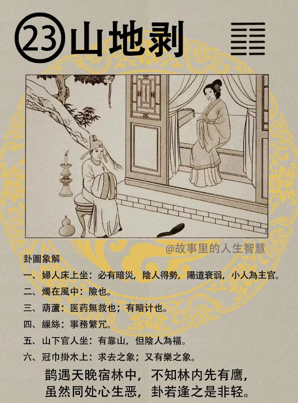

#### 详解山地剥䷖

这个剥卦的来源是贲之极，外饰到了极限太过了，而招剥，剥就是损害，脱落。

诸位看，你看这个卦爻，都是阴有没有?，到最顶层是阳。意思就是捉如果你让阴柔的小人，刚开始不去阻止他， 长到最后你发现很大你再去阻止他，就已经剥了。 这是第一个意思。

这个由下往上、由里到外这是剥的象，山在上面，地在下面，诸位知道如果地在山的下面，《易经》叫做地山谦，山再大都要依附在地上面，这都是自然界的象，你要让山剥，山受到损害有剥落一定是在地下面会有问题。

剥的道是由内到外，由下往上。你哪天出去的时候或者是到一个地方上班，你一听到不对，周围人看你的样子不对，你就知道剥之道来了，这个剥之道一定是由里到外，会造成剥，可能来自你的太太，来自你的朋友，了解的人才剥得到你。

一个国家会受到迫害也是由内到外，反过来我们要把一个国家打败也是由内到外就可以打败了，所以最坚强的堡垒是从内部破坏开始。这个是剥道。

所以过去的军事打仗也是用剥，如何用剥，利用剥。剥之道一定是从里面开始剥，诸位看间谍，情报工作。

卦象看起来，诸位看山是外止，地是什么? 是内顺，外卦是止，内卦是顺，为剥的象。

简单举例你就懂得了，你看小孩子一出来，怎么那么乖啊? 外面是不敢动，然后内心又很熟顺，这就是他的智慧被大人剥削了。

小孩子训练他，你要让他平常心，小孩子有童蒙，他什么都会好奇，什么都会问，开朗的。一方面小孩子变成外止内顺，什么都是乖宝宝，就完了，剥象就出现了。这就是大人来剥小孩子的智慧。

所以你想尽办法把你的孩子教成乖宝宝，就是想尽办法把他从聪明变成笨蛋。一定让他平常心，让他明辨是非，让他用开放的智慧去考虑，去深思才可以。什么东西都制止，结果这个小孩子就毁在你的手上了。所以教是很重要，千万不要剥，现在很多人是想办法把小孩子教成这样，很可怕。

在人间道，君子事天，什么叫君子事天? 君子在事之始， 事情一开始的时候君子就知道它的盈亏，知道这样做好不好，就已经考虑到盈亏，而且知道它的消息，就是知道怎么做，进退之道在哪里，知道进退如何处理。这个顺之则吉，君子一开始就知道了，逆之而凶，因为他事天。

我们讲的天道算命或者什么，包括《易经》讲的事情发生之始，我们看一个人讲的话， 听一个人讲的话，一个动作， 事情在开始的时候我们就已经知道它的盈亏了，所以君子是事天。

小人呢? 是事人。什么叫事人呢? 小人不见事，看不到事情开始的作为如何，看不到事情的开始，也不论事之盈亏如何，我们为什么叫做盈亏? 因为我们老祖宗把天上，天的日月， 太阳有时候也不是是整个能看到的，日月也有盈亏，小人也不管事情的盈亏如何，他为什么叫事人? 小人专门一味的奉承、迎合， 小人只知道奉承、迎合，所以小人是专门事人，现在这种人太多了。

所以当官的人，观念错了，他只知道迎随人，只知道如何做官，不知道如何做事。你今天当官，人民给你那么大的权利，就是让你做事的，你还在摆官威，让会迎合人的人都会升官，就是现在小人当道。

有一个君王之剥，你要去看我写的天纪，你是不是看得到，是你愿不愿意去看，如果你看到你会逃过一劫。处剥之时，《易经》处剥，当你被剥的时候如何应对，我们从初爻一直谈到六爻，中间谈到第五爻，君王之剥，如果你是一个总统，看《易经》会改变你的。

剥到了极限的时候，天下大乱，越来越乱，太好了，你知道为什么? 因为物已经乱了对不对? 乱开始的时候，我们就知道君道必复，君子之道一定会复回来，小人呢? 就无处藏匿了。因为乱极，人心，人的心是这样的，如果我们说孟子说性善，荀子说性恶，我不管了。你不要说善还是恶，但是人心都是从善如流，我们就可以知道。

所以如果天下大乱的时候，诸位不要紧张，天下大乱的时候股票一定大跌，房地产一定大跌，赶快去买，人弃我捡。相信我的话。放心，当然不会有事的。

君子之道会恢复，人民因为乱而失智，君子会回来。

治世来临的时候，天下之间法是最大，这就对了，我们叫法制的国家， 我们不要人制的国家，现在东南亚大陆还有台湾，都是人制，这不对，今天说改宪法就能改了，法治哪有那么简单改。所以我们要求法制的才对。《易经》也是这样讲的，因为人的性是这样的，人的性是从善如流。

这里我为什么会讲一些宗教的事情?就是要跟你们说明一下，为什么要讲? 因为很多人知道从善如流，坏人就会利用这点，你看佛教都在做好事，不讲人去做好事，好了，佛教都是好的，才会有佛教念书会强奸女孩子的事情发生，人们会利用宗教来骗人，你为什么讲佛教呢?你就讲人去做好事，要强调这个嘛，你去做好事就代表你人就是佛，你为什么要强调佛教?了解我的意思吗? 那天主教都是不好？我没有信教都该死？该到地狱去啊？不要说是佛教在做的。

骗子讲话的时候，手在横着晃动就是在骗你，眼珠是这样，猪眼，黑珠子旁边都是血丝，那是大骗子。

君子要言简刚中，讲两三句话就讲完了。讲了那么多不懂的名词，就是告诉你我要骗你。

君王之剥的时候，处剥如何用? 《易经》叫做贯鱼，什么叫贯鱼? 你仔细看我写的天纪，这里不教，回家看书。

#### 占卜

占卜，第一个，就是卜卦，在这里丢个铜板，老师，我一卜看我今年做生意好不好，一卜是山地剥，

第一个，妇人床上坐，妇人床上坐代表阴人得势。如果你是太太，一卜，一定是你婆婆在那里作怪，阴人得势。如果你是当官的，代表你上面有阴人在作怪。

阴人得势，阴人除了指女人以外，也指小人，所以一定有暗灾，要小心，背后有人要偷偷的害你。所以或者是小人为主管，主管是小人了。

第二个是烛在风中险也，危险。有两种状况，气色上可以看到。

第一个，面如枯槁，枯槁，就是人怎么枯萎了? 头上没有油了，干干的膨起来了，我们的脸上的油和头上的油就叫做气，隐在皮肤下的颜色就叫做色。鼻子上会出油，所以诸位带玉的时候，常在鼻子上磨，一摸，鼻子、头上没有油了，险也，快死了。 

第二个，这个人面如潮红，整个脸上是红色的，你说老师，他气色很好，我看他是快死了。这个红是没有亮的红，了解我的意思吗? 没有亮的红，就是好象血色浮起来一样，没有亮的红，这个往往就是中毒的病人，中毒的人。

这几种都是危险，险也。我们在象上叫风中之残烛。所以你在那边打麻将，对面的人头发都没有油了，蓬起来了，死的原因不见得是重病，可能明天出车祸就死掉了，两个礼拜就可以看到他的气色。

还有的时候，临床看到的是蓝色，蓝色其实就是青色，青色，我们以节气来说的话，四时的节气来说，这里我跟诸位提到一点，木火土金水，木是青色的， 火是红色的，土是黄色的，金是白色的，水是黑色的，这个是春天、夏天，长夏，秋天，冬天。在五行相生里木生火，火生土，土生金，金生水，水生木，如果我们在相生的时节看到气色代表吉，相克的时节代表凶。

比如说在秋天的时候打高尔夫球，看到有一个人的脸上发青有没有?这个人很快就会买单了。春天的时候发青无所谓，依此类推下去。

第三个，葫芦在地上代表医药无救。如果你卜疾病， 完了，医药无救了。暗中有毒计也是，你卖什么葫芦? 你葫芦里卖什么药?有没有? 暗中有毒计的意思，还有医药无救的意思，疾病的话卜到这个山地剥很危险。

第四个，缫丝，一团乱丝在地上，代表这个事情非常的烦琐。诸位，在这里要记得一点，有一个人经常把事情越弄越简单，有一个人在尽量把事情越弄越复杂，越弄越简单这个人就是诚实，不会骗你的，越弄越复杂的就是想骗你，让你搞不清楚，想骗你，要听明。 

第五，山下有官人坐，代表有靠山，但是阴人为祸，山下有官人坐， 即使你有靠山，但是有阴人为祸，就是小人在后面害你。

第六，万金挂树上，有求去的象，我不干了，求去的象。还有安乐的象，这个历史上也出现过，为什么叫安乐呢? 白色的丝巾挂在木头上面这不是乐（樂）吗? 所以杨贵妃就死在这上面。如果树木上戴了一个帽子这就是宋。如果树木上面加一个齿，所以是朱。所以中国人要读图，你不要读字，读字都不对了。

在讲阳宅之前，我讲一个总卦给你看，比如说这个人居在很危险的地方，好像风中的残烛一样，心中心乱如麻，有没有? 无计可施，为什么呢? 阴人当道，这个时候以退为乐，所以处剥之时闪开一点，离远一点。等到剥到极就好了，天下大乱的时候你再出来，人心思变。

#### 阳宅

阳宅上，三儿子居母位。三儿子住在妈妈的位子。

第一个，主耗破家业，

第二个心生毒害，你哪天发现你三儿子那么小人，就是这样子。

第三个，婚事不成。

第四个，科甲不兴，读书也不好。

第五个多灾病，病痛又很多。

所以这是大凶之地，不是很好，所以不要乱住。

诸位刚刚就在提醒你，千万不要把你小孩子教成山地剥，有时候他不是三儿子，有时候是大儿子或者是你的女儿，所以除了卦上面有的话，人间道上、教育上你要注意，你把小孩子教的外面谁讲的话都听了，他出去了，坏人讲的话他也听，给他拐走了，失踪婴儿就这样来的。我这样教儿子怎么不对?他一定要坐好，好了，变成山地剥了，没有自己的主见，他就被剥了对不对? 你就很痛苦，剥由内生，找原因在你自己身上。一定要让小孩子有主见。