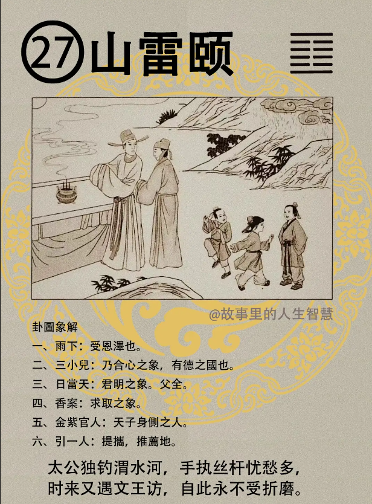

#### 详解山雷颐䷚

山雷颐。物畜之后，累积的很大之后乃可养，就好像小孩子在妈妈肚子里还是一个受精卵的时候他不会出来，没有积。慢慢积到十个月之后，大了，出来，可以养了。所以颐就是养之道。

你看这个卦，中间都是空的，上下两个阳，就像嘴巴张开的样子，在咬东西，口中含物，吃东西的象，外实中虚的象。一个人要养，小到看见人嘴里在吃食物，在养自己。大到天地养万物，环保就是讲这个。我们古代的圣人是养贤，如何培养出贤人来。人养生之道，养形，或者是养德。还有如何养人、如何带你的手下，通通是养之道。所以山雷颐专门讨论的是如何去养。

到了人间道：

第一个， 易经上面说自求口实，这是自养之道。就是说要求你每天讲话要改实话，不要乱讲话，不要添油加醋讲话，就按照事实陈述就好了，这个是自养之道，你要自己养自己。

现在的人口造谣言，这个致凶，为什么? 不知自养。所以造谣这种人，你就知道他不会养自己。现在大部分人都停留在这里。

那你知不知道那个人会造谣? 吹火嘴，口不闭齿，左眉上一条竖纹，通上天，穿破整个印堂，这就是表里不一致，讲话阴险，尖酸刻薄的。

第二，养之道，对外面的养，必上下相应，易经上面给我们一个名词，叫做巅颐之戒。为什么要上下相应呢? 以同类养，才能养，你让上下跟你相同，同样的志向、同样的看法，才回去互相养，互相增益。现在小人不是这样，小人是谁来养我，我就追随他，不会找同类人，只要对他有利，他就跑去了，到头来自取其辱。这个讲的是臣，为将、为相都要掌握这个原则，你不是做老板，你做主管的时候就要注意。

第三，如果你是董事长、你是总统，君王之养，易经提出来一个原则，这个人如果是性柔之人，为君，当你发现到第五爻是柔爻的时候，当皇帝的人个性很柔，你遇到这种情况，你何以养活贤才，比你英明、能干的人。这个时候可平安于治世，当天下太平的时候，君王又性柔，你养贤才没有关系。如果遇到天下困顿的时候，贤才再强，你是性柔弱的人，都不能养，会遭凶。

在养之道里面，当天官的要知道，他讲人间最美的叫由颐之美，也是一样，等于是第六爻。君王为柔顺之才，但是能够用贤且信贤，信用贤德之人，而贤德之人要知道他对你的恩，知恩图报啊，要知恩受养，施济于天下。

今天我遇到一个很感动的事情，这位先生在纺织界做事情，老板一直对他很好，因为他跟老板理念不和，他就很想离开。然后他来找我，我看他流年是化忌，今年是小人，明年是化忌，不能走，我说不好，你要稍微忍耐一下，你到42 岁，十年都是忌，都是杀，一般看小流年的话，到45岁以后，你现在43 岁，你忍两年好了。

你知道他回答什么？他说老板为什么我跟他理念不和，因为我认为老板给的薪水太多了，我很想帮他做很多好事，我每次提出来，老板都说你不提，我知道，我跟老板提什么要求，我要什么单，他通通给我，可是我要提什么计划，如何对老板好，他通通不听，所以我是觉得很难过，不想干。我说你要再耐心下去，遇到这个老板太好了。

而这个人也好，为什么? 就是有由颐之美。你知道现在多少人没有由颐之美，你给我钱是应该的， 因为我很行，但是他从来没有想我要做多少事情。

历史上有哪些人做到? 像周公，还有伊尹。由颐之美。

#### 占卜

占卜：旁边是雨。

下雨代表受到恩泽。

三小儿，三人在一起有合心之象，三人成虎，三人在一起同心协力的象。以国度里说的话，就是有德之国。

日当天代表君明之象，所以如果你卜到这个卦，你说我想离开这个公司好不好，不要离开，你的老板太好了，他看得很清楚，只是一时他还没有反应出来，稍安毋躁。

香案，代表有求取的象。

金紫官人，代表天子身侧的人，还有过去的天官，他的服饰就是金中带紫，像很有名的唐朝的帝师杨金忠他配的衣服就是金紫的。

金紫官人引一人，就是提拔、推荐的意思。

做生意平平，官运非常好。

#### 阳宅

阳宅：三子居长子位，成格。

第一，早发。如果有人来你家里面跟你诉苦，说大儿子、 二儿子很差，老三可以，山雷颐马上就想出来了。

第二，健康平安。如果你三个儿子身体不好，让他住在山雷颐卦上去。

第三，婚提前五年，早婚之象。命本来是26 岁结婚，住到山雷颐了，21 岁就结婚了。

第四，同父异母的象，这个怎么解释? 他没有经过你的指点，自己跑到颐卦上面去住了，你就看看他小孩子，看他眼睛是不是上下不相等啊，然后同父异母。因为太阳旁边有雨在淋，太阳只有一个在上面。

