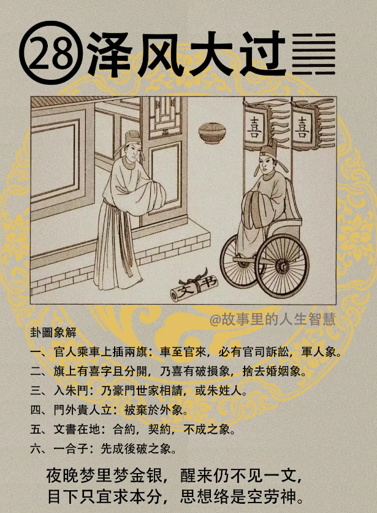

#### 详解泽风大过䷛

泽风大过。山雷颐是养，养而后有成，物成必动，动则有过，所以大过就是经历过这个阶段。就好像小孩子养成以后他会动，有时候太过了，小到杯子打破，大到外面闯祸。

风是木，泽就是沼泽，木在下面，泽在上面，这是能够灭木的象，所以树木会被毁灭，沼泽淹上来。

一般人看到大过，就是以为说你有大的过失，错了，大过分两个：一个过之大，就是你们认为犯了大的过失。还有一个是大事过。大过本身就是这两个东西，一个犯了大的过失去。一个是大事之过。

君子之大过于人者，就是常人做不到君子能做到，天下诽之而不惧，全天下都在骂他，他不怕啊。举世不知而无悔，全世界没有人知道是什么，不闻名，没有一点名气的人而无悔。你有这种气度，君子是大过，能立不世之功勋，也就是说大过于人的功勋。

不管我们蒋介石、毛泽东，任何人都有褒有贬，全世界都骂你，不理，举世不知闻，都没有关系，甘之若饴，这种人都能够立不世之功。

但你们诸位就不是这样，有人骂你一下你就很难过，非要去花几个小时给解释清楚。不用，脑筋不要放在人上面。如果你一放在人上面，越讲是非越多。

#### 占卜

如果你看不懂，你把你儿子叫来，看这个是什么意思，就是告诉你要奔放地想，不要很窄小的想。

官人乘车，上插两旗。车过来一定必有官司诉讼。也象征军人、武官、警察。

旗上有喜字，喜字是两个分开来的，所以喜字有破损的象，代表要舍去婚姻。如果也一对夫妻来问你婚姻怎么样?一卜到大过，可以舍掉了，不要继续留念。

入朱门，就是豪门世家，或者是朱姓也。

门外贵人立，人站在外面，代表弃于外。就是说你不用谈了，你再找什么贵人都没有用了，已经没有谈判的空间了。

文书在地，合约契约不成，代表和约无法约束。比如你买了一个房子，有没有问题，一卜到这个，和约是无法约束的，这个会带来很多困扰，甚至可以结果到官司。

整个的结果，你看第三个盒子，正南的上方有一个盒子，盒子是先成后破。

占卜遇到的时候，零零散散的很多，但是事情一来的时候，会同时结合在一起。

#### 阳宅

阳宅部分：三女居长女位，你在家里面排名老三，你应该是住在西厢，结果你住在东南宫，泽风大过。

三女住在西厢，你的恋爱可以写一本小说，轰轰烈烈，可是都没有结果。

如果跑在长女位置，成格。

在象上，泽风大过卦，外面是泽卦，里面是风卦，风卦代表柔顺，泽代表喜悦，外悦内顺的象。

我们可以把它拿到外象上面来看，如果你发现你的太太或者是孩子突然对你很喜悦，而且百依百顺，一定又做错大事，你儿子搞不好是把玻璃瓶打破了，你太太可能钱被偷走了，或者在路上手表被人抢走，不敢跟先生讲，突然变得很喜悦，对你很好，奇怪，今天是什么日子，突然太太变得很高兴，而且很顺从你，泽风大过。

如果是女孩子住进去，早婚三年，而且嫁夫长10岁。

第二，身入豪门世家，嫁到很有钱人家。我没有说这个一定是好，只是说有这种情形。

第三，性刚，任意而为，非常任性。

第四，如果三女儿住在大女儿的位置，如夫妻年纪接近，主凶，这个婚姻一定是凶的，赶快要注意，在还没有结婚之前就注意的，她是在大过卦上结的婚，那个喜是分开的。文书掉在地上，文书也是婚姻的契约。