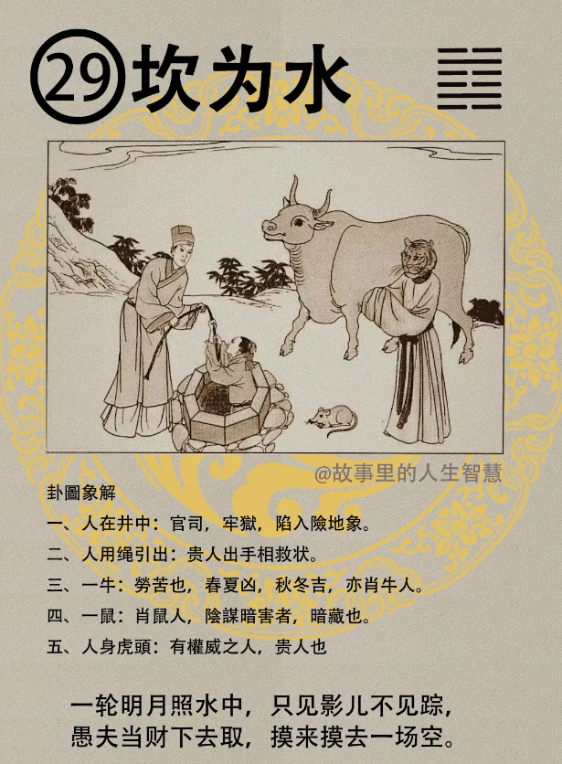

#### 详解坎为水䷜

我先跟各位讲，中国的易经本身分上经和下经，上经 30 卦，30 卦以后，从泽山咸开始了，就属于下经了。上经论的是天地，下经完全是人伦。 

易经在汉唐以前完全在象、数上做文章，现在易经看不懂，就是象、数看不懂。我跟诸位讲占卜的时候，年龄差几年就是数，那个数自然来的，是由象推演来的。

到了宋元明清以后，研究易经的人经常把易经拿来做经世之学、人伦之理，判断君子、小人，还有我们做大将、君王要有什么样的修养。现在出的大问题是他们拿着宋元明清的版本在卜世，一看那个卦辞都是小人、君子，搞不清楚读到什么东西。

所以我们在介绍的时候，象和数、人间道一起讲给你听。看宋元明清以后是看这些，看汉唐以前是在象和数上面讨论。

汉唐出了一个少邵康节，是把数发挥的很高，可是他是从唐朝继承下来的，到了宋就没有了，邵康节就被列入数了，实际汉唐是象、数最后盛行的时候。

上经的最后两个卦，一个坎为水、 一个离为火，前面泽风大过。

坎为水，两个都是水，上卦和下卦是一样的，重卦。

在天道上面告诉我们理之过，任何事情大过了以后，过极必陷，所以坎陷也，也代表险，危险的意思。两个卦重叠的时候，卦象叫重险，代表说险中有险，就告诉你说我们在遇到险事的时候，你要有用险之道，要如何行险，你不可以止险，你在险里面如果处理的方法不对的话，后来还有更大的险，所以险一到的时候，我们要知道如何除险，整个坎卦就在讲如何除险、如何用险。如果处理的不好，后面跟着来的就是大祸。

比如说我是工厂的厂长，有一个人使用机器不当意外死亡了，你要面对它，因为已经有险了，如果你不去行险，是停止的，不管就跑了，险中还有更险。所以要有戒心，险事的发生千万要小心处理，脑子要冷静，处理不好后面还有更大的险。

人间道的部分有很多，我们把重点讲一下。

第一，脱险之道。遇险的时候要以刚中，刚就代表要很诚恳的、很至诚的面对，必须可脱险。刚中就是讲话实在，从丹田讲话出来。有人来查问这个人怎么死的，你不够至诚，说不关我的事，用喉咙发声音讲话，结果人家一查是非法劳工。如果你实话实说，我现在赔他钱，又不是我故意要杀他，人家觉得你至诚面对，跑是不行的。

第二，君子体险之道，以行为功。真正去执行、去面对。

这要说一句话，易经的第四爻，如果你是大臣，大臣之险惟示诚，见信于君按，以质实，品质内质要真实，不尚外饰。

比如说总统用我们的公款一个月到一个国家做西装75套，你做76套就是害死你自己了，懂不懂，我就做一套就好了。穿的要比他差一点，他的一万块，你一千块就可以，路边摊买一买，都可以去险。 你不要他怎么样，你偏要超过他，那是你找险。

#### 占卜

占卜：如果你有一天卜到坎为水，

第一个，人在井中，代表有牢狱之灾，或者是陷险地。我们卜卦人走了都可以，包括卜这个人死后平安不平安，一卜，人在井里，不在坟里，一样的意思。

第二，人用绳引出，人代表有贵人相救。

第三，一个牛在旁边，牛是代表劳苦。卦里都有时机，时机是牛在春天、夏天的时候比较辛苦，春夏苦，秋冬没事晒冬阳，秋冬吉。还有，属牛的人也贵人。

第四，一个老鼠在那边， 除了属老鼠的人以外，代表有人阴谋陷害。

第五，人身虎头代表有权威的人，代表有贵人，属老虎的也算。

还有，我们解释相，如果你卜到人身虎头，如果你的贵人是女的，一定是身体小小、头很大，老虎的头嘛，贵人啊，很好的相。

我们有一句话说从来没有看到头小的贵人，大头才有贵。但是头大，骨头也要均匀，不然那是痴呆啊。

#### 阳宅

在阳宅上来说，二子居二子位，成格。

第一，以行险为乐。吸毒等，行险。

第二，如果你的儿子是属虎、牛的人，住坎为水的位置没有关系， 吉。除了这两种生肖，其他都会作奸犯科的。

第三，如果你的儿子是属鼠的，暗中生害。

第四，二儿子住进去以后，结婚会延后两年。比如说他的命上面是26结婚，如果住在坎为水的位置上，要延后两年。

第五，居此之人常犯官司牢狱之灾。有很当少年犯都是这样。

二儿子住二女儿的位置上最好，二儿子是水，二女儿位置是火，去住的话水火既济卦。你有二儿子的时候，让你的二儿子去住南房比住北房好。住北房，一天到晚赌博、打电动玩，你还很恨他，不要他出门，一关，房间还是北房，你这边关起来，他从窗户跑了。你要让他住南房，给他关在里面，他就不会跑了。