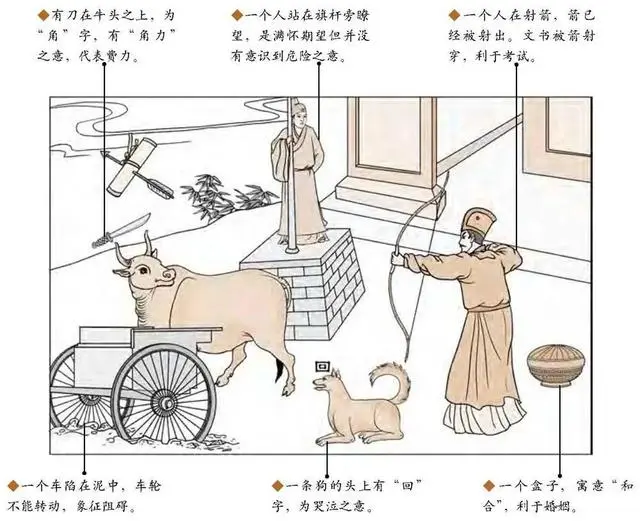

#### 详解水雷屯䷂

元亨，利贞。勿用有攸往，利建侯

▅▅　▅▅ 上六：乘马班如，泣血涟如。
▅▅▅▅▅ 九五：屯其膏，小贞吉，大贞凶。
▅▅　▅▅ 六四：乘马班如，求婚媾，往吉，无不利。
▅▅　▅▅ 六三：即鹿无虞，惟入于林中，君子几不如舍，往吝。
▅▅　▅▅ 六二：屯如邅如，乘马班如，匪寇，婚媾。女子贞不字，十年乃字。
▅▅▅▅▅ 初九：磐桓。利居贞，利建侯。

首先诸位看，我们前面介绍乾为天，后来介绍坤为地，天地定位以后，有天有地以后，所有世界上的万物都是夹在天地之间，物之始生的时候就是屯，所以我们一个动作接下来，我们先定天，再定地位，天的德，地的性，天地之间开始第一个出来是屯，屯的象。

因为物质始生，物质刚开始出来，阴阳刚开始交的时候，叫做物质始生，如果阴阳始交还未成泽的话就是屯的象，如果已经成泽，就是雨已经下来了，地上一个水洼一个水洼的，成泽后就是为解，后面有个雷水解卦。

如果天地的阴阳不交，否，所以刚开始阴阳始交的时候就是屯，已经交了就是解，阴阳不交的时候就是否象。

在人间来说的话，刚好天下屯然、未亨泰至时，水雷屯，卦指的是事，爻指的是事的时机，这个很重要，卦本身指的是事。

屯卦的卦象上面是水，雷初阳，上面是水，下面是雷，这是卦的象，所有的爻就是事的时机，这一辈子当你遇到屯的时候，意思就是说没有亨通的时候，你不了解的时候，物之始生嘛，包括你刚开始进一个公司的时候，包括你刚开始换一个地方完全不了解的时候都是屯。有的时候从职员开始做，最低初爻开始做，有的时候从君王五爻开始做，进去的时机都不一样，我们用的态度统统不一样，就是我们后面介绍爻变的时候重点在这里。

屯卦以卦体而言，水就是我们的坎卦，代表的意义就是险，诸位以后看到水就是险，雷代表的意思是震代表的是动的象，卦体是这样的时候，外卦是不是险，内卦是动，就是整个卦就是心里想动，可是外面是险得，外险内动。遇到这种情形你想动而不明了外面的时机，所以这个屯卦就是要告诉我们坚心，以明而动，不明而动的时候则动于险中，不动还好，一动就危险。已经告诉你动于险中，一动就危险，当然选择不动啊，不动比动好。

老祖宗看到物质刚开始的时候对外不明，所以在《易经》的辞上就写利建候，诸位看到《易经》里只有有利建候就是适合在这个时机，屯之时，广结善缘，广结贤能的人，找辅弼，找资助，这是找人的时机。

《易经》如果你是初爻，如果你是屯的时候，第一爻刚开始进去的时候职位在最下，刚从小职员开始干，意思就是说你要盘恒，利居贞，利建候，两个利。

我们知道阳爻代表阳刚，以刚代表你就算再有能力的人刚开始的时候要盘恒，不要急着求进，很多人第一天报到，第二天就想干科长。盘恒的时候，利居贞，还没有得到想要的时候要坚心，不能动。利建候，要跟周围的人多认识，多交往。但是在盘恒的时候要利居贞，这是原则，这个原则我们在天地里就讲过了。要有做事的原则。君子和而不同，小人同而不和，为什么? 就是君子有原则，今天即使发生冲突以后我们事后和解，但是我不能改变我的原则，小人如果有纠纷产生了以后，小人的目的是想要钱，没有什么原则，君子要对他的行为负责。所以，如果我们东西被人家复制了，一定要告的，为什么? 原则不变，我告你不是为了你的钱，而是教育你，这是我的智慧财产，你给我钱还是没有用，如果你给我钱我就不告了，那我是小人。所以一定要居贞。

第一爻同时，《象》曰，要有一个原则叫做以贵下贱、大得民也，我们过去有一个人做到了，谁呢?我们的严家甘，严先生很好，怎么讲? 他就是盘恒，他刚开始到省政府报到的时候，不了解里面的人，是不是屯，但是他以贵下贱，对下面所有的人都很好，很尊重，他离开省政府的时候跟每个都握手，包括门口的工友他都说谢谢你，都是靠你照顾我，真的很谢谢你。这就是以贵下贱。

六二，易经讲六，代表阴，九代表阳，六二是说第二爻为阴，第一爻是阳爻可以叫九一，也可以叫初九，初爻为阳爻的意思，这个是九五，九是阳，五也是阳，所以这是君王的位。

如果你是将，你一进去的时候你是一个银行的经理，换到另外一个银行当经理，你去的时候里面的人统统不认识，这是屯的象，这个时候《易经》就说了，如果你下面有很多手下，要屯如，邅如，乘马班如，匪寇，婚媾，女子贞不字，十年乃字。这个为什么会这样呢? 因为我们在《易经》上 1、3、5是阳位，其他2、4、6 是阴位，你是第二爻进来，结果你进来干经理或主管，结果你下面是阳刚的人，你此时水雷屯，你不了解，结果下面是阳刚的往上面逼，屯如，邅如，乘马班如，这就是说因为你本身并不是很了解状况了，没有办法做决定，这个时候又遇到手下很刚，一定要你做决定，这是讲这个的时机，你要知道你是动于险中，你一动就出险，你不了解做决策，这是讲这个人在这个时机的。

为什么说匪寇？中国人讲寇都是坏蛋，都是非礼而字，我叫你到我家里玩，这是我叫你来的，你没有经过我同意就过来，这是寇。如果遇到这种情况的时候，诸位即使他是寇，婚媾，如果是下面逼着你去结婚，你是被逼的，这个人你都不了解，下面的人逼着你，爸爸妈妈也逼你，兄弟姐妹也逼你，媒婆也逼你，夹在中间也是属于被刚所逼，就是婚媾。女子贞不字，坚心不动，即使是婚姻也不要动，为什么说十年乃字，如果你做错了一个决定，十年以后才能回头，为什么十呢? 十为数之终，数的最大到十，过了十以后就是一了，回头了，所以十是最大。这就是告诉诸位，一念之差。所以我们算命的时候，批八字的时候是十年大运。

这个人呢很好玩，一个念，我现在干公务员干的很起劲，干到十年的时候，开始疲乏了，人职业倦怠的时候刚好是第十年，我们常常算命也遇到这种情况，如果他是金四局，我们晓得逢四起运，14、24、34 岁的话，他们都是刚刚好是34、24，要换的时候来找你，如果火六局的人，刚好逢六来找你，比如26，36，或者是尾巴，交接的时候，中间是不会来的，所以我们看也是十年一次。刚好在那个点上，为什么早不来算，晚不来算，为什么这个时候来。

六三呢，第三个位置是阳位，结果是阴爻，是阴爻居在阳位，是不是这个爻跟上面的坎水的险最近，第二爻还没有近，第三爻是离险最近，所以《易经》给六三下了定义，说六三即鹿无虞，惟入于林中，君子几不如舍，往吝。吝就是咎，就是悔恨，就是灾。意思是说当你到了象的位置的时候，你发现上面是险，跟你第五爻的君王中间有一个阴夹到，代表你的东西、好意、想法没有办法直接传达到君王的耳朵里面，因为君王被上下两个阴包围了，你跟君王中间隔了一道，这个时候怎么办? 《易经》说你就好象是即鹿无虞，这个虞就是导游，你去树林里打鹿，结果你没有导游，鹿没有打到，自己也迷路了，遇到这种情况我们知道前面是有险，如果没有导游君子宁可舍弃，你不要想办法跨过，自求所往，越级，以为很好，结果会受到伤害。遇到这种情况不如舍就是舍掉，《易经》告诉我们进退、取舍之间遇到这种情况没有办法就舍掉，再往前走一定会得到吝，得到悔恨。一进到第三爻，碰到这种情况，马上不要干了，马上离开。不信邪继续干下去就往吝了，遭到纠纷。

六四在《易经》中是说乘马班如，求婚媾，往吉，无不利。为什么这样讲? 六四是阴，再进位就是君了，六四是屯，屯就是你不明，如果你进去的这个位置，刚好你爸爸是董事长，你是总经理，你不明了情况，你一进去的时候就是这个象，乘马班如，求婚媾。为什么这样讲? 不是针对求婚，而是说你要知道自己不了解情况，代表你的才能不到这边，你要运用贤人，到手下去发觉贤能的人，求婚媾好像求婚一样，找贤能的人辅佐你。

所以每个位置有每个位置的不同的做法，如果两个君子，你刚好进来在第四爻，他在第三爻，他一看，跟君王沟通就要经过你，结果你正要找贤人，他离开了，赶快把他找回来，贵人、君子、人才难进易出，他为什么敢走? 他到那里都会有工作，小人是赶都赶不走，所以第三爻要有这个人的立场，通常的反过来如果你要考验下面有没有贤才，你故意变成坏人，装傻，让他们的意见反映不到君王这里，你看离职不做的人就可以把他找回来了，继续做的就是小人，这都是我们辨别君子人才的，很厉害啊，这就人间道理。所以当天子下面就是你最大的时候，屯然的时候，不明了的时候，一定要用贤人，千万不要太相信自己的能力。

如果进入九五的时候，你是董事长皇帝，《易经》就说屯其膏，小贞吉，大贞凶，为什么要屯其膏? 因为当你居到君王的位置的时候，因为你不明，你会发现你的手下、你的政令下达下去的时候，在最下面并没有收到，中间都是阴，三个阴挡在中间，他们阳奉阴违，你的政令下去说要给工友加薪1万块，结果根本就没有，都给吞没掉了，你以为已经给他了。这是屯其膏。为什么小贞吉、 大贞凶、改革的时候刚开始的时候因为你不了解下面的手下如何，改革的时候小的地方可以改革，大的地方不要做，不要急，因为屯，还不明了，还不能动，如果大动的话就是凶，小的地方改革可以，无关痛痒的可以稍微动一下，为什么要先动小的? 因为动一下代表说我有权利了，告诉你权利在我手上，你动一些无关痛痒的事，比如八点半开饭改九点。不要动大的，不要随便乱下承诺的意思。要通通明了之后才能动。

如果你发现这种情形的时候，当你发现政令无法下达的时候，就代表你的权利已经转移了，只是你还没有看到，如果你聚正必凶，当你发现政令无法下达的时候，权威没有的时候，你一个政令下去他们都不听你的时候，你要马上警惕自己的权威。

如何试你的权威? 先改小的，小的如果没有权威的话，大的就不要讲了，聚正，马上要把权利抓回来的时候，就会大凶。这个时候要怎么样? 改小的，要慢慢的收回来，渐渐的收回来，不要太急着收，所以杯酒释兵权，你不要急着，你不给我我就干掉你，那他肯定要反，要想尽办法让你的政令下去。这是你当君王处在屯然之时，最好的方法。

我们过去有句话，周天子没有什么力量，诸侯根本就不听他的，他是形同虚设，可是象征天子的鼎还是在周朝天子的手上，有一天周天子派一个大使到楚国，楚王就问他，请问你们周天子的一个鼎有多重? 叫做问鼎轻重，必叛。如果有一个人来问你，你的朋友来问你，请问你有多少钱? 这就叫做问鼎轻重，这种人一定是小人，管别人有多少钱干啥。我曾经骂过一个小人，他跑来问我说你知不知道我的未婚夫的银行存款是多少钱? 问鼎轻重。如果你是律师，有个人来问你，不管是亲人，还是朋友，来问你，你什么时候考上的，办多多少的案子，有没有办过民案，问鼎轻重，尤其是你的手下来问你，履霜坚冰至，所以要特别的谨慎。

到六爻的时候，上六，因为最上面的爻是阴爻，就是柔，上六是以阴柔居，屯之极屯屯未明，阴柔居在屯屯未明的极限的地方，就好象险极，因为上面是水，水就是险，险极又无援的象，在很危险的时候又没有外援的象，所以上六是爻辞是这样写的，乘马班如，泣血涟如。到了第六爻的时候如果你还是柔就不行了，你是君王你就是刚的，一定要进入刚的，九五是刚的位置，一发现不对马上要去掉，不去掉的话你履霜坚冰至，到了第六爻的时候你还在柔，泣血涟如，这是险之极，孤立无援的时候，它的揭文是什么? 泣血涟如，会有很大的变化，对你伤害很大的，让你血泪都哭出来了，所以这个时候第六爻一定要有阳刚来助，也是要用贤来解，因为贤是阳刚之人，阳刚之人包括了法律上就是阳刚的，或者是领导力很强的人，或者是有一件事情，阳刚只是一个形容词，不是名词，代表一个个体，正体，不要找黑道解决，要法院，警察局等等正体。君王没有办法，就找外援，找美国帮忙等等。所以说如果到了屯的极限，如果你不知道怎么危险，赶快外求。

诸位看卦上的图解，水为屯，上面有一个人站在堠子的望杆上，一个车子在泥中，犬头上有一个回字，人射文书，刀在牛上，一个盒子，诸位看这个图，要开始读图了。

人站在望杆上在那观望，这就是不明局势屯难之时，一卜到这个卦告诉他不可妄动，那做什么呢? 利建候，多交朋友。犬上有回字，有一条狗上加了两个口，哭的象，你一动的结果就是哭，泣血涟如。第二个是指肖狗的人还有姓狄的人，反犬旁。

车在泥中、进退两难，车子陷在泥巴里进退两难的时候，刀在牛上，解，所以牛为贵人，这件事情要找肖牛的人，是你的贵人，如果说你哥哥刚好肖牛，找你哥哥去，听你哥哥的意见，找你哥哥就是利建候，去找贤能的人问一下。

一个人在射文书，后面很多图像都有。第一，在拉弓是姓张的人，第二，也代表小人阻碍，为什么一个地方有很多解释? 因为我们一个卦有很多不同的事情，所以可以解释的我统统告诉你，代表小人阻碍。这个文书，这个派令应该很快到你手上，但是有个人设限阻止它，这是小人的阻碍。射，中国的文字同音的，射和色，就是很多人在闹绯闻，也是属于色，女人会困扰你。如果他来找你卜卦，又不信，这种人就是在事情发生之前认为不可能，事情发生以后再后悔，世界上十有八九都是这样人。

有一个人在望，如果卜疾病，人亡，望者亡也，你看望怎么写? 是不是这样写? 旦夕而亡，死在一线之间，快走人了。

人立在那里，人立是位字，意思是在位的人，同时画了一个盒子，盒子是先成后破，如果你卜到这个卦，如果你要动，它的结果是先成后破，所以卜到水雷屯，你告诉他如果你要事情很快的解决的话，你找个属牛的你说我爸爸就是属牛，赶快去找他，他就是你的贵人，你说我就是不听他的，所以你就水雷屯了。盒子为什么先成后破? 我上次已经解释过了，做好的碗掉在地上打碎了这是先成后破。如果是衣服呢，衣服是不是先把一整块布剪破，在做成衣服，先破后成。

注意看图牛头上有一把刀，牛回头看那个狗，牛有时候会计无所出，待之。你找牛来解决，牛这个人一看，我不行，就要找狗。

我们卜到这个卦的时候，八个字，动于险中、先成后破。就好像买股票，有的人就贪了，买了涨上去了，不卖，结果跌下来，很惨，卖不了了，先成后破。

春秋末年的时候，越王勾践和吴王夫差，越王勾践十年卧薪尝胆，勾践有一个大臣叫范蠡，范蠡十年做生意就赚了很多钱，把吴国打败了，范蠡这辈子做生意就是八个字，所以范蠡得到《易经》的神髓，他说人弃我捡、人争我予，他说这句话的时候勾践听不懂，问范蠡什么意思? 他说旱灾的时候天下大旱的时候我们去买船，把车子卖了，天下大水的时候我们把车子买回来，把船掉，越王还是没有听懂，你想想看，今天你有500万，你拿300万出来，在股票大家不要的时候你就买回来，你留 200 万过日子，当大家在抢的时候你就卖掉，所以天下旱灾的时候船没有人要，大家都要车子，你把车子卖掉，没有人要船的时候你把船买回来，囤积起来，等到大水来的时候车子没有人要了，你把车子买回来，把船卖掉。所以股票大好的时候应该是卖股票的时候，如果你没有股票卖就代表你不要进去，等到股票大跌的时候，股票没人要了，你赶紧买回来。

我们算命只是看果，诸位学完了以后千万不要拿不义之财，因为人一辈子的财有限，如果该拿 3000 块，你拿了20 万，哪天你出了车祸，刚好赔19万7千块，这个陪包括你的车子对方的车子还包括你的身体健康，还有医药费，不该是你的就不要去取。

阳宅，象从哪里来?二子是坎卦，长子是雷卦，你的名字叫次子，居长子位成屯。阳宅上你住的位置不一样，你的念就不一样，想法会影响做法，如果你有二儿子，如果把他放在大儿子的位置上住的话，他就变成水雷屯了。早上起来，他就在那边观望，不知道干什么，这是第一个。然后只要有书信来，好的事情来，你的婆婆打电话来，晚上来吃饭，他说我知道，但是他不讲，不给你们说，他说我知道就好了，管你们什么事? 他的想法就改变了。

牛是顺行，什么叫孝顺?就好象牛在按照道路走，牛在回头看就是背道而驰。你叫他朝东他就朝西，跟你背道而驰，你很火大啊你管他他不听，你打他他就躺在地上哭，很难管，为什么？越位了，位置不对，名位不正，这是二儿子在大儿子的位。

如果大儿子和二儿子分开来往，大儿子和爷爷住在一起，二儿子跟外公外住在一起，这就不要管了，同在屋檐下才有长子、次子，如果两个兄弟分开两个房子住的话，都是长子，都是东宫，马上补位，这是一种还没有结婚的情况下。

还有一种是当他住在同一个屋檐下，大儿子结婚了，还是住这个房子或者是不住这个房子，大儿子都不叫大儿子了，叫做丈夫了，就要移位，去西北，二儿子补位，变成大儿子，长子跟媳妇住在西北，父母可以住到三儿子的位置上，天山遁卦。父母住三儿子的位置，就变成大儿子和媳妇把爸爸妈妈当成三儿子一样的宠爱，这个就是孝顺。

所以年轻的夫妻对自己的子女很有耐心，对亲生父母没有耐心，如果你对父母就像对孩子一样这就叫孝顺，这是《易经》的解。礼记的解是把你骂成畜生，变成愚孝，你不要看到书就以为它对啊。

这是三代同堂。

还有个情形，如果三个儿子都结婚了，还和爸爸妈妈住一起，爸爸妈妈还要做事业，你们家最好盖四楼，所有人都住西北角。长孙住东宫。所以依此类推。这个布局的时候我们最好就在立基的时候就设计出来。一定要依此类推的住。

以后天人地同参，比如你算他的二儿子是28岁结婚，结果你不知道他二儿子住在东宫，26岁就结婚了，就提前了嘛。然后是哥哥停弟弟的，弟弟变成大儿子。变成弟弟结婚，哥哥还没有结婚。为什么？找不到理由就先听我们的解释，先假设我讲的是对的，再去验证嘛。