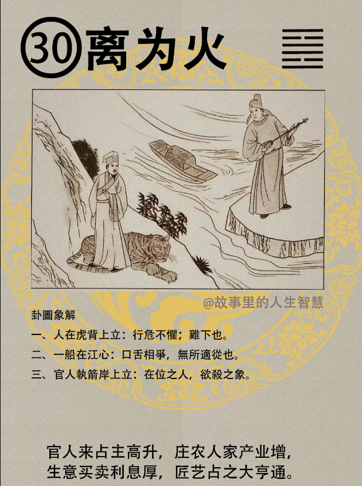

#### 详解离为火䷝

离为火，离中虚。上下卦都是离，重卦。

离本身是丽，天下万物，包括植物动物，如果陷于险中，必有所附丽，所以离卦是坎卦的续卦。 

比如说你今天犯法了，被抓在里面，旁边又收押进来一个人，两个人就变成一党了。同样的，小人，他没有办法了，被君子遗弃了，他就会在很多太太、小姐面前装的很可怜，博取人家的同情。愚善的人就来了，说没有关系，我专门济弱扶贫，你很可怜，我来帮助你，你就是看着小人等把他弄的很壮大的时候，反过来咬你的就是他，这种人还至死不悟的很多。很多人是装出来让你通情他，这个都不好。

前几天我在新闻上看到有个大兵从波斯湾回来，他控告美国政府说没有照顾我们战后老兵，实际上到波斯湾才多久? 九个月，一直在那边吵，说自己带来了怪病，常常嘴巴会破裂，会流血，现在小孩子都有的，其实这个跟波斯湾没关系。听就知道了，血太热了，流汗留太多了，太皮了。你在装同情，他表面上说我好可怜，国家都没有照顾我，你就要下去调查他的家，看他夫妻之间、看他的孩子有没有正常的工作；太太有没有正常的带孩子，你去看他的家庭背景，他的可怜是他自己造成的。如果一个人活的很光明正大，一百块钱过一天我都过的很爽，我吃馒头也很爽，有什么怕的，装什么可怜，那么多人，为什么独独你一个人，带来了怪病，什么怪病? 白虎汤就好了，五块钱。

离也是代表明，叫中虚为明，离中虚，中间是两个阴，什么意思? 明的意义是什么? 很简单就是你的性，现在我们的人都是先入为主的观念太重了，所谓中虚为明就是佛教讲的无我，很多人会读佛经而不会做。易经讲的很清楚，要无我，你不要把自己想的太重要，不要以为自己可以决定一切，你今天走了，太阳明天还是照样升。不要有先入为主的观念，心里面不藏任何东西，用耳朵去听，才能够很明。先入为主的观念是还没有开口，我是儿子，你是爸爸，你还没有开口我就知道你要给我讲什么道理，听不下去了，所以中间是死的，不是空的，一定要中虚。 易经告诉我们的很明确，一定要很谦虚的、很中虚的，空的才能够接收东西，就像空杯子才能把水倒满。

现在很多人根本不懂就做决策，就是他认为自己太重要了，不够中虚， 中不虚的人当然不明，这种人现在占了十之八九，因为他不了解明的意义。

易经不但光讲一个卦是明，两个卦还有继明，就是相继着要明，什么意思? 我是，我要找我的接班人，不是你总统找的，我眼睛要明，我自己要明，知道这个人可以接我的位置，他接我的位置的话，我很明的看见，他可以把我好的政策继续执行，有不好的我还来不及改善的地方，我现在滚蛋了，你来接，你会把不好的补强，不但我的好的要继承，还要继续做补强。承继之人，他好的我要保留，还没有做的，需要修缮的我赶快去做。这叫做继明，两个都明。承继之人，他好的我要保留，还没有做的，需要修缮的我赶快去做。这叫做继明，两个都明。

现在你明我明没有用，上面不明，问题在这里。这个问题才大呢。他自己觉得自己最明了，什么都知道。

所以人间道里，易经要人有继明之德。

第二，至明之人，最清楚的人，知盛必有衰，有始必有终，结果不是成就是败，一定会有结果。因为知道这是自然的定律，一定会有结束的时候，所以君子以顺理为乐，顺理合乎道理我们去追寻，所以君子是乐天而已。至明的人乐天。

第三，小人之明，不知道人有生有死，有盛有衰，这是正常的。每天恐有将尽之悲，将尽就是快完了，每天担心，乃以倾没哀叹，至凶而已，害到自己。

如果你现在是部长、院长，你不必听谁讲，你顺理而行，你顺理做的时候乐天，你认为下对得起黎民百姓、上无愧于天地，就可以了，这是最乐的。如果是小人，我现在是部长，我还想升院长，每天恐有将尽之悲，我要不好好巴结他、不背后送礼，我一定是干到部长为止了，每天在那里叹息，这个都是在政治上我们可以看到的。

#### 占卜

第一，人在虎背上立，告诉你骑虎难下，还有行危不惧，不要紧张。

第二，一个船在江心，船不靠岸，叫口舌相争，无所适从。

第三，官人执剑岸上立，在位之人欲杀之象，要把你干掉。

所以，这个课，是各自为王的课, 起到这个课的时候。海峡两岸，台湾海峡在中间，黎民百姓站在船上面，留在大陆还是逃到台湾，怎么才好，一念之差，四十年不一样。所以，民国38年的时候，年卦进入离为火，海峡两岸分开来。

中震兄啊，拿着剑很凶啊。老王兄啊，站在老虎背上，你看我老虎背都敢站，怕你啊，行危而不惧啊。

#### 阳宅

阳宅上面来说，二女居本位，成格。

第一，你发现你二女儿很奇怪，总是想出国，不想回来，离为火。

第二、正科红鸾星动，26 岁就26 岁那年，18 岁就18岁，管她是落在哪个宫，就结婚了。

第三，明理而不惧，你哪天发现你的二女儿跟你讲话那么有道理，你都想不道，离为火。

第四，你发现妈妈上个月给你零用钱，给完第二天就花掉了，破财不守。

第五，你跑过来说爸爸你看成绩单，爸爸不用看了，名列前茅。

图就是读象，是汉唐以前的。