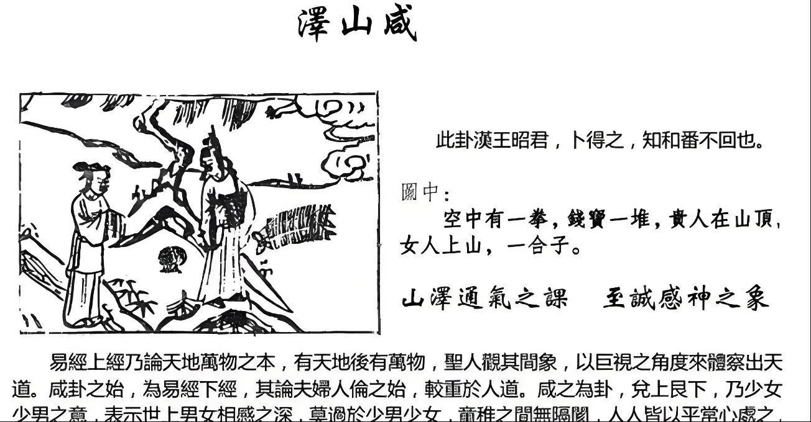

#### 详解泽山咸䷞

进入第 31 卦，下经开始了，第一个卦泽山咸，什么意思? 咸本身就是感，感觉、感应。

为什么咸卦是下经第一个卦? 因为天地生万物，生万物之后就会有男女出现，有男女之后就会有夫妻，有夫妻之后就会有父子，有父子之后有君臣，就会有上下之别。

进入人伦的时候，第一个卦就是感应，感应的外象是什么？外面是泽，里面是山，内止外悦。

泽是少女，山是少男，这个世界上男女相感应，外面很喜悦，内止，里面没有欲望的，那是小孩子。你看你的儿子跟隔壁邻居的女儿玩在一起，他是没有邪念的，这是感应之始。在幼儿园里面一看，大家都玩成一片，不管玩的人背景是什么，大家玩儿的都是一样，这叫做初感，就是咸卦。外面很喜悦，里面是止的，里面没有欲望的。

但是你现在出去玩就不一样了，你看到那个男的笑着，鱼尾纹翘起来，眼睛眯眯的，这个人是有问题的。我们和男的在一起他不笑，有女的，他就在那边笑，无事而笑，心生毒计。

在人间道上面，我们古代的圣人知道用咸之道，知道这个感应是人间至真至善至美的一种感应，所以他会用咸，用至诚以感亿万人民，这个时候才能天下太平。

感应的方法，沼泽在山的上面，山上有泽的象，泽有渐渐浸润的相。所以要感人家，以至诚的心慢慢去浸润，你不要急，不要每天在那边讲新闻说百姓是第一，实际上我是第一，然后说大家都同意我当总统，用民心至上来压人，实际上都是他说的。你要用至诚的态度慢慢感应，亿万人心才会成为一心。

如果是小人和女子，抱歉啊，我讲女子，身上就会发麻，这不是我个人讲的，是易经讲的啊。小人和女子不能以至诚感人，唯以物来感人。我是男的，我来追女朋友，第一次见面就送钻戒，第二天见面带着去买很有名的名牌衣服，第三天见面买个车子，以物来感人，就是小人。这里的女子不是指全部，是指部分。

君子是以至诚来感人，诸位要接受至诚，男孩子追你诚心诚意，你要试他的诚意很简单，学诸葛亮，他来了你不理他，找不到人。再来找你，第二次还是不要理他。第三次不理他，你就太过了。第一次不理他不急，怎么讲? 他一来找你，你不能说太好了，我等你好久了，不要急。第二次来找你，你不理他是中庸之道。第三次他来找你的时候，你就给他看到，但是你不要出面，如果你喜欢他，你觉得如果还不错的话，就在那边等，故意坐在那边看看他有没有耐心，就边等一个上午，他很有耐心坐在那里，这叫至诚。

你看男的来追你的时候呼天抢地，在雪堆里面衣服也脱了，说我爱你，这是假的，真的至诚不是外形的呼天抢地。像前一段有人上香的时候，有人呼天抢地，这是小人，他哭的越伤心，越要昏倒，麻烦越多，你给的越多。 

家里面真的有实力的人，不会在乎你这个，不会哭成那样，他很冷静，克制感情，处理这个事情最重要。呼天抢地的那种，你给他的钱他觉得够了，他就不哭了。

所以我们圣人很厉害，所有的人间的事情，每一件事情他都仔细去观察。如果我不说泽山咸卦，你们从来就没有想人间感应最好的是在小孩子身上，所以我很喜欢看孩子玩。

#### 占卜

空中有一拳，指头画的看着好像发育不良，云彩上面一个拳头，代表凭空而得，有贵人提拔。

第二，财宝一堆，在那边有三串，看到没有，叫做求财得财。如果你问我说这笔生意后面会不会赚到钱，一卜到泽山咸，大赚。

第三，一个贵人跑到山顶上，代表孤立的状态，旁边没有助力。还有将走下坡，已经到了山顶上，再下来就是走下坡了，将退之象。

第四，女人上山，如果是卜夫妻，卜夫妻复合，会复合，吉卦，夫妻是吉。

如果是阴人卜之，一个女人来问你官运，我在银行工作，会不会升迁，女人卜之，走马上任，因为往山上走嘛。

第五，盒子在旁边，先成后破。就是进入咸卦的本卦，我们在卜卦之初的时候象就出现了，小姐你这次走马上任会很成功，可是你恐怕会历史重演，你很倒霉。看到上山是好事，里面有先成后破的象，那怎么办呢? 没有关系，以至诚方吉，以物感，凶。如果这个事情发生在你任内，一发生以后，开始马上到处送礼。出事以后晚上开始到处送礼，是以物在感人。至诚的面对，反而不见得受损。

#### 阳宅

阳宅：三女居三子位，成格。

第一，婚成于媒妁之言。就是夫妻都没有碰到面，就结婚了。

第二，婚先成后破，所以在媒妁之言的时候就要合八字。

第三，对象必为豪门，除了有钱人家以外，官家也是。

婚延一年。比如她26岁红鸾星动，结果变成27岁。大部分是单岁结婚。我们发现红鸾天喜星出现的时候，是双岁，婚延一年就变成单岁。

第四，如果女孩子去住的话，财路、事业婚前佳，科甲不兴。读书不见得很好，但是工作各方面做得非常好。