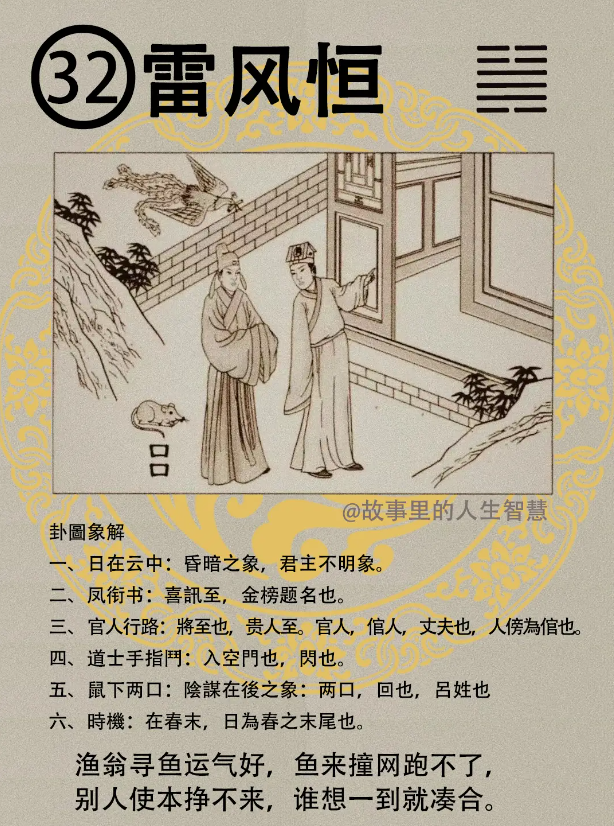
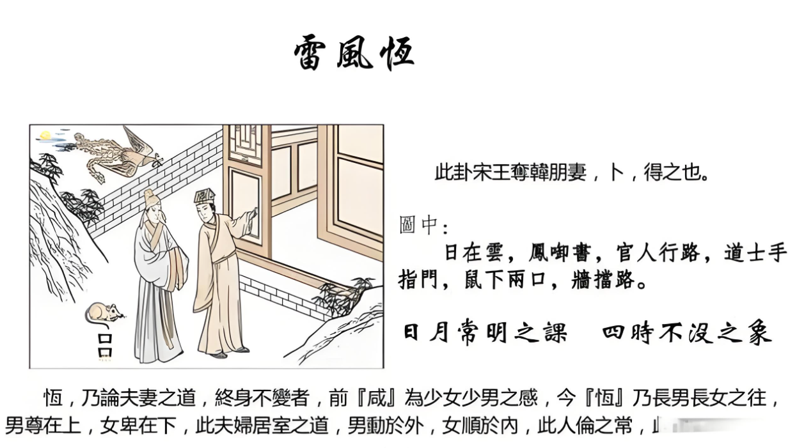

#### 详解雷风恒䷟

雷风恒卦。为什么恒卦是在咸卦之后。

男女之间有感之后就结成夫妇了，成为夫妇以后，夫妻之道在易经里面谈的就是恒久，算命是赞合不赞离，这是基本的原则。但是对方实在不行的，要舍，易经并没有说你先生去抢劫，你也陪着去，不可以的，要恒有恒之道。这个卦整个讲的就是什么时候持恒，对的地去持恒。

你看它的象，长男在上面，长女在下面，在夫妻之间来说的话，男在上、女在下，男尊女卑。刚刚讲到的泽山咸，女在上、男在下，女尊男卑，这是初感应的时候，所以你看到男孩子去追女孩子的时候，女孩子都是至上的。

人间道里：

第一，君子不忘本，持恒到底。恒的时候，原则是目标不变，方法可变。

第二，小人之恒，恒恶不变，作恶的心态永远不会改变，外象常变。他要想骗你的钱，用这个方法骗不到，他会用第二个方法，他的外象在变，可是目标不变。你是小人，结果易经上会叛你的刑，叫做无地可容。

第三，妇人之恒，从顺于夫即从人，夫要贞正，你可以持恒。

第四，君王之恒，不可持恒于人，持恒在正理。所以君王的恒是大恒，夫人的恒是小恒。如果你持恒在人的话，你的手下已经是坏人，什么资格都没有，眼睛在那里翻来覆去，在后面造谣生事，你还在持于他，你是持恒于人，不是持恒于正理。

#### 占卜

第一， 日在云中，代表昏暗，君王不明象。如果是卜婚姻，就代表你老公不明。

第二，凤衔书，有凤来仪，代表喜讯至。

第三，官人行路，代表将至也，贵人要到了，也代表丈夫欲回。为什么古人要卜到这个，因为以前丈夫出门做生意或者走马上任，或者去京城考试，需要很久，秦香莲就来了，聊斋故事很多啊。补到这个卦很好，你先生快回来了，而且是喜讯哦，不是乌鸦传书，是凤衔书，好事情哦。

第四，道士手指门，就是告诉你要跑路的时候，入空门也，躲到和尚庙里面去。所以以前盗匪、通缉犯没有地方跑的时候就倒到和尚庙里面去，就出家当和尚。现在很难了，以前很好跑路。

门内一人，人跑到门里面，就是闪，躲开来。

第五，老鼠下面两个口，是回，回来，或者姓吕。或者代表阴谋在后。卦卜出来，就是警戒我们，提醒我们的象。

整个卦有个时机在里面，要拿捏准确，在春末，农历3月底的时候叫春末。有人说老师你怎么知道春末? 诸位看，日在云中，日不明，春是三个人，日在最下面，春的最末一笔是日，日上面是三个人压着，所以时机是春末。

有一次我在上海，有一天晚上来了一个人，说你看看我们要去美国，签证可不可以过?我说我什么都没有。你写个字好了。他刚好写一个“春”，那时候是过年嘛。我说你们此行三人，春末成行。他说就是三个人去， 不是我一个人去，公家单位派出去，三个人一组，不能一个人去。

字上面很多，像，老师，我这次到泰国去，你看会不会有结果? 我说你也个字，他写一个“海”。我说你是去三个人? 他说没有，我们两个人。我说不对，有个母，三人母。飘洋过海，海就是水，水是财，会成的。结果他从泰国回来，真的是三个人，我跟我朋友去，他的太太从别的地方过来，跟我们在泰国曼谷机场会合。本来是我们两个人去的，一去机场变成三个人。

#### 阳宅

阳宅：长子居长女位。

第一，易从宗教，但不正。

第二，智慧会有蒙蔽现象。

第三，心生毒害，凶。

第四，婚晚一年。

第五，如果还没有结婚，如果在官场，官运不佳。如果是做生意，商场不顺。科甲旺，所以如果你想让你大儿子读书很好，你赶快换到雷风恒。