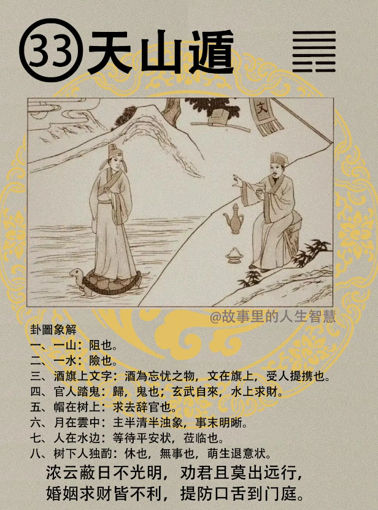

#### 详解天山遁（遯）䷠

天山遁（遯）。上面是天，下面是山，第三个是男孩子。

前面的恒卦，恒者久也，物不可终久。我们讲物好了，不要说是人，你的稻谷放在谷仓里面，不能放很久，所以我们在部队吃的推陈的米，永远在吃三年以前的米，永远都存粮那么多。物不可终久，久则有去，遯就是去的意思，不单单是指退休，是指离开、去的意思。

在外相看，天在上、山在下。天性是阳，向上。山体大而止，山是不会像苹果树长大的，但是体大，可以顶到天。这个自然的象就是遯，讲到人间道你会更清楚。

人间道：

第一，小人盛时，君子退。你说退的话，不行，就没人讲话了，不是，君子要退，而且贵在速，快速地退，为什么? 退以伸道，你可以去外面演讲，到学校去讲课，你不要恋战，恋战会自毁。

所以君子在屯然的时候，所以并不是真的要避开，而是处在末梢来伸道，来找志同道合的人，才对啊。所以我就常常劝很多博士你出去教书，让学生听清楚。

接下来有个很重要的，这个我承认我做不到，诸位可以随时提醒我。

第二，君子观遯，就知道远小人之道。君子还是可以往上，小人再高大也是停着的。若以恶声厉色，很严重的骂他，徒致怨忿，导致怨忿，只会让小人增加对你的怨忿而已，不见得能把他变成君子。唯在矜装威严，使知敬畏，小人自然远走。

如果你公司里有小人，或者是家里面有小人，或者朋友中有小人，易经告诉我们不要恶声厉色，痛骂他，这个我就做不到。矜装威严，就是做事情要有分寸，眼睛不要对他苟以言笑，你对他一笑，他就得寸进尺了，他一做错，你就很严正地纠正他，让他怕你。你不用很恶声去骂他，不需要，让他自己知道敬畏，知道他的目的达不到，他自然而然就走了，这是君子对付小人的方法。不像我，直接说你就是小人，滚啊，讲完了，我没办法做到真正的君子。

在遯卦里面最重要的，易经讲的一个很重要的道理，在遁，在退，在去的时候，讲君子小人之分。

小人如以女子，大部分人，但知恩不知义，你要对她亲爱之，则忠其上，忠上的原因，完全是私恩。所以得到小人女子很简答，你亲爱，还好对他就得到了。就告诉你要私恩，私人的恩惠。现在很多人事的公司，他是保险公司，如果我是这个公司的总经理，我从那个保险公司想到这个保险公司，我可以带一个班底来，你可以走了，不要你了，懂不懂我意思。小人群聚在一起不知道真正的义，义就是对黎民百姓有用的，他只知道谁对我好，我就跟着他，其实这个人是个坏人。所以对付小人很简单，你让小人围在你身边，你就亲爱他，他就来了，即使你是不对的，他也支持你。这就是小人和女子。

#### 占卜

第一，有一个山，山代表阻碍。

第二，水，代表险。

第三，酒，旗上有文字。酒是忘忧之物，文字在旗上，受人提携。

第四，官人踏龟，归也。还有乌龟的头就像蛇的头一样，乌龟和蛇合在一起叫做玄武，水上生财，水上求财大吉，海运就是水上求财。

第五，璞头上树，右上角有一个官帽子，包公带的那种。求去之象。

第六，月半云中，半清半浊的象，就是事未明晰。

第七，人在水边，等待平安之象。如果是人立在水边，就不是，就是泣。他是坐在那边喝酒，是等待平安的象。

第八，树下人独酌。树是木，人站在木旁边就是休，休的象。所以如果有人说要卜卦，你看看我这一趟，好不好，一卜，此行大凶，不利。酒为忘忧之物，你回家喝喝酒，不要接受文书，不然官帽都会丢了，等待时机，不要急着去。你去可以，去了踏着龟就回来了，随时会归来。

#### 阳宅

阳宅：父居东北位。这在阳宅上常常能看到。

第一，萌生退念。你看到有些人三十六岁就不想干了，每天像老头子，没有干劲，就是结婚以后住在东北角。

第二，夫妻感情退化，对夫妻不利。

第三，事业回归到原地。这个时候你看看流年，比如说26—35岁权禄重重，非常好。36—45 岁，本来是逢到廉破，然后吉星落陷。再一看他住在遯的位置，26—35非常好，36 岁以后一直走下坡路，到头来回到原地，干了半天不想干了，发现努力了半天没有功劳。有人说，命是我们人类开创出来的，假设你这句话是对的，那你去拿一个农业博士嘛，去干个总统嘛，胡说八道。

第四，官运不升。你是当官的，结果住在遯卦的位置，不会升迁，劳而无功。

第五，疾病上面来说，身体退化，中年得老年的病。奇怪为什么38 岁得粮尿病，为什么我膀胱无力喜欢上厕所，为什么我40岁老年斑已经出来了，因为东北角是遯卦。

遯卦什么时候可以去住? 65岁以上的人可以去住，年龄大的人，你爸爸退休了，三代同堂。西北角是乾卦，是夫妻的位，太太和先生住在这边。这是三儿子的位置，父母亲年龄大以后住到三儿子的位置，这叫返老还童，艮卦是山，叫寿比南山。长子、媳妇结婚做夫妻，住西北角，一世夫妻，白头偕老。这个时候易经的象就改变了，儿子和媳妇，把爸爸妈妈当成三儿子一样的宠爱，这个动作就叫做孝顺，不然你解释孝顺给我听。

现在年轻夫妻对自己女子很有耐心，跟父母没有耐心，你能够把父母当成你的孩子那样宠爱，这就叫做孝。

所以三代同堂的时候，长孙住东宫这边，夫妻住西北，长辈住东北。但是东北爸爸住好，妈妈住不好，妈妈住毛病很多，妈妈可以住东南，地风升，跟大女儿住在一起，爸爸孙子住在一起。打电话发现孙子不听话，住东宫没孝，让他住到西南，变成雷地豫卦，儿子每天在家里煮饭洗衣服，很顾家以后，发现很好了，再回到东宫里睡。你不要把他爸爸也改进去，里不知道很多人老爸已经退休了，干了一辈子公务员很辛苦，每天上下班都很累，65岁退休了你让他住在西南，他早上起的更早，平常上班7点钟起来，现在变成6点钟起来，每天早上去菜市场，问题是他还很爽、很愉快，就很累，让你爸爸到老还要做妈妈。