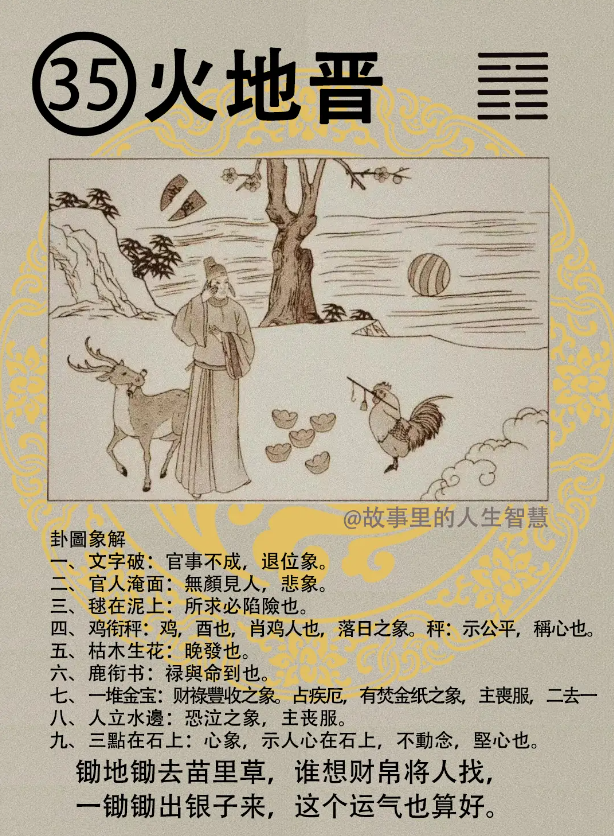
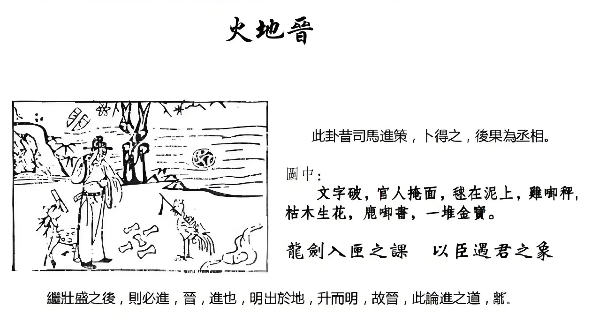

#### 详解火地晋䷢

诸位再来看大壮卦的巽卦，叫做火地晋，地上面有火，这个万物既壮必进，所以这个晋呢就是进也，讲的就是进也，进之道，晋升之道，讲的是专门是进。

壮了以后一定会前进，火地晋，所以他既大壮，外面是明，明中虚，内顺。所以卦上是这样子，代表火在地上面出现，诸位现在看，如果一个地上面一堆火，那这个光亮是局限在这一个地区而已，所以他是讲，这门卦专门讲的是诸侯之道，诸侯。

现在没有所谓的诸侯了，省长嘛，地方法院院长，地方的警察局长，这都属于诸侯之象。

如果火到天上面，火天大有，那是天子之象，所以天子象是比这个更大，那火地是晋升之道，那是诸侯之象，一个人的晋升之道，所以晋本身有进而，光明盛大的意思。

现在到了人间道，人间道上面来说的话，现在的人大部分都知道我要往前冲，我要往前进，不知道需要明而盛。你不能光是往前进，你要明，明才能盛。外明，外面要明，易经一直在讲这个明。所以明之道是什么，中虚为明，举例给你听。

这个小人和君子，刚到一个地方报道，或者是刚到一个公司报道，刚到一个学校报道，不一样的动作。

君子呢，他是以明而进，我来这边报道，我就是把我，老板给多少薪水，我把我工作做好，那我根本不要求你给我多少代价，我做我应该做的事情，这叫做以明而进。 

小人不是这样子，我来了，我要表现的很好，什么义理你先不要管，看老板喜欢什么，我就巴结，迎合奉承他，希望上面赶快相信我，赶快让我提升，赶快让我升迁，这就叫小人你僅不懂我意思。君子他不会管这个事情，所以他只把他分内工作做好，他来做事儿。

所以我常常跟诸位讲，君子小人很简单，小人他根本就不是人，所以他一天到晚花儿时间做人，希望你了解他，是不是。你不需要去做人去了解他，真正的人会看，让人家看你就好了。

现代人只知道进，不知道需要明而盛，诸位试想想看，最近的报道，这个校长都可以干部长，这是什么咖，他是怎么进来的。

还有呢，今人上位，这个讲的是三四爻，就是将相之位。今人将相之位求进，很可怕，以富有为明。你有钱就可可以进来了，所以现在只要有钱的，就可以当官，你看看上去都是有钱人，都是鼻子大大的，眼睛都不好。

这个鼻子大，有钱，上去有时候你有钱就是对的嘛，有钱人讲的话就是真理嘛，没有。

所以现在的我们的局势就是，富有的人为明，富有的人居上，真正有才智的人呢居下，才智之人居下。易经按照这个道理，易经就推了一个结果给我们，它说这些富有的人，他胸中无才。他虽然今天上了，可是他一天到晚担心，为什么? 下面才智之士太多了，哪天会篡我的位。他一朝天子一朝臣，所以你看他好像过的很了不起，可是他每天对着他的主子，必须迎合奉承，每天要防手下这些才智之人，尽量不要让人家出头，不要让下面的人，才智的人，给外面的新闻界的人看到他能力比我强，他每天过这种日子。

所以越过人就变得越阴险，每天眼睛在那边闪动，很阴险。他也很痛苦，君子说，易经说给这种他批了一个结果，自凶，自己自凶，自凶你懂不懂，没有人要他凶，他自找的。

所以如果是做君王之明呢，明要中虚，不要受到谁的话什么影响，让他推荐，他推荐人搞不好跟他有关系，对不对，你推荐没关系，你们统统做没关系，我自己看。

现在就是我们这个登辉先生就是不够中虚，没有中虚，看到人的时候，有钱人都是对的，明明是错的，以财富来论英雄是不对的。

#### 占卜

第一个文字破，文字破呢，代表官事不成，升官的事情不好，官事的事情不好，还有退位象，退位下来了。

官人掩面，无颜见人。还有代表什么你知道吗? 还有代表心胸。先生抱着脸在那里哭，太太有问题，太太可能身体有问题，这个都要考虑进去的。有悲象，悲的象。

球在泥上，诸位球在泥上，为什么现在水象，地象，都写在泥巴象上，代表取则陷也，代表进凶。有一天有一个人升官，先生你看看我此行去升官，吉凶如何? 升官不一定都是好事儿。我们碰到他就很倒霉，那一卜到火地晋，你不必去了，你待到原地就好了。有凶的现象，陷进去，你可能会出事。

鸡衔称，鸡代表时间是酉，有可能代表酉年，还有代表黄昏，有落日之象，太阳下山，落日之象。

称呢，称是公平的东西，表现公平的东西，吉衔。

第五个呢，枯木生花，代表晚发，发的很晚，

鹿在衔书，鹿含着书，代表禄与命到了，这个命是命令，人事命令，升官的命令，不是你命到了，升官的命令。

一堆金宝，这个金宝呢，财禄丰收的象，财禄很多。如果你是卜到生意，生意会赚钱，但是有人悲，恐怕凶事儿会发生。

那这个卜疾厄，金宝在地上，就有焚金之象，烧金子之象，占疾厄是大凶，主丧服，2人去1，两个人去1个，夫妻要死一个。

人立在水边，立在这边，水在这边，泣，哭泣。

左上角三点在石头上面，三点在石头是心，艰辛，人心在石头上不动。

如果你把整个卦读起来。比如说一个人卜事业如何，卜下去的时候，卜到火地晋，事业会进步，但是恐怕会有丧服，恐怕会，家人会出人命，夫妻之间会死一个人，要注意。

然后你讲完以后，你一看到旁边三点在上边，你卜完了，他心不动，他不会听，读出来。卜到这个卦，绝对你讲这个凶，你不会接受，这很好玩儿，人在大限到的时候就不会听。不会听，是你死又不是我死，那没办法。

所以我说我们那个邓某某人旁边，一定有高人在旁边，高人不难，高人很多，高人真的很多，隐士的，现世的人一定有高人，问题是他怎么能让他这么信任他，这个不简单。

#### 阳宅

阳宅，阳宅呢，火地晋，二女居母位，成格，你的名字叫二女儿，他不去住，好好不去住，跑到妈妈位置去住。

第一个，性柔如慈母之人。

所以如果你结了婚有了孩子，你看看你妹妹还没有结婚，那你给孩子找保姆找不到，那你把你妹妹，妹妹你去睡那个房间，只要西南角一睡，她就是保姆了。然后帮你养孩子那个人，她就是养的不是她的孩子，叫螟蛉子，对吧，就是养了别人的孩子，鼻头纹就一条线就出现，很明显。

婚晚至40 岁以后, 40岁以后结婚。

第三个，一样，偏房或二房。

然后这个人住在火地晋上财禄非常节省，非常省钱。

如果是在火地上面的人，一个例外，对象为鸡，大吉。 除此之外都是好，不管她是怎么样，40 岁以后结婚还是怎样，对象是鸡都可以很好。