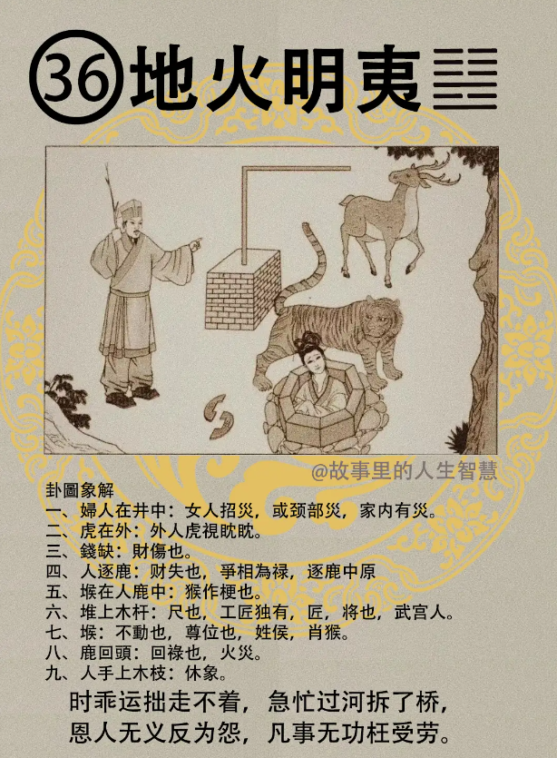

#### 详解地火明夷䷣

火地晋，晋和明夷卦，把晋反过来叫明夷卦，好象表里一样。

火地反过来叫地火，火在地下面。刚刚是是火在上面，所以是诸侯之象，因为它的照亮，只照亮一个地方。这样子火跑到地下面去了，叫明夷卦。

因为物进，我们都会人会升迁或者是人会长大，物进不已，一定会受到伤害，有伤。所以我们常常不是说，每一步都很顺随。

所以物进了以后，一定会有伤到。就好像我们汽车开了，引擎里面磨磨自然一定会磨损，一定会有伤。

所以明夷卦是什么?火地晋的序卦，上面是地，离中虚，地火明夷。

那刚刚呢是日出地上，是进而盛的现象，现在是日出地下，太阳跑到地下去了，光亮跑到地底下，这个卦是昏暗之卦。这个卦讲的是暗君在上，明者见伤。上面的君王表里不一样，暗地里搞阴的，明者见伤的时候，这个地火明夷讲的就是这个，玩阴的。

玩完阴的以后每天拿着圣经去忏悔，我是基督教的，我是圣经的门徒，我怎么会说谎话，最坏了。

现在呢他进入人间道以后，这个地在火上面，明被遮掉了。进入人间道，那君子呢，用明夷之道，什么叫做君子， 他如何用明夷之道。 

当遇到这个时机，时机遇到这个时候，卦是，地是顺，火是内明，对不对? 君子看到，明夷是伤，我讲过，事情也在这里，解也在这个卦这里。君子用明夷知道，这个时机是明夷的，好，他外顺以避祸灾，内明以求自制。

因为知道现在小人当权，各方面都是小人，外顺来避祸，内明，心知肚明，但是我们和，所以中庸说的一句话，和而不流。小人是反的，流而不和。那和而不流，内明，求自制。

我不宣扬你做的很多事情，那也是顺，没有办法，这是君子之道，遇到明夷的时候怎么处理。

好，那伤呢，这个伤有一个标准，易经讲了君子用晦而明，这是晦明，这个晦明很有意思。老师竟然用这个明，怎么用这个晦呢，这个就是明察天下的事情有一个标准，你不要太明了，就好像办案一样，你不要把什么都弄出来，总是法内要有情，要有人，睁一只眼闭一只眼算了，无足轻重，不要去追，是个人但是算了，就好像畏罪就算了，你把他什么都查出来，什么都去搞，也不好。

所以君子要用晦而明这个，不极其明察，做事情到了警告，达到处罚就够了。就可以了，达到处罚的目的就可以了。好，才能够容物，合众，众人才会来。

如果你自任，这不算小人，易经没有说这个小人，说这个是君子。如果自任这个刚明，太刚了明，这个无所不察。有一些得过且过的地方没有关系，你会造成愤怒不已，会造成易经说的失众之道。

因为一个人绝对没有办法明察天下的事情，好了，旁边A、B、C三户住在这里，A也有做，B也有做，C也有做，你把A、C查了B放掉了，人家就会怀疑到你，了解我意思吗? 反而很多灾祸因为你明太过而影响。当你处罚处到一个阶段的话，他们AB 就会说，C 比较侥幸，看罪到什么程度。所以用晦而明，这个明真正的真明，真明就是用晦，而不是全明。这个水太清澈了就没有鱼在里面，人呢太清则自心则无图，水自清则无鱼，自然的道理都是一样的。

君子有晦明之戒。 

#### 占卜

第一个夫人在井中，代表女人招灾。或者就是颈，颈部，是不是在这里，脖子，颈。或者是家内有灾。

第二个，老虎在外边看他，外人在外边虎视眈眈看。

钱缺，那个钱变两半，财伤，伤到钱财。

第四个，人逐鹿，一个人在上面赶鹿，有财失的象。

还有这个争，争相为禄，这个争是为了财禄。

还有呢如果卜到你是陈胜吴广卜到，想逐鹿中原，想揭竿而起，逐鹿中原。

堠墩子在人和鹿的中间，有没有，你看那个鹿，那个堠刚好在人和鹿的中间，那个鹿围着那个堠在跑，人在后面赶，这个代表说猴在作梗，猴姓的人在作梗，挡在中间，不让你成。

还有一个猴子上面有一个反L形的尺，有没有，这个尺代表工匠，因为这个尺只有工匠独有，匠，将也，代表的是武官，武官的人。

还有你看那个鹿是不是回头，鹿回头，回禄，什么叫回禄之灾? 火灾。所以如果你卜到卦，小心一点，有火灾。

人手上有木条，如果你卜官，你问我这个官继续当下去好不好? 人上面拿一个木条，就是休官，可以停下来不要干了，休的意思。

#### 阳宅

阳宅造成明夷，很多明夷卦，诸位常常在临床上可以看到明夷卦。结果阳宅上面一看，母居二女位。

你的名字叫妻子，叫妈妈，结果西位的位置不去住，结果住到二女儿的位置住到南边。住到南边以后，夫妻都住南的话，先生是天火同人，太太是什么地火明夷，明夷卦。

所以有的时候你看夫妻两个，先生身体很好，她的很差，或者是先生身体很差，她的身体很好，不能乱睡。

住在明夷卦的太太，性刚烈如火，性爆裂如火，如果你家刚好是你太太住在地火明，你家隔壁的太太住在地水师，两个人干起来，两个老公拉两个老婆，两个人拉两个老婆，两个人这样子，很凶。

第二个，必有隐疾，暗灾，难言，不好讲。身体上很多妇科的病，不好意思讲。

还有呢太太会破财，诸事不顺。

第四个，个性上面来说呢，易受小人言。我们为什么要你去分，去听，如何分辨出真话，谣言，谣言止于智者，为什么? 受到小人言，易受小人言，自害，懂不懂。别人那边三姑六婆讲到，陈太太你知不知道，那天菜市场我看到你老公跟哪个在那里，想想你老公在菜市场那里干什么，对不对。谣言就这样制造出来，为什么? 她看你夫妻太好了，她妒忌，不要乱信。好，如果你在地火明夷卦，假的也给你说成真的，你还听成真的了，不问三七二十一，先生回来先修理一顿，很倒霉。一段时间之后你先生眼尾就挂了，往下垂了。

第五个在明夷卦上面，见血光必凶，开刀的话都是凶的，癌症开刀都扩散，开刀都开不好。不是说他本身开刀不好，而是开完刀以后状况不好了，开刀都不好，懂不懂我意思。

好，那这个卦常常有一个现象，夫欲救妻力不足，人力做不到。先生把鹿赶走，我不要钱，我要太太，太太陷在井里面，陷在井里面是自陷进去的，救都来不及救，所以地火明夷卦的时候非常的不好。

所以如果哪一天你发现到习惯，我先生打鼾打的那么凶，刚好住西北角，每天吵死人，先生不住西北角不出声，好了，先生你去住南边好了，先生好了，南边就是天火同人，太太还是在地天泰的位置，这都好了，位置可以随时调整的懂不懂。有的人因为打鼾，结果住到西南角的时候去了，变痞了，对不对，那不知道，跑错位置去住，可能他外面形的原因是打鼾。