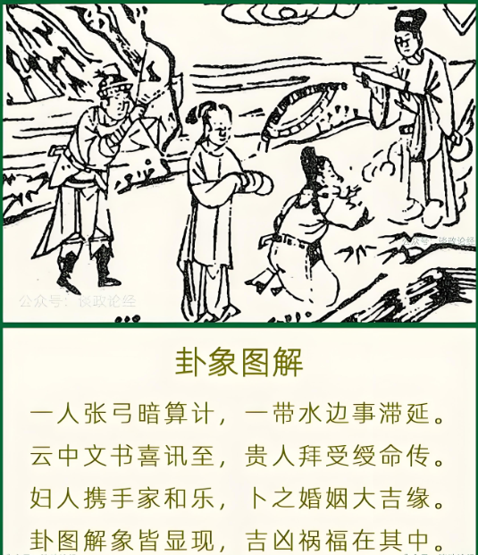

#### 详解风火家人䷤

明夷卦后面呢，再来就是家人卦，我们刚刚讲的这个明夷的夷，夷者伤也嘛，伤于外，必返于家，一个人小孩子在外面跟人家打架打伤了，第一个是逃回家找妈妈。所以伤于外必反于家。所以明夷卦之后就是风火家人卦。

家人卦呢，专门讲治家之道，讲父子，夫妻之道，好，这个长幼有序之道，统统在家人卦里面提到，我们这里没有办法一一的讲，我们提重点出来。

过去我们老祖宗的观点，一个人的治家就等于治国，方法是一样的，形不一样神是一样的。

诸位看，这个火上面有风，过去我们古人的观点，火生风行，烧了火以后起来，风就起来，的确是这样的，那个原子弹一大挂造成那个飓风，有没有。所以叫风自火出，叫做风从火出来。所以说由内治外，就是由内而致外，从里面发到外面出来的一种现象，一种状况。

所以治家也样，你治家里面跟治国是一样的事儿。

人间呢，第一个，圣人，看到这个风，风自火出，看这个象。以前老祖宗没事儿，坐在那边生一堆火，晚上就会在那儿防蚊子，他就看这个火，风就开始吹了，看到自然界的象，他就已经知道知事必由内出。任何事情一定发生内，所以最坚强的堡垒由内部破坏。

事必由内出，知道因为事一定由内出，爆发内，爆发自止。所以圣人看到这个洞，就看到自然界这一个象，他就体会到什么，所言必有物，讲话一定有事实，言之有物，这个物讲的是所言必有物，圣人所行必有恒。这个恒呢就是法度，法则，一定有一定的法则。这是圣人的家道。

现在我们人的家道不是这样子，易经上头早就写好了，五千年写的就是这样子，今人的家道说的不是这样子。大皆，大部分人都是，以情胜理，自己再错，儿子或者家里面人再错，还是自己家人，你懂不懂，比较包庇。以情胜理，以恩来夺义，在正义和道理上面自己家人不对的，但是还想尽办法挽回，想尽办法帮他脱罪。

那易经上面谈到呢，这个家人卦，我们自己家以刚中有柔，不能全刚，你太过严也不行，太过严人心会变，人会变，跟家里面没有沟通的管道，没有人敢讲话。你过柔，下面人会骑到上面来不行。

所以我们在相书中讲到要有威，这个威怎么解释呢? 和兇不一样，这个兇，很多人很兇没有用，有的人兇了人家还不怕，要有威，人要有威。为了望而生惧，他不敢，对你怎么样。要有威，要威的话，一定要自制，从自己开始做。
你自己都都没有要求自己，还要求儿子。你说儿子去KTV 不好的，那天我在KTV碰到你，不然为什么知道KTV，所以说不清楚了。

所以一定要律己，你要律己才能有威嘛，这是治家。

#### 占卜

占卜的时候诸位看， 家人卦的时候，我们卜到一个人张工，一个人一条腰带，官带在水旁边，五阴中有文书，贵人拜寿，富人洗手。

一个人张弓，代表暗算。暗算，破坏的意思。

一个带在水边，带在水边，是不是这样，带在水边，带旁边加一个水，滞， 事情停滞不前。代表弃官，腰带丢掉了，我不干了。

云中有文书呢，云里而有立书下来，突然的喜讯，突来喜讯。像我们这个孙某人校长不干了，突然来喜讯就当部长了。

贵人拜寿，代表授命（绶命），接受授命。

第五个最难解的富人洗手，代表在风火家人代表家和，易经在讲家人卦的时候，特别强调富人，富人必须要正，贞正，所以有时候在家里面爸爸唱黑脸，太太唱白脸，好，比较正，比较好。一个黑一个白比较好。

你说我那天看到你在KTV 对不对，儿子说谁说的，我妈妈带我去的，儿子就没办法管了嘛。所以富人在这边，除了有家和之象，最难懂的在后边，叫做妻同。

如果你卜到这个卦，倪先生我现在，本人不干，不当官了，我辞职了回到家里，上面派令我到别的地方去。一卜到这个卦，先生请问你，你太太同不同意去，我太太坚决反对，你不要去，听老婆的话，妻同。

最难懂的是这个，要得到妈妈和家里女人的同意，女人旁边看的比较准。

所以这个卦告诉你，千万不要一意孤行，遇到这个事情的时候，这个事情停在那边不走，是有人在那边暗害，所以让事情停滞不前。

那有突来的讯息是很好的信息，要由太太，你老妈，女人家同意你去，不要一意孤行，要听取她们的意见，她们不让去，你不要去。

易经这个卦就是把女人写的帮助很大。

#### 阳宅

长女呢居二女位，大女儿住到二女儿位置，好好的大女儿位置不去住，住到二女儿的位置。

第一个，如果这个女孩子当官，当老师的，就是在公家单位做事儿的，官运不前。

第二，如果考公家单位，科甲顺畅，高中。好，云中燕传说，科甲高中。

第三个，大女儿住到二女儿的位置，婚姻就是什么? 婚姻有问题，婚姻要延后五年。

你看她流年，如果24岁红鸾星动，要29 岁。如果她是14 到23 岁中间有红鸾星，结果一算，小限22岁逢到红鸾或天喜，那结果就住在家人卦位置，一定加5，27。

家人和睦，家人一定很和睦，有人来卜风火家人的时候，女孩子住在这里，代表大女儿跟家处的非常的和禄。

但是第五个呢，妇女病比较多，家人卦，为什么? 带，带在水边，怎么那么多水出来，带。

不好意思，可是易经是这个意思。