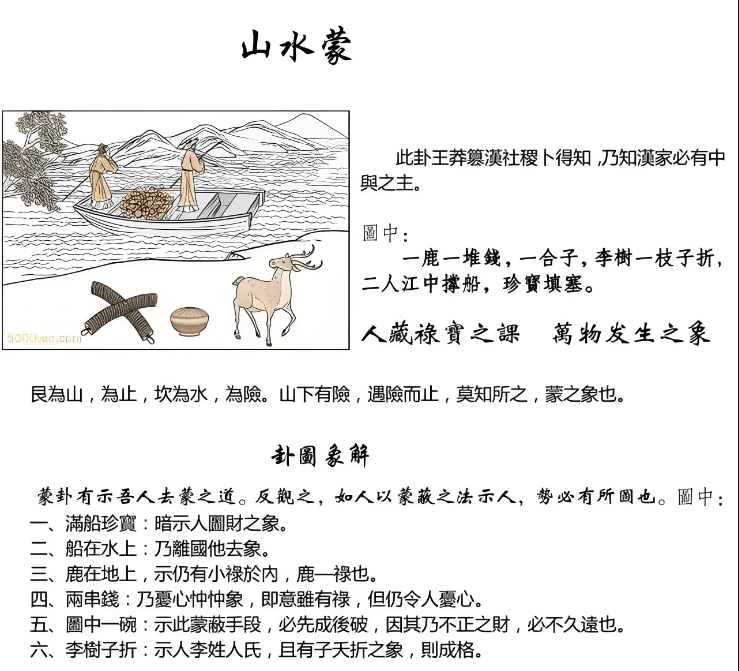

#### 详解山水蒙䷃

匪我求童蒙，童蒙求我。初筮告，再三渎，渎则不告，利贞。

▅▅▅▅▅ 上九：击蒙，不利为寇，利御寇。
▅▅　▅▅ 六五：童蒙，吉。
▅▅　▅▅ 六肆：困蒙，吝。
▅▅　▅▅ 六三：勿用取女，见金夫，不有躬，无攸利。
▅▅▅▅▅ 九二：包蒙，吉。纳妇，吉，子克家。
▅▅　▅▅ 初六：发蒙，利用刑人，用说桎梏，以往吝。

要是他的位置越山水蒙。水雷屯，物之始，我们古代人自己屯的时候，开始有智慧，智慧开始的时候就是蒙，山水蒙完全要谈如何启蒙。你是笨蛋没有关系，启蒙的方法对就好了，所以启蒙的技巧很重要。

山水蒙的卦意你如果了解的话，你就是大彻大慧的人。

启蒙为什么说这个蒙叫做山下有水，这是水雷屯的续卦，就是一步一步进来，小孩子刚开始出生，从妈妈肚子里的时候叫做屯，一生下来就是蒙了。

为什么叫做蒙? 上面是山☶，下面是水☵，山下有水，遇险而止。这个水是险，一个人遇险而止，莫知所之，蒙象也，蒙的象。一个人出行会遇到险，一看到前面不对了就停下来了，在那边犹豫，你在犹豫就是蒙了。所以不是说每个事情都很清楚，这个时候如果拨蒙，瞬间让你看清楚。宗教家常常念经10年还是笨蛋，宗教就靠一些咒语、经书让你发蒙，诸位如果能够了解《易经》不需要这些外在的东西。

你看到一个人遇险而止，他走到十字路口，不知道往那边，这就是蒙，蒙的象，看到前面不知所措，你自然而然就会停下来，因为你没有办法做决策的时候，我先停下来，这是人的本性，这就告诉你就是蒙的象。

在《易经》上，山就是止也，水就是险也，所以山水蒙是外止内险，《易经》说外止内险的象就叫做山水蒙。外面是停，不知道怎么办，内里是险，担心、担忧、受怕，这就是蒙。

诸位当你有一天在家里突然不知道怎么办，你不是发神经病，有很多事情你不知道怎么办，你又不敢动，这就是蒙，蒙是要找人启蒙，术业有专攻。比如说这件事情是因为官司引起的，你要找专家，这件事情因为什么引起的你要找什么，这就是启蒙。这就讲蒙的时机。

《易经》第一句话就讲，匪我求童蒙，童蒙求我，初筮告，再三渎，渎则不告，利贞。这是发蒙之道，这个怎么解释? 小孩子的蒙叫做童蒙，你们发现儿子、女儿如果现在心里想我要一杯牛奶，他就要找你，你跟他说了半天，他还是要牛奶，这是童蒙，这是他坚心，匪我求童蒙，童蒙来求我，不是我要去找这个小孩子，而是小孩子要找我。最好启蒙的是童蒙，后面还有很多蒙，把笨蛋分很多种。

童蒙是小孩子，他心里没有城府，他平常心，他觉得他不懂他就要问，他就一直问，这是童蒙，这是最好启蒙，你就告诉他，这是童蒙。

有一种蒙是他来问你，你告诉他了，讲完了，什么叫再三渎？他一再反复的重复的问你同样的问题，他就是蒙，就是他没有听懂，你讲了他没有收到。比如有个小姐今天问我有个考试，可不可以上，我说上就讲完了，她没有收到，她还问我为什么上。再三渎，就是一件事情重复的问你，就是没有问懂。遇到这种情形的时候渎则不告，如果他反复的问的话你不要告诉他，而且坚心的不告诉他，所以我常常跟客户说一次，第二次你再问我我就烦你，我讲了，你没有收到。

易经发蒙之道，坚心，不告，你越是不讲他越按照你说的，现在很多太太、小姐去劝人家，诸位有时候出去帮人家启蒙的时候，第一句话讲完了。比如说你们算到一个人的大限到了，你对他好言相劝，我告诉你千万相信我们，其实你这样会对你很好，这话讲完，我告诉你他不会听你的，他烦你了，你在那边再三渎，你也是一样，同样的话再次的劝他，你也是反渎，他也是反渎。碰到我呢? 他会追我，追到我是童蒙求我，如果他死活都不走的话怎么办?就是他想要了，我就告诉他，我一下解决掉，因为如果你花三个小时给他讲他还是不相信，让他变童蒙，因为他年纪很大了，他已经成蒙了，已经是蒙了。

所以我们应试教育有问题，就说我们应该保持他的平常心，保持他的童蒙，很开朗的来问，没有什么不好的问题，你不好问就是你放不下你的身段，孔子都不耻下问，尧舜都不耻下问，所以他为圣，你有什么不耻下问呢? 童蒙啊，所以你发现小孩子很可爱。所以我为什么能跟小孩子沟通? 就是因为他是童蒙，有什么话他就直接讲了，这样最好，拐弯抹角讲就不要给他。

小孩子玩玩具玩的很专心，你把他拉开他说还没有玩完，你有没有办法做到每个小时都专心呢? 很难，你做不到，为什么? 因为你已经不是童蒙了，是成蒙了。诸位想办法把自己变成童蒙，诸位来学或者是研究的时候先把自己变成童蒙。

这是蒙卦，你蒙的方法，启蒙的方法是对的是大吉。蒙卦是吉卦，蒙要对。

有的人已经是进入蠢的阶段就很难了，叫做双目似睁未睁，两眼无神，眼睛好像打不开来。诸位看眼睛的象，眼睛不在于大小，眼睛在于有神，眼睛好象打不开是没有神，这个就是蠢。平常我是没有菩萨慈悲心我给你开蠢，我们只有开蒙，偶尔碰到蠢的我宁可不讲了，这个很累，如果我们好心告诉他这样做，他说真的吗? 他在怀疑，这是蠢，我看太多了。

我给蠢的人下了一个定义，为什么他会蠢呢? 因为他不知道自己笨，他自以为是，他不知道哪里笨，术业有专攻，你不懂就要问人家，这是童蒙，有的人半瓶子水。他并不是读法律的，他就只是看了一下书就在那边卖文章什么的，遇到这种最累，我们遇到完全不懂的最好了，碰到懂的还先这个杯子洗掉然后再装，我们又不欠他，这有变成蠢蛋了，两眼无神的人都是学而不思，思而不学。学了以后就要用脑筋想。

#### 方位的观念

<table>
<tr>
<th colspan="1">巳 </th>
<th colspan="1" valign="top">午 正南</th>
<th colspan="1" valign="top">未</th>
<th colspan="1">申</th>
</tr>
<tr>
<td colspan="1">辰</td>
<td colspan="2" rowspan="2" valign="top"></td>
<td colspan="1">酉正西</td>
</tr>
<tr>
<td colspan="1">卯 正东</td>
<td colspan="1">戌</td>
</tr>
<tr>
<td colspan="1">寅</td>
<td colspan="1" valign="top">丑</td>
<td colspan="1" valign="top">
子 正北
</td>
<td colspan="1">亥</td></tr>
</table>

这里在介绍下一张批之前，我们要先介绍方位的观念。在方位之前还是一个东西要给各位，我们叫做子午卯酉偏左或居中,寅申巳亥头偏右,辰未戍丑双旋以上。

这就是说我们有时候遇到一个客户他的八字搞不清楚，他说我五点钟左右生的，或者是我在鸡叫的时候我生的，什么答案都有，你问他什么时候生的，他的问题很多，他说我是在妈妈早上喂猪的时候生的。

我们有一种方法就是看后面的发旋，如果你是子午卯酉生的话发旋是中央或者是中央偏左，如果你是寅申已亥发旋一定偏右，是从后面看，如果你是辰戌未生的话，一定是两个旋以上，有的人三个旋，用发旋来协助我们判断出生的时候，这是第一个。

还有方位上的问题，我们的正向，卯时正东，午时正南，酉时正西、子时正北，诸位只要知道正向就好了，可是我们实际上在阳宅上的时候我们需要知道 12 个宫，我们把八字合在阳宅上看的时候只看 12 个宫而已，所以说我们的罗盘上有24个分经，真正的阳宅上用到12，方位上只用12，其他的多余的是我们看风水用的，看阴宅用的，山川河流用的，看房子的部位，看整个大自然界的位置，这是看风水，房子四面的布局叫看地理阳宅。依此类推这是方向。

#### 详解山水蒙，去蒙之道

上次我们介绍了山水蒙，蒙的象山下有水，这个是外挂，这是内挂，水是险是内险，山是止的象，外止内险就是蒙。

举例，当有一个人走在十字街口不知道左转还是右转，以为心里有险到，慌，结果动作停止了，当他动作停止下来，在那边考虑，代表他是在蒙的状况，所以叫做山水蒙，从这个动作知道蒙。

我们人常常会有蒙的，所以蒙没有关系，要有童蒙，你在蒙没有关喜欢，你要敢问，你不问我怎么知道你要呢? 你要去请教别人，别人才会告诉你。可是有的人是渎蒙，为什么? 就是说他已经成为蒙了，成笨蛋了。我是博士，我怎么可能会错? 我是天下无敌，我什么都知道，我走马路还要问人家?结果真的迷路的就是他。哲学上才应该叫博士，其他的都应该叫专士，叫博士就完蛋了。我不懂法，但是我可以问，像小孩子一样跑去问，人家一定会回答你的，你就自己去猜测，自己去以为，结果猜测自以为出来的都不是事实，这是蒙。

易经告诉我们为什么人会经过这个阶段，就讲了说人间道。去蒙之道，如何要去他的蒙，诸位你要帮小孩子启蒙，也要注意，必待他诚心一致，来求己，再告之，方能去蒙。去蒙之道要有时机，所以《易经》告诉我们时机如何掌握。

有一个人是你先生，结果你从我们这个班上毕业出去以后，他没有听过我的理论，我的理论到了身上，再从你到他，结果他就蒙掉了，结果你发现先生很固执，怎么讲他都不听，你想尽办法主动告诉他是没有用的，请你以后不要讲了，要待他诚心一致求你。

诸葛亮当年隐居在陇中，他就是看刘备来，刘备来就不理他，走掉了，他不是摆架子，是看看你会不会听我的，你要问的话你又不听我的，你来干吗? 现在很多人去问了人家以后还是自己的意见，那你干吗要去问呢?问了半天浪费人家的口舌，你自己又没有收到，一定要诚心一致。看小孩子来问你的时候，他不懂就跑来就是童蒙，诸位一定是童蒙，要常抱赤子之心，有什么事情连尧舜都不耻下问，你为什么不问? 气量大一点嘛。

现在所有的才智之人，现在外面很多博士，肚子里可以容下万卷书，一句话都容不下，这叫做气量大？有什么容不下的。他平常心来问你的时候，代表他想要，这个时机你告诉他才能去蒙，否则他不想要，你在后面追他，你一定要听我的，拜托。你要待时机告之，方能去蒙。

这句话，必以贞正，很重要。我们的阳宅学，《易经》的样东西南北，这个九宫八卦下来，定位的时候，夫妻、子女、长子，一千年也不会改变，卦就定在这里。外面的阳宅学你找他来看，对不起，你家客厅在这边摆一个盆景比较好，明年再请他来，这边怎么会摆盆景呢?错了，盆景应该摆在这里，这里摆鱼缸，去年和今年讲的话怎么不一样呢? 他本来不蒙的，被你造成蒙了，以为你不贞正，前后不一样。所以外面的风水地理为什么会有这种现象? 以为他没有法则，都在形上做文章，所以每年都不一样，所以法国巴黎设计师，每年都要设计衣服。我们不用，这个阳宅几千年还是这样。

这是它的神。所以外面阳宅学是狗屁了。根据什么? 根据他自己说的，以为他今年说的和明年说的都不一样，等他真正死的那天他还搞不清楚阳宅学真正好在什么地方。太差了。你放心，我们就要抓住真正的方法，十年以后该是地天泰，还是地天泰，该是天地否，还是天地否，什么还是什么。

过去古人，在民智未开的时候，百姓还是蒙的时候，君王就说发民之蒙必以刑禁。叫老百姓启蒙，让他们做良好的国民，要大家一心，同舟宫济，替国家出力，一定要发百姓的蒙一定要以刑禁，所以立法为先，这是以国运来看，所以立法非常的重要，你要教人家，百姓才不会造成不教而诛，有时候他犯了法他还不知道，因为你没有去教。

第二个立法的精神要有，现在我们国家立法院有大问题，真正的立法，诸位，我提一个案例看看，如果立一个计程车管理法，这个方法立出来，这个法要适用、实用才可以，立出来只有你懂其他人不懂就没有用。第一个找一个立法委员，一个人就可以了，第二个找一个交通警察，第三个找一个计程车司机，第四个找一法官，第五找个找一个百姓，消费者，这五个人在一起立出来的法一定适用。立法委员一辈子没有开过计程车，他根本不知道开计程车多苦，冒着痔疮的风险，夏天皮肤很痒啊，闷在里面有湿气，脚还有风湿，每天还要担心上车的人抢劫他，你要找一个开计程车的人，还有一个执行现场交通警察，还有法官，法官的立场怎么看，消费者是百姓的立场怎么看，然后立好的，这个法才合用，让从来没有开过计程车的人去立计程车法，什么嘛? 我们大错误的。

《易经》告诉我们要发蒙，你在欺瞒，利用、蒙蔽百姓来增加你的权力，不行。所以蒙之道必须反过来，你立出来的法不合百姓用的时候，你在欺骗百姓，你是为你自己的利益着想，你可能是为什么利益团体着想，立出来的法是符合那个利益团体的利益，根本没有替百姓做事。如果一个人需要用蒙蔽的手段代表他想图什么东西，所以需要各位的脑筋清楚。

#### 蒙之极

这个蒙至，蒙到了极限以后，发现没有办法改了，你怎么样教他，你怎么等他，他都不发问题，他已经蒙了很深了，太严重了积重难返，蒙之极，《易经》上实在没有办法了，《易经》怎么写? 利用寇，当急伐之。

他都已经没有办法沟通了，修理他，利用寇，征战后，当急伐之，要适中，不要太过了。就像是你打官司，你赢了也不要太乐，平静的回家，不要怎么对人家，这样才不会有后遗症，这样就是上下顺，这就是到了终极，终极去蒙，易经就让你当急伐之。

六四天安门事件，请问如果你是邓小平你怎么办?国家赶快完蛋了，急伐之，但是急伐有一个限度，你不能把所有的人都干掉，所以极蒙的时候要教育他的时候有一个限度，才是最好的，打到他启蒙的时候停下来，利用寇，征战，这是没有办法了，一征战急伐之，适度，不可以太过。到的终极的时候要立即提出来，所以我个人认为当年天安门事件邓小平没有办法，只有这么做，你随便找一个天安门的人，不管他是谁，你叫他当总统，你看他怎么做? 你要反面想，这是不对的。你实在逼的没有办法了。

诸位看占卜。有一只鹿站在地上，诸位看现在我们都知道鹿者禄也，有人说老师，我们为什么要读图啊? 各位知道不知道以前有一本书叫做《无字天书》?就是没有字，就是图案，你当它白纸一张吗?那么好笑啊?

地上两串钱，这个钱是两串，两个串就是忧心忡忡。

他说一个李树一枝子折，李树开花，你们知道十二生肖吧? 不是肖李的而是李姓的人，枝子折是指儿子夭折。

满船珍宝，二人江中乘船，珍宝填塞，有两个人在海上乘船，船上都是珠宝，陆地上就变成有财禄在那里没有错，钱还是有，但是这个钱还是忧心忡忡，大部分珍宝都在船上面，这是《易经》上的卜事告诉我们的。

结果是一个盒子，盒子是先成后破。

整个卦，整个蒙卦读起来，就变成了李姓的儿子夭折，如果用蒙蔽的手段，出现蒙蔽的手段以后，为的是禄，禄在船上了，钱是在那里，但是钱和珠宝在船上面，大家忧心忡忡，但是整个计划对不起先成后破。所以为官之道一定要有信用，这个为政者不可以有任何的贪念，大家不要做大官，要做大事，这个话谁都会说，但是怎么做呢?要知行合一，千万不能说，大事你们做，大官我来做好了，不可以啊。

这是山水蒙，所以蒙蔽除了我们如何启蒙以外，还反过来看如果我用蒙蔽的手段对付你，你发现了我在蒙蔽你的时候就代表我有所企图，没有企图的话有什么好蒙蔽的?
