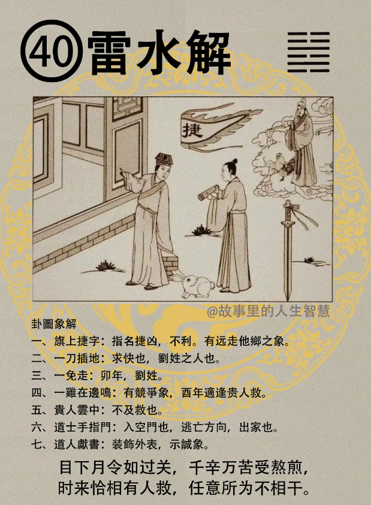

#### 详解雷水解䷧

这是雷水解，解卦，解这个字呢? 上面是雷，下水。解卦本身就是散的象，有散的意思，前面这个水山蹇是难，万物呢不会，不可以终难，不会永远有进退两难的时候。到了难到极点必散，所以到了96爻，到了极也以后，散掉，散到就进入雷水解的卦。

解释，天下灾难刚解的时候，刚刚解难的时候。所以雷在上面，水在下面有没有。这是，外卦是动，内卦是险，这个时机呢? 就是刚刚好，出险的象，那这个时机专门讲的是天下呢灾难出解的时候，专门谈天下灾难出解的时机。这个时候是在这里。

人间道：

天下刚刚解散的时候，一定这个人民很疲劳，国家库存没有了，法纪也乱，这个时候呢，如果处理不好的时候，会延伸很多灾难出来。所以圣人呢主解难时，所以我们说台湾给这个李家治的很累，圣人主解难的时候呢，第一个不可严苛赋税，不要增加人民很重的税单。

第二个呢，不以峻法约束，要修身养性。这样子的话，要宽待，宽易对民，民心就聚在一起了。当民心一聚在一起的时候，这个祸患就很少了。

在天下刚解灾难去掉的时候， 大家人心涣散，记劳的时候，人民也没有钱，国家政法法令很坏的时候，一定要用这种方法。

如果你一下，强行的下去，一下子就会很多人揭竿而起，天下会大乱，大家很多人出来争做天子，就会出现这种结果。所以当解难的时候，要给百姓安静的修养。

这就好像一个人生了大病的时候， 刚好的时候身体一定会大虚，病出解的时候，一定要安静的修养。政治上也是这样，也是一样，以安静修养为主。

当然里面还有，这个一般百姓遇到家的解道，很多人的解道，象的解道，君子的解道不一样。

#### 占卜

大家看这个占卜，

诸位看占卜，如果你卜事儿的时候，不管是卜婚姻的时候，卜到解卦，诸位看中间那个图，提上有旗帜，看到中间那个旗帜有没有，那个旗章不是写的很清楚，旗上有旗帜。

第一个，就是指名提凶，这是很不利的，非常不利的。

还有呢，提这个字，解字，是不是杨字的部首，叫做杨旗而起，揭竿而起，一个部手，手提边是杨嘛。它后边结尾是不是这个字，因为它是走的字尾有没有，所以呢它的其果，远走他乡。

走字的尾，这个走字是这个尾，有没有，提出的这个，这两个字尾是一样的，懂不懂。所以这个尾巴是走字的尾，结果是走。 当你扬旗而起的时候，杨，就是揭竿而起的时候。你火大了，到政变揭竿而起的时候，结果走字尾，结尾远走他乡。

如果第二个，一刀插在地上面，刀呢求快速，还有刘姓的，你姓的这个刘什么刘，宝金刀刘，口天吴，人儿倪，双木林，弓长张，易经上面都有。

那一兔子走，有一个兔子走，那这个兔子除了讲肖兔的人以外，还有兔年以外的，兔子也代表卯年，也代表刘，刘是不是上面是一个卯，下面是一个金刀，也代表刘。

第四个贵人在云中间，不急救，来不及救，还在空中。有一个鸡在旁边叫，可以说有竞争的象，这个事情会有人跟你竞争，那这位先生你要达到酉年或者是酉月。最近就要决定的叫酉日。天干地支。酉年酉月或酉时，酉的时候呢，酉时会有贵人下来救你，帮助你。

第六个道士手指门，代表入空门。易经教我们很多，实在没办法当和尚跑路，就是入空门。就是告诉你逃亡的方向，或者是出家都算。

道人献书，道人在里面献书，穿一个道服，这就是什么? 装饰外表，也就是说要示诚，表示很诚心的象。

#### 阳宅

进入阳宅的位置呢，长子居二子位。如果你的大儿子没有给他主东宫，或者住别的地方，给他住到北方，雷水解。

第一个，会成为性刚，而且勇武之人。反过来这个阳宅可以反过来看，那个一般大家，大众不知道，他不晓得，结果他按照命走，他儿子是这样子，他就把他儿子放在北方，所以你可以反过来读，正过去读。所以真理都是圆的，你怎么看他都是圆形的，所以你反过来过，你看到儿子性刚勇武之人，好勇，斗狠，有没有。到处去杀戮，旁边的人拿刀在旁边砍，住了二儿子的位置。

第二那北方呢，官司，纠纷多，非常的多，每天会有官司纠纷在苦恼。

第三个，无婚，没有婚姻。

第四个，你去问他，你要帮他忙，你儿子属什么? 我儿子属兔，姓刘，或者姓柳，柳也是卯，都是更凶。

那你说我儿子怎么救他?出家是唯一的解法。我儿子怎么办呢? 没事儿在那边作奸犯科，在马路上一言不合，不要三言不合，一言不合就干起来了，然后把他重伤害。叫他当尼姑和尚，出家是唯一的解法，这是地脉道上的解。

那么地脉道还有人间道，如果让出家，不干啊，那如果出家了结果做了火头陀，好了，把里面的真人都打了，都是问题。