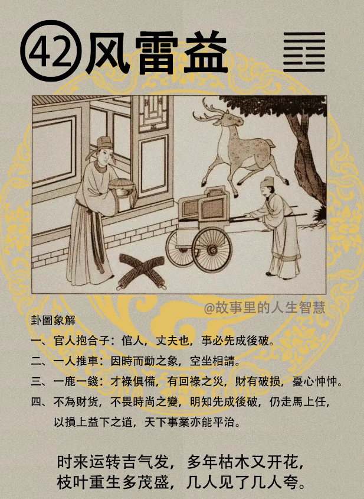

#### 详解风雷益

风雷益，益卦，我们历史上变迁，有盛世到衰，衰落下来，然后到损，朝代一衰落以后就会进入损，所以上堂课我们记录山泽损。损卦，就是我们把山泽在下面，慢慢的把山的根部腐蚀掉，山其实没有动，但是山会越来越高，因为水一直往下渗。

所以是损下益上，这个呢是山泽损，现在我们的国运就是这样。

那损之后呢，到了人民的根子没有了，山倒下来了，地又饱满了，损之后呢，受之为益，所以风雷益，所以益和损是表里卦，就是这两个是相对。

那风雷益专门讲益之道。益之道呢，有互益，相互为益的，风和雷，雷也打，风也大，雷可以增加风的威力，风又可以增加雷的震撼力，好，就是互相相得益彰的意思。

好，所以用风雷益，老祖宗在那边看这个是益卦，互相增益，那到底如何才能够如何增益来，益卦就是讨论这个东西。

那它这是自然的，进入人间道以后，好，到了人间道之后，我们就知道为政者，为政之人要损上益下，益就是说则民无疆。

为什么叫民无疆? 人民就没有疆界了，全世界都想来做你的子民，你就好好的可以为牧这匹羊了，对不对。你要损上益下才行，懂不懂我意思，这是真正的益。

那么我们现在刚好是反着的，懂不懂我意思，我们想尽办法剥削百姓的钱，我们想办法加税嘛，地方税，什么人头税，什么都来了，都加税。我们国家还没有钱，然后又跟国外说，我们外汇是全世界排行的，在那边都是他说的，我们老是在损下益上，懂不懂我意思。所以你去当官，现在是当了大官是最有钱的，其实应该反的。

那如果能够这样做的话，全世界，你是世界总统，不是单单台湾的总统，民无疆，没有疆界，易经这样讲，谁都愿意，这是希望你好好警戒一下。

这个呢，那君子之益，君子的益道，君子看到的益道，他知道见善而迁，有过即改。

如果第一个人做到，好的我们就向好的方向去走，正义随时在变，你要合时宜的，你不能立你的正义懂不懂，那不行。

像这个行政院长没有附属权，是立你总统，你想尽办法没有这种，是不是见善而不迁。见善而迁嘛， 易经上面可尽天下之善，全天下好的事情统统会显现出来，见善为迁。

那有过即改，则无过一样。人难免都会有过失的，所以我相信过去我们中国有一句话，叫做衙门里面好修行，法有法的威严，有的人是触犯，可能还不知道犯了，然后能够当他悔罪不举，处分一下就可以了。这个就很好。为什么?因为让他有过即改，不能让他连改的机会都没有。

有过即改，则无过已，那很多人知道过，还不改，就永远是在过，所以你要无过，就是发现过失就要改，每一个人都会有过失的，但是有过即改，要有这种气度。君子之益。

易经上面说君子，你是君子，君子讲的就是人才，贤才，这个叫做贤才，贤才的人去服侍，去帮君王做事情，这是易经说的，贤才侍君的时候，不患君不从己。你是承认他的你做事情，你不要去担心你的主子，担心您的总统，不同意你，你不要去担心这件事情。

你要担心的是什么? 患志不诚也，如果你叫做志诚，不见得是一个志诚的。患志不诚也，就是不够心诚，你要担心你自己做这件事情，是不是对天下的黎明百姓有益，你要担心这个事情才对，你不要担心你的主子同不同意你，喜不喜欢你。

这个小人侍君，每天就在担心但患君不从己，如何让皇帝听我的，让总统听我的，不患已之合理否。

一天到晚担心如何就去讨好的，讲好话，奉承去耳边咬，谁要对你不利，你看我对你多忠心，我现在给你秘报一些消息，哪个人要对你不利，哪个人要对你不利，用这个来博得君王的欢心，博得他的认同，而同意你，一天到晚担心，在想这个事情，从不担心自己做的事情合不合义理。这是小人的侍君。

那你如果是君的话，你看的很清楚嘛。哪一个是人才，哪一个是小人。

然后小人的时候，你要开除都开不掉，你要开除我，我就把你所有的事情都抖搂出来。易进难出，没关系，你们到时候互相狗咬狗，待会儿还有一个挑拨的，听我的讲究是挑拨了，但是都是都百姓有利的，无所谓了。

#### 占卜

官人抱盒子，第一个占卜的时候，你那个卜卦，卜到这个风雷益，左边一个官人在抱盒子，官人呢，就是我们平时很熟的倌人嘛，就是属于丈夫。事情，先成后破。

丈夫的事情，官人就是指丈夫了，还有官家的事儿，官事儿，懂不懂我意思，比如说刚好有一个来卜升官。官家的事儿。

第二个呢，是一个人在推车，有没有。一个人在推车，告诉你要因时而动，我一再的跟诸位讲，读易经的的目的呢，就是要知道如何，时机是什么时候，时机来到的时候，所有的易经上面解释，时机未到，要敬德修业，像诸位来读者怎么样都很好，要敬德修业，不管你到美国深造都是好事儿，时机到的时候你才能有才能出来，要不然等到时机到的时候你才不够。

当然易经后面有才不够如何去选才，这当然也有了，但是最好是自己平常要敬德修业。好的，因时而动。

要空坐相请。为什么要写这个空坐相请，曾经有一个人呢卜卦，现在我要去这个，可能我会发布命令做这个总经理，可是我一天到晚担心我们老板董事长，让他儿子来当总经理，不让我来当，卜到这个卦，空坐懂不懂我意思，你放心，那是你想出来的，你老板不会这样想，老板为才适用，不会说他儿子就当总经理，所以我们提到这个空坐相请。

一鹿一钱就是财禄嘛，财禄具备。

那比如说有个人来卜卦，我要用这个人做我的大将可不可以，一卜，可以，用他，而且要很虔诚的去请他。

那上面的鹿回头有没有，就是回禄。

卜到这个，财有破损，财禄在地上，两串钱在地上看到没有，下面地上是不是有两串钱，好，这是财禄有因为火灾有破损的象，而且优心忡忡。

如果是卜做生意从商的话要注意了，禄会来，但是你的工厂可能会有失火。那个玩具工厂失火，高雄二三度失火：当然保险公司赔惨了。

#### 阳宅

阳宅上面呢，长女居长子位，大女儿没有住东南，跑到东宫去主了。

第一件事情婚事不成，婚姻不会有结果的。还有呢有一种状况或成后又破，成婚又破。订婚了结果没结婚，又散掉了。

第二个，财禄从祖业而来，钱财从祖业来。好，但求外财。如果到外面做生意，忧心忡忡。

第三个，女身男性，而住在这个上面呢，贵人为男人，小人为女子。这是第四页的。

从官运，如果你的女儿当官，亨通。当官亨通，但是不可贪禄，贪财，贪财的话，凶，不好。

那我们看看阳宅上面，如果算到一个女该子她的阳宅上面是风雷益，八字拿出来——看，廉贪落陷做命，我们知道她会贪财，懂不懂，当官不好。

那再看风雷益的话，钱财在地上，两串钱在这边，他看到钱忧心忡忡，一定从酒色财气，六合彩的总投，赌钱，赌场的老板来找你算命。