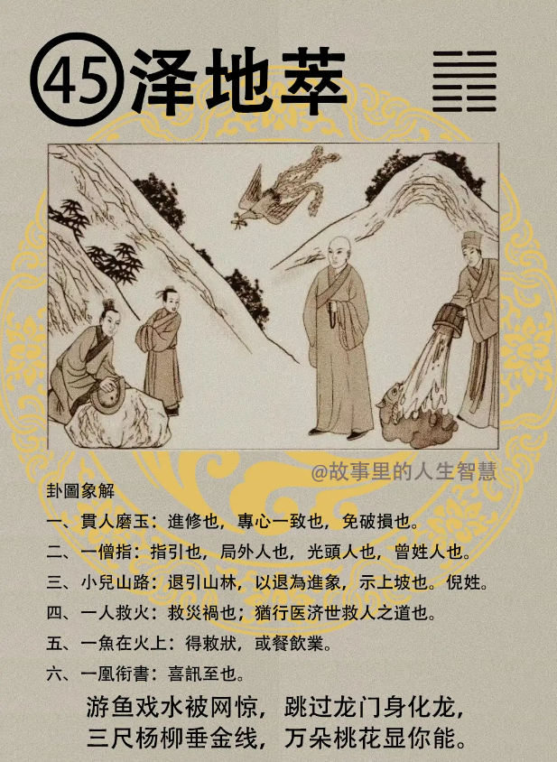

#### 详解泽地萃

泽地萃，这个姤卦呢是遇也，相遇的意思，那万物呢相遇以后必有聚，一定会聚在一起，这个聚呢就是现在讲的萃，聚集的意思。

你看那个草，你有没有看过一个山上就一颗草，一根在那边，那一定是一票。这个遇之后会萃，相聚的象。

这个卦专门在讲，聚的道，聚之道，君子如何聚呢，小人也会聚。那聚的象呢，地上面有沼泽，平地上沼泽的水聚在那边就是聚象，所以叫做泽地萃。

同样的，如果按照卦象来看的时候，泽是外悦，喜悦的悦，地是内顺，一个人露在外面是喜悦很高兴，内部又是很柔顺的，一定会很多朋友，大家来找你，只是你要选择，懂不懂我意思，你要选择一大票小人，那不是真正的萃，你要选择一大票君子，这是聚的道。

那到了人家道以后呢，我们老子就很厉害，我们圣人就在看，这个萃，聚集人心的象，是泽地萃的萃道，他知道民心之聚，莫过乎宗庙，所以我们老祖宗知道，太好了，要收人心，你只要知道如何立宗庙，宗庙立的对，人心很快就能收起来，人民的心就收了。

你说中华民国要去外交，要进入联合国，你去立这些宗庙，真是笨得跟猪一样，这几年我们看看台湾有没有事儿，为什么要花儿那么多钱去讨好那么多人，拿百姓的钱，最可恶的是花的钱还说是我给的，不是说中华民国百姓给的，你懂不懂我意思。

那不是立宗庙收人心。宗庙要如何立，我知道，你来问我，你不下求，你去问那个非洲的黑人总统有何屁用，他是吃人肉的，对不对。他易经都不知道还糊涂，蠢。

那过去易经上面说，这个王立宗庙一定要讲孝，以孝道宗庙为立，了解我意思吧，要孝。那我们现在不是，过年的时候跑到基督教那边做礼拜，你为什么不去敬孝呢，上香向祖呢，这一个都不知道，你其他人怎么知道。最基本的嘛，百善孝为先嘛，所以过去我们的历代君王，都是非常敬视他们的祖先，知道孝顺。

你说不能祭祀，我们基督教不可以用香拜的。对呀，你注意看人心的时候，你看那个妈祖生日的时候，管你什么民主党，国民党，全部跑到妈祖庙去，收人心，圣人厉不厉害，但是重要如何立，不讲，我就不告诉你。

所以我们易经上有部分删掉，你们看到就好了，我会给你们看到。

让我们全台湾的人都晓得，大家都知道如何立，就是有一个人不知道。

因为他中实嘛，我怎么会错嘛。

#### 占卜

第一个，贵人磨玉，有一个人在磨玉有没有? 代表进修的象，也代表坚心，就是专心一致的象，要坚心到底，不能间断，你要小心一点了，不能让玉破碎。

第二个有一僧指路，有没有，一个僧手指在那边指来指去，对不对，代表指引。那僧人，一般的世外人，都代表局外人，那个跟僧同音，也是曾姓的人，光头人也是僧，是不是? 看头发，叫做牧师，光头人是僧。

第三个，小儿在山路上面，如果是当官的人，或者是做生意的人，有退隐山林的象。好，又有以退为进的象。

一个人救火，有一个人右边救火，有没有? 代表救灾祸，救灾，代表救灾祸，求救。也代表现在救火队，也代表行医的人，济事救人。

第五个，有一个鱼在火上面，那个鱼得救了，本来要烧要煮的，那个水一浇下去，那个鱼就得救了。

一个凤衔书，有没有画一个孔雀金凤在上面，代表喜讯，好事情，好消息要来，喜讯。特别讲凤，没有讲乌鸦。喜讯要来。

#### 阳宅

泽地萃，萃卦出现的时候，三女居母位。

第一个，不想成婚，不想结婚。未婚有子，小儿嘛。

终日进得修业，终日在进修。

第三个，代母职，代替母职居家内，你让她出去工作不喜欢，我待在家里面就好了。我生我的小孩，找个平衡好了，不需要结婚。

有一件事情是例外，如果有一个人开一个餐厅来找你说，我刚才开的餐厅，看看这个好不好? 阳宅是泽地萃。餐饮业，大吉。三女儿开餐厅会大赚钱，只有这个好，其他不好。

