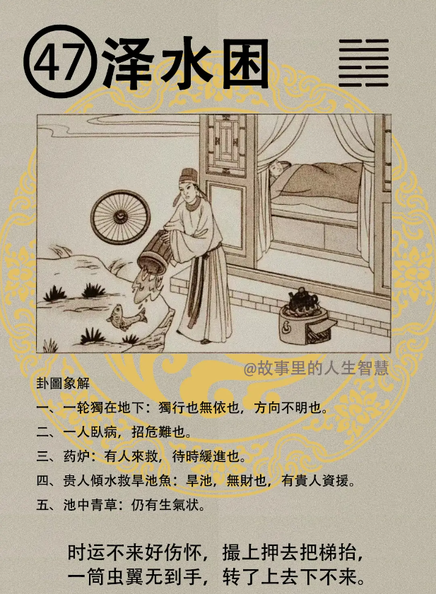

#### 详解泽水困

地风升，升卦之后要泽水困，所以说天下的万物升升不已，升升升升，升到一定的高度就不升了，不升了，停下来的时候，升之尽必困，一定会遭困。所以呢天道自下而上，你由下而上，有必力尽，完全你是拼命在那边力，用力在那么晋升，不久一定会困，一定会招困。

所以招困的人，这个泽水困，你有一个疲乏之象，你看这个人刚开始到你的公司上班，雄心万丈，一进来以后看到社会很多现实，慢慢慢慢就会磨烂了。那个就是处困，这个困卦就是告诉你，什么样的状况会让你困，那困的时候怎么办?这个困卦专门讲这个道理，这个孙X好好听啊，什么叫困。

人道，人间道：

君子处困，你一直在困吗，我现在告诉你，君子处困怎么办，乐天安命，你本来不是那个咖，坐你不适合的位置，理所当然要治困，你想去，你去就是困之始，你刚开始去就不对了。

所以呢要乐天安命，随时善处。所以那个人在困的时候，跟你讲话的时候，眼睛这样子闭在一起，你讲了半天， 他还是想不开， 这就不是君子之道。困是什么，每个人都有困。

那处困的时候，一定要乐天安命。我们为什么要给他算命? 先生您未来非常好，所以您今年困是正常的。哪有那么多好事，他现在笑开了，阴德就积起来了。

他来的时候，他正在困，那个脸五官都挤在一起，你说先生你不必活了，你可以跳河自杀了，这边很好，风水不错，你可以往那边跳，你不能给他这样子算命，也不好。

这个人呢。 一个人，易经，泽是悦，水是什么? 险。如果你今天报的心情，外悦，外面很高兴的笑，内险，里面担心很多事情，这就是困。
困的意义就是这样。反过来，你看那个人，一个人在那儿想，有的人在那儿很开心，那就是困了。你就告诉他要乐天安命，随时善处。

延伸意义，处险，虽然很险，但是很开心。你不小心踩到老虎尾巴了，你紧张也是死，不紧张也是死，愉快一点嘛，说不定老虎还不会咬你。

人或万物遭受到危险之前，有危之前，必惧。所以诸位你不要怕，心里一怕的时候，危就来了。危险的刚开始，就是你怕，你不怕就不会危险，你一怕，进退就失据了。有什么好怕的，看到银行存款20块钱，你就在那边怕，不要紧张嘛。越怕越担心啊，担心没有钱，你就会铤而走险啊。不怕，就不会生危嘛。

易经说，泽无水，困。沼泽里面没有水了，水往下走了，泽里的水被困到。君子以致命遂至，所以我们为什么算命，就在这里，了解自己的命，你就永远不会困，不要担心眼前。所以你说我们是个心理学家也好，什么都可以，算命的也好，该骂还是要骂。

所以人要乐天知命，易经里讲知命，能够安固啊，守困。困没什么的，你能够安固，甘之如饴嘛。颜回，一箪食一瓢饮，就过得很愉快，为什么要去比呢。现在人类不是这样子，笑贫不笑娼，很恶心啊。老祖宗的东西都被丢了，西洋的东西都是好的，然后说要发扬中国文化，一句话讲完了，实际去发扬欧美文化去了。

易经在泽水困里提出，尚口之戒，当困而言。处困的时候，人所不信，别人一定不相信你，现在的百姓，相信你坐豪车有司机的人。遇到处困时人所不信，这种情形的时候，欲以口来免困，比如别人在攻击你，你在那边反击，你明明知道你讲的话别人不会去信，你还在用口舌脱困，用嘴巴辩论，就会致穷。

卦本身讲的状况，解也在里面。以悦处困，反正日子总要过的嘛，悦之道，来处困时。每天读书上课很开心，当你内悦外悦，就变成兑为泽了。

#### 占卜

卜到泽水困，你要小心了。

第一个，一轮独在地上，独行，特立独行啊，或者是无依无靠。一个轮子当然方向不明啊。

第二个，有一个人卧病，卧病呢，遭危难，有灾难。

药炉放在地上，就有人来救，代表有人来救。要待时缓进，等待时机缓慢进步。所以卜到这个卦的时候，泽水困的时候，以守也，然后不但叫他以守，还要教他以悦之道，万事喜悦。

贵人倾水就旱池鱼，旱池代表无财，你如果是求财来卜卦，你自己要小心了，无财。但是有一个贵人在那边丢水，有贵人怎么样? 相救，有贵人会支援你，供应你钱财。

第五个池中有青草，代表目前还有生气，仍有生气，你这个事业还是可以做，你放心，你每天高高兴兴的上班，高高兴兴面对你公司的员工，有贵人会相援，会支援。倒水下去，会用钱来投资你，你目前还是会有生气。你困的时候不要紧张，一个字就讲完了，悦。

悦之道，要随时的，你不要摄像机镜头没照到你的时候，一照到你的时候马上换一个脸，脸色善变，孙X你要注意一下，不要乱搞。这是他的致命伤，他不晓得他有那个致命伤。所以李XX你用的时候要小心一点，不要用那个致命伤。其他的还来不及讲，先讲它就够了。

#### 阳宅

三女居二子位。当你发现你的老三，每天那个脸上无泽，你就知道泽水困。

第一个体弱多病，你跑到人间道，给西医去检查，就说这个人先天的遗传什么疾病，就翻你家家族史，其实是身体不好，住的位置不对。体弱多病也罢，偏偏她性刚，个性很刚强，独行。一个人决定什么，她不听父母亲的话。

第三个，婚事不成。 一辈子没有婚姻。

第四个，然后财禄不守，钱财给她多少，她给你花了多少，守不住祖业。
