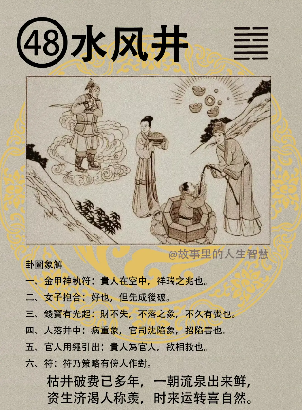

#### 详解水风井

困卦之后呢，困的续卦是井卦，水风井。

人呢受到困以后，困以后必下，对不对? 我干这个没意思了嘛，困到了，然后我就下来了，往下走。

那物之下，落若井。我们人呢，富跟人也有关系，人所有的东西，最下面就是井，以前在大陆上面就是过去的井。

所以困井之后我们受制于井，所以井为次困。

然后风是木，这个木呢跑到水的下面去，就是汲井之象有没有，木入水中，有汲水于井，在井在旁边打水的象，汲水的象。所以井卦。

那到了人间道以后呢，井之道呢，第一个，君子的法井之道，效法井之道。

他说第一个，世界所有的城市，城邑改，邑改井不改，你换到别的地方那个井没有挖，没有水了，井不能动，你城市在动，井不能动。告诉你要坚心，要坚心正道，不能坚心歪道，不对的道你还坚心，就变成不是坚心，不是真正的正了，正就是坚心。你在不正的道上面坚心，地雷复了，那就是执迷不悟了。

第二个井卦呢，取之不竭，存之不盈。

那井无私又无德。那一天把井水倒出来，第二天又满，那取之不竭，存之不盈。

第三，所有的人，人道旁边，人至皆得其用，井呢，不管什么它都可以用，什么人走到旁边都可以用得到它。这个是井的德。

那我们老祖宗很厉害，它就看到我们的后世有很多混蛋出来了，他就提出来了，他说井泥，也可以叫做舊井之戒，取之不竭，存之不盈，八个字。
君子在旧井之戒，君子在对时机的时候，随时在进德，就像井一样，随时随地在慢慢慢慢的渗水，每天在积，积累成，积小成为很大的德，日新月异的，日积月累。他不会因为当不当位，他不会因为外面发生什么事情而停止，每天都在进步。

那为什么易经说上面，井泥的名字叫做旧井之戒。现在很多大学教授，他在教学的时候，拿出来是二十年前的讲义，我教经济学，我是郭 XX，我们是女的嘛，很好，我们教经济学，他拿出一个十几年前的讲义，根本不合适用了，他还在那边教，没有再去进修，我是博士了，我怎么需要进修，不需要了嘛。现在时代进步成这样，她还在十几年前，这叫做旧井，易经骂你是旧井。我们现在一大堆的学校的教授都是旧井。

你如果是真正的得到井之道，让学生感觉到你是取之不竭，存之不盈。每天在存，中虚有没有，还是在吸收，你不会这个时候在自满，每天还是在进步。人家每天来找你，一两个月看不到你很紧张，为什么? 因为你又进步很多。

那现在的大专院校的教授都一票旧井，懂不懂我意思，他不会去进修。你看这怎么办，所以我们的教育XX，郭XX该下台，你也是旧井，摸着良心讲话，你平常读什么书? 我们是部长了，我们是博士了，还需要读什么书，你错了，书是读不完，每一天在读。

所以我们非常，本人非常敬佩向学之心的人。每天你都很乖，每天都在读书，我一定不会骂你。

不读书嘛，鼻子就越来越歪，读书的人鼻子越来越正。

#### 占卜

那如果有一天占卜，你卜到水风井，有一个金甲神持福在床边，中间有一个女人拿一个盒子，然后有一个人，官人在救井，一个夫子掉在盒子里面，那边地上有金钱纸在烧，什么意思? 

金甲神执符，代表贵人在空中，这是祥瑞之兆，这是来救你。预兆。

这边呢，易经的图里面只有字我们就要拿出来。是不是执一个符在手上面，竹字头拿出来，策略，是策，竹字头，策略，人，寸，付是不是人字旁，旁边是不是有一个人，人字旁旁边有人嘛，旁人在怎么样? 旁人作对。

这个事情金甲神执符是有，但是会有旁人作对，好了，要小心，读图厉不厉害。

我下次读正给你看。

第二个呢，女子抱盒，女子就是好嘛，是不是好的意思，好也，盒子呢，代表先成后破。

第三个，钱宝有光起，如果卜财，你先生，我的钱财掉了，被人家偷走了，手表掉了。财不失，不露，不会露出来。

那还有如果家里面不久有丧，你卜到钱在地下，都没有好预兆，那个火一烧就是烧纸钱。

人落在井中代表病重，病重的象，或者是官司呈现，陷在官司里面，或者是冤狱都有，遭陷害，遭到人家陷害。

官人用绳把你引出来，一个贵人在旁边要救你，把你救出来，有人帮你伸冤。如果是官司的话，这个就是冤狱，冤枉的，那也要把他救出来。
有旁人作对，被他陷害。

#### 阳宅

二子居长女，二儿子跑到大女儿的位置成格。

第一个，那个未婚男的是二子，婚事妻长，太太年龄比你大，且是二婚妻。

第二个呢，带丧服。比如说他原来以前，从来没有去住过东南角的位置，今年突然去住东南角，戴孝，家里面会戴孝。那你看看他是太阳落陷，还是太阴落陷，看看他日角暗，还是月角暗，都可以知道了。看他左眉高，还是右眉高。

你不要看那个孙X鼻弯，那个没有关系，那个是小人的鼻子，脸是歪的，那个跟丧服没有关系。

第三个，还有颈部生病，脖子生病，比如说这个淋巴癌，大脖子，反正脖子那边有病。

第四个，从商吉，因为有钱在地上，做生意很吉，从祖业。如果本身祖业下来，祖业也吉，可以到祖业去做事情。

第五个，我都不喜欢从商，也不喜欢从祖业，我喜欢从官，我喜欢去当公务员，从官遭陷，遭到诬陷。

我们那个孙XX就下台了，飞机上的关他屁事儿，对不对，他是无力管你懂不懂我意思。了解我的意思吧。原来的袁XX到这边来干总经理，我是纪袁 X，袁 XX是我以前的长官， 我怎么去管你，对不对。 因为国民党，一下冲过来，乱搞，管不了嘛，你想也知道嘛，对不对，你怎么管。

待会给你介绍一个例子。